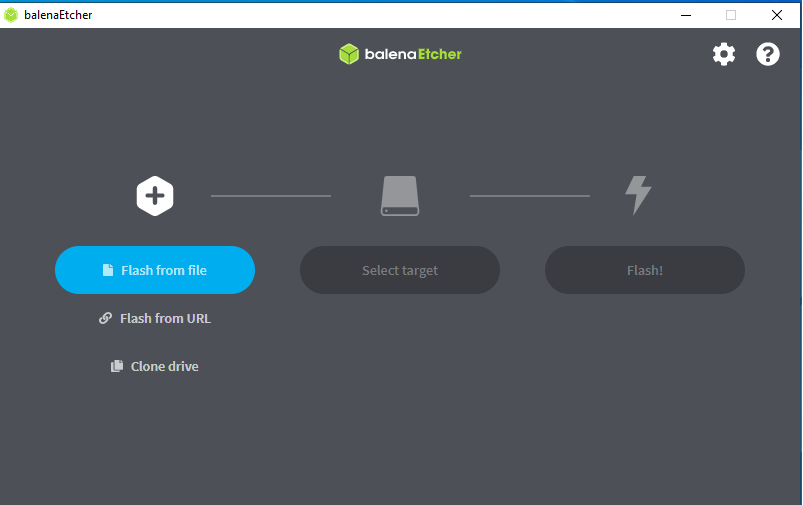

[**Back to ICO330 BSP**](../README.md)

---
# ICO330

* [Set Up the Build Environment](#set-up-the-build-environment)
* [Download the Project](#download-the-project)
* [Build Commands](#build-commands)
* [Boot from a USB Flash Drive](#boot-from-a-usb-flash-drive)
    - [Disk Image](#disk-image)
    - [Use the `balenaEtcher` Tool](#use-the-balenaetcher-tool)

* [Boot from an eMMC Card](#boot-from-an-emmc-card)


---


## Set Up the Build Environment


<div align="right">

[**Back to Top**](#ico330)

</div>
 


Source the QNX SDP environment script before building the BSP:

```console
$ source ~/qnx803/qnxsdp-env.sh
QNX_HOST=$HOME/qnx803/host/linux/x86_64
QNX_TARGET=$HOME/qnx803/target/qnx
MAKEFLAGS=-I$HOME/qnx803/target/qnx/usr/include
```

<div align="right">

[**Back to Top**](#ico330)

</div>
 

---

## Download the Project


<div align="right">

[**Back to Top**](#ico330)

</div>
 


Clone the repository and check out the **ico330** branch to retrieve the ICO330 BSP source:

```text
$ cd ~
$ git clone --branch ico330 --single-branch git@github.com:JasonL-GHub/qnx-industrial-pc-guide.git ICO330
```

The ICO330 BSP source files will be available at:

```text
~/ICO330/
```
<div align="right">

[**Back to Top**](#ico330)

</div>
 
 
---

## Build Commands


<div align="right">

[**Back to Top**](#ico330)

</div>
 


Change to the ICO330 BSP directory and build the project:

```console
$ cd ~/ICO330/
$ make clean
$ make
```


<div align="right">

[**Back to Top**](#ico330)

</div>

 
---


## Boot from a USB Flash Drive


<div align="right">

[**Back to Top**](#ico330)

</div>
 


### Disk Image


<div align="right">

[**Back to Top**](#ico330)

</div>
 


The build generates the following disk image:

|  Names      | Graphics | BIOS Legacy Boot | UEFI Boot |
| ------ |:-------:|:-------------:|:-------------:|
| disk_ico330-803.img  | **Yes** | **No** |**Yes** |


<div align="right">

[**Back to Top**](#ico330)

</div>
 
 

### Use the `balenaEtcher` Tool


<div align="right">

[**Back to Top**](#ico330)

</div>
 


Download and install the [`balenaEtcher`](https://etcher.balena.io/) tool.

Use `balenaEtcher` to write the QNX disk image to a USB flash drive.




<div align="right">

[**Back to Top**](#ico330)

</div>
 

---

## Boot from an eMMC Card


<div align="right">

[**Back to Top**](#ico330)

</div>
 


After system booting from the USB memory stick, use `dd` command to copy image from the USB memory device onto the eMMC Card: 

```console
# dd if=/dev/umass0 of=/dev/emmc0 count=1642496
1642496+0 records in
1642496+0 records out
840957952 bytes (802 M) copied, 27.491 s, 29 M/s
```
After the copy operation completes:

1. Power off the system.
2. Remove the USB flash drive.
3. Power on the ICO330.
4. The system should boot from the eMMC card.

> **Note:**

The image size is based on:

```text
512 bytes × 1,642,496 = 802 MiB
```


<div align="right">

[**Back to Top**](#ico330)

</div>
 
---

[**Back to ICO330 BSP**](../README.md)


