[**Back to CAPA322 BSP**](../README.md)


---


# Test Guide

This guide describes the basic functional tests performed on the Axiomtek CAPA322 platform running QNX 8.0.0.

* [Basic Function Test Items](#basic-function-test-items)
    - [Storage](#storage)
    - [Graphics](#graphics)
    - [Ethernet](#ethernet)
    - [USB](#usb)
    - [COM/UART](#comuart)
    - [GPIO (CN7)](#gpio-cn7)
    - [Watchdog](#watchdog)
    - [I2C (CN1)](#i2c-cn1)
    


# Basic Function Test Items


---


## Storage


<div align="right">

[**Back to Top**](#test-guide)

</div>


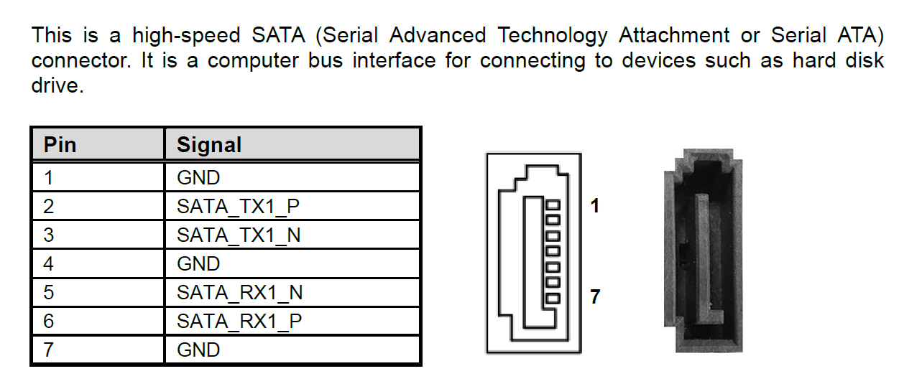


<div align="right">

[**Back to Top**](#test-guide)

</div>


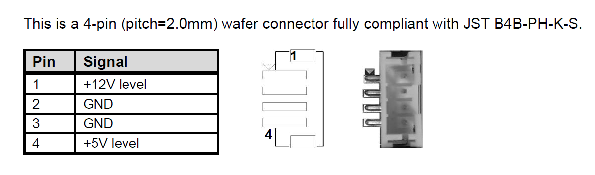


<div align="right">

[**Back to Top**](#test-guide)

</div>


Connect a SATA disk to the board.

Check the `/dev` directory to verify that the SATA disk is detected:

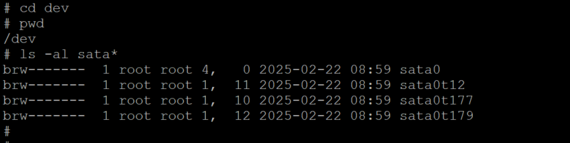


<div align="right">

[**Back to Top**](#test-guide)

</div>


Use `pci-tool -v` to verify the SATA controller is connected:


```text
# pci-tool -v

Partition: pci

Managing Server ID: 1, pid: 20487, running
B000:D00:F00 @ idx 0
        vid/did: 8086/4538
                Intel Corporation, <device id - unknown>
        class/subclass/reg: 06/00/00
                Host-to-PCI Bridge Device
.
.
.
B000:D23:F00 @ idx 6
        vid/did: 8086/4b63
                Intel Corporation, <device id - unknown>
        class/subclass/reg: 01/06/01
                SATA Mass Storage Controller (AHCI Interface)
.
.
.
```


<div align="right">

[**Back to Top**](#test-guide)

</div>


---


## Graphics

<div align="right">

[**Back to Top**](#test-guide)

</div>


Run the following commands to show the display demo:

```console
# cd scripts
# ls
graphics_start.sh
# pwd
/scripts
# cat graphics_start.sh
#!/bin/sh
 LD_LIBRARY_PATH=/lib:/usr/lib:/lib/dll:/lib/dll/pci:/proc/boot:/usr/lib/graphics/intel-drm
 PATH=/sbin:/bin:/usr/sbin:/usr/bin:/opt/sbin:/opt/bin:/proc/boot
 echo "Starting screen"
 drm-intel-518 sleep 6
 screen -c /usr/lib/graphics/intel-drm/graphics.conf
 waitfor /dev/screen
#
# /usr/bin/gles2-maze &
```


<div align="right">

[**Back to Top**](#test-guide)

</div>


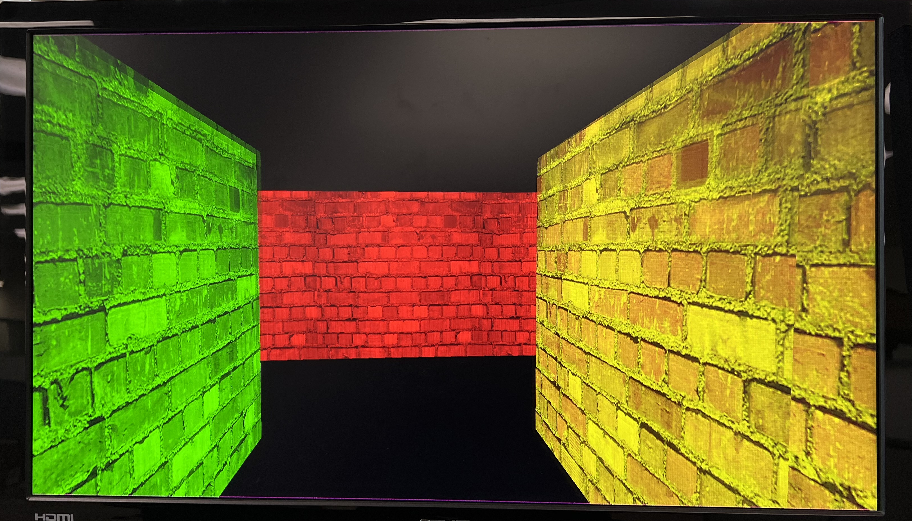


<div align="right">

[**Back to Top**](#test-guide)

</div>


---


## Ethernet


<div align="right">

[**Back to Top**](#test-guide)

</div>


There are two Ethernet Ports:  LAN1 and LAN2

Connect an Ethernet cable to LAN1, then power-cycle the system:


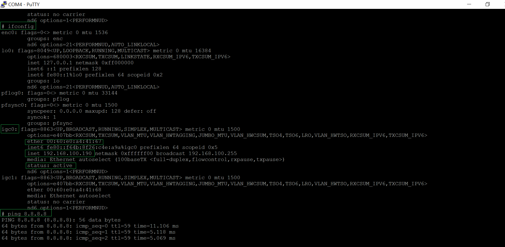


<div align="right">

[**Back to Top**](#test-guide)

</div>


---


## USB


<div align="right">

[**Back to Top**](#test-guide)

</div>


|USB ID|USB Type|
| :---: | :---: | 
|USB1|USB 2.0 Wafer Connector|
|USB2|USB 3.2 Gen2 Type A Port|
|USB3|USB 2.0 Type A|


###  USB1


<div align="right">

[**Back to Top**](#test-guide)

</div>


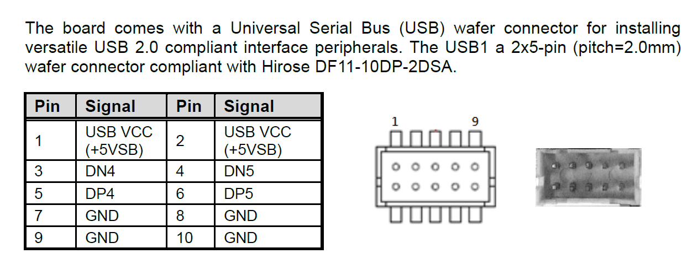


<div align="right">

[**Back to Top**](#test-guide)

</div>

A USB 2.0 wafer cable is required:

- **P/N**: 594E8422800E
- **Description**: 2 × USB 2.0 wafer cables with bracket, 180 mm

Before inserting a USB flash drive into **USB1**:

```console
# cd /dev
# ls umass*
umass0  umass0t12  umass0t177  umass0t179  umass1  umass1t12
# ls -l umass*
brw-------  1 root root 4,   0 2025-02-25 06:03 umass0
brw-------  1 root root 1,  11 2025-02-25 06:03 umass0t12
brw-------  1 root root 1,  10 2025-02-25 06:03 umass0t177
brw-------  1 root root 1,  12 2025-02-25 06:03 umass0t179
# pwd
/dev
```

<div align="right">

[**Back to Top**](#test-guide)

</div>


After inserting a USB flash drive into **USB1**:

```console
# ls -l umass*
brw-------  1 root root 4,   0 2025-02-25 06:03 umass0
brw-------  1 root root 1,  11 2025-02-25 06:03 umass0t12
brw-------  1 root root 1,  10 2025-02-25 06:03 umass0t177
brw-------  1 root root 1,  12 2025-02-25 06:03 umass0t179
brw-------  1 root root 4,   1 2025-02-25 06:13 umass1
brw-------  1 root root 1,  15 2025-02-25 06:13 umass1t12
#
```


<div align="right">

[**Back to Top**](#test-guide)

</div>


Two USB flash drives are connected to **USB1**:

```console
# ls -l umass*
brw-------  1 root root 4,   0 2025-02-25 06:03 umass0
brw-------  1 root root 1,  11 2025-02-25 06:03 umass0t12
brw-------  1 root root 1,  10 2025-02-25 06:03 umass0t177
brw-------  1 root root 1,  12 2025-02-25 06:03 umass0t179
brw-------  1 root root 4,   1 2025-02-25 06:20 umass1
brw-------  1 root root 1,  15 2025-02-25 06:19 umass1t12
brw-------  1 root root 4,   2 2025-02-25 06:20 umass2
brw-------  1 root root 1,  17 2025-02-25 06:20 umass2t12
brw-------  1 root root 1,  16 2025-02-25 06:20 umass2t177
brw-------  1 root root 1,  18 2025-02-25 06:20 umass2t179
```

<div align="right">

[**Back to Top**](#test-guide)

</div>


### USB2


<div align="right">

[**Back to Top**](#test-guide)

</div>


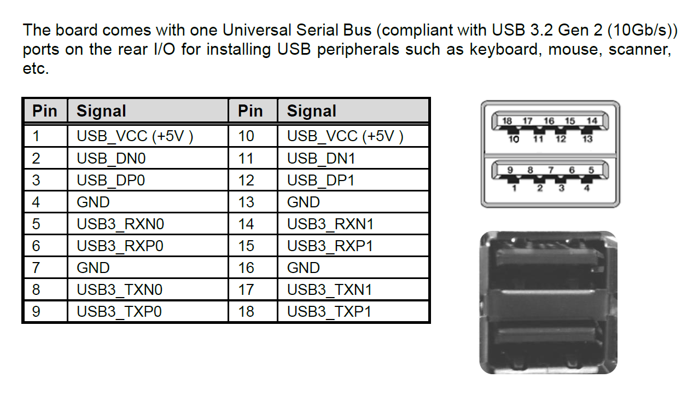


<div align="right">

[**Back to Top**](#test-guide)

</div>


Boot the system from a SATA disk.

Before inserting a USB flash drive into **USB2**:

```console
# cd /dev
# ls -l umass*
ls: umass*: No such file or directory
# ls -l sata*
brw-------  1 root root 4,   0 2025-02-25 06:28 sata0
brw-------  1 root root 1,  11 2025-02-25 06:28 sata0t12
brw-------  1 root root 1,  10 2025-02-25 06:28 sata0t177
brw-------  1 root root 1,  12 2025-02-25 06:28 sata0t179
#
# pwd
/dev
```

<div align="right">

[**Back to Top**](#test-guide)

</div>


After inserting two USB flash drives into **USB2**:

```console
#  ls -l umass*
brw-------  1 root root 9,   0 2025-02-25 06:31 umass0
brw-------  1 root root 1,  16 2025-02-25 06:30 umass0t12
brw-------  1 root root 1,  15 2025-02-25 06:30 umass0t177
brw-------  1 root root 1,  17 2025-02-25 06:30 umass0t179
brw-------  1 root root 9,   1 2025-02-25 06:31 umass1
brw-------  1 root root 1,  18 2025-02-25 06:31 umass1t12
#  ls -l sata*
brw-------  1 root root 4,   0 2025-02-25 06:28 sata0
brw-------  1 root root 1,  11 2025-02-25 06:28 sata0t12
brw-------  1 root root 1,  10 2025-02-25 06:28 sata0t177
brw-------  1 root root 1,  12 2025-02-25 06:28 sata0t179
#
```


<div align="right">

[**Back to Top**](#test-guide)

</div>


### USB3


<div align="right">

[**Back to Top**](#test-guide)

</div>


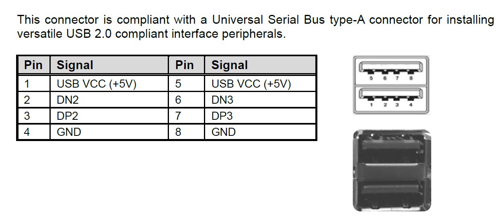


Perform the same tests as those performed on **USB1**.


<div align="right">

[**Back to Top**](#test-guide)

</div>


---


## COM/UART


<div align="right">

[**Back to Top**](#test-guide)

</div>


|COM Number |DevName| COM Wafer Connectors On Board|
|:---------:|:-----------------:|:-----------------:|
| 1 | /dev/ser1 | COM1 |
| 2 | /dev/ser2 | COM2 |
| 3 | /dev/ser3 | COM3 |
| 4 | /dev/ser4 | COM4 |


Use the COM port cable (**SAP Item #: 59380880250E, DB-9 × 1P, P = 1.25 mm, L = 250 mm**).

- Connect one end of the COM port cable to the board's wafer connector.

- Connect the other end (male RS-232 connector) to the male RS-232 connector of a USB-to-RS-232 cable through a **null-modem adapter**.

- Connect the USB end of the USB-to-RS-232 cable to a PC.


```console
# cd dev
# pwd
/dev
# ls -l ser*
crw-rw-rw-  1 root root 3,   1 2025-02-21 06:36 ser1
crw-rw-rw-  1 root root 3,   2 2025-02-21 06:36 ser2
crw-rw-rw-  1 root root 3,   3 2025-02-21 06:36 ser3
crw-rw-rw-  1 root root 3,   4 2025-02-21 06:36 ser4
...
#
```

<div align="right">

[**Back to Top**](#test-guide)

</div>


Assume **COM1** is connected: 

```console
# echo hello > /dev/ser1
hello
# echo hello > /dev/ser2
# echo hello > /dev/ser3
# echo hello > /dev/ser4
```

<div align="right">

[**Back to Top**](#test-guide)

</div>


---


## GPIO (CN7)

<div align="right">

[**Back to Top**](#test-guide)

</div>


According to the **CAPA322 User's Manual** (page 17), the GPIO pinout is as follows:


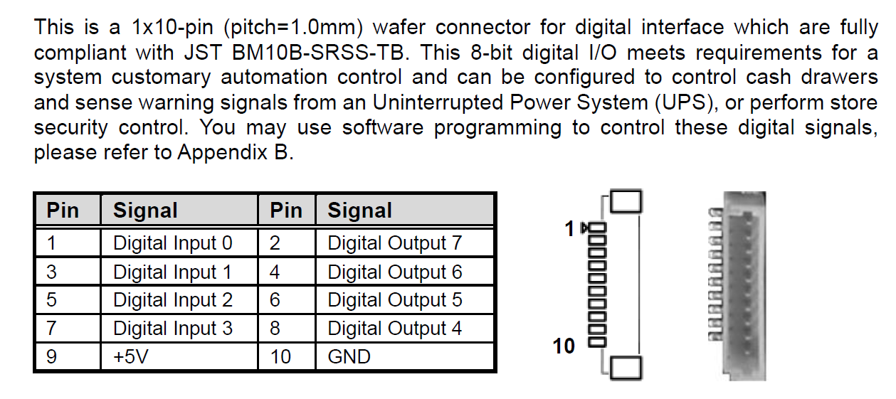


<div align="right">

[**Back to Top**](#test-guide)

</div>


A shared library is provided to configure and access the GPIO interface.

With this library, **Pins 1–8 can be configured as either inputs or outputs**. 

This provides greater flexibility than the original BIOS configuration, which supports:

- Pins 1, 3, 5, and 7: **Input**
- Pins 2, 4, 6, and 8: **Output**

Two test applications are provided to demonstrate how to use the GPIO library:

- `capa322_dio_read_test` — GPIO input test
- `capa322_dio_write_test` — GPIO output test


The test applications are located in /usr/bin:

```console
# ls
bin  etc   lib   root  scripts  tmp  var
dev  home  proc  sbin  sys      usr
# cd usr/bin
# pwd
/usr/bin
# ls -al capa322*
-rwxr-xr-x  1 root root 8192 2025-02-21 22:55 capa322_dio_read_test
-rwxr-xr-x  1 root root 8192 2025-02-21 22:57 capa322_dio_write_test
```


### Input Test


<div align="right">

[**Back to Top**](#test-guide)

</div>


#### Test 1: No Pins Grounded


<div align="right">

[**Back to Top**](#test-guide)

</div>


When no GPIO pins are grounded, all pins are pulled high:

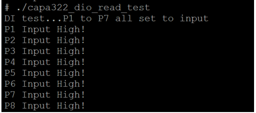

<div align="right">

[**Back to Top**](#test-guide)

</div>


#### Test 2: Pin 1 Grounded


<div align="right">

[**Back to Top**](#test-guide)

</div>


Connect Pin 10 to Pin 1 to ground Pin 1:


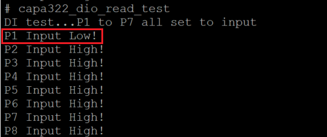


#### Test 3: Pin 2 Grounded


<div align="right">

[**Back to Top**](#test-guide)

</div>


Connect Pin 10 to Pin 2 to ground Pin 2:

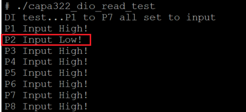


<div align="right">

[**Back to Top**](#test-guide)

</div>


#### Test 4: Pin 3 Grounded


<div align="right">

[**Back to Top**](#test-guide)

</div>


Connect Pin 10 to Pin 3 to ground Pin 3:


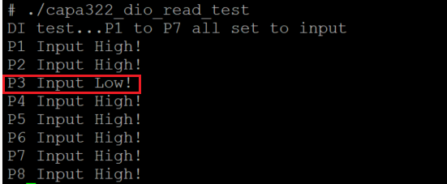


<div align="right">

[**Back to Top**](#test-guide)

</div>


#### Test 5: Pin 8 Grounded

Connect Pin 10 to Pin 8 to ground Pin 8:

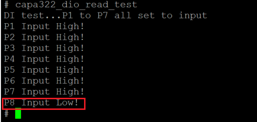


<div align="right">

[**Back to Top**](#test-guide)

</div>


### Output Test


<div align="right">

[**Back to Top**](#test-guide)

</div>


The GPIO output test can be performed using the `capa322_dio_write_test` application:


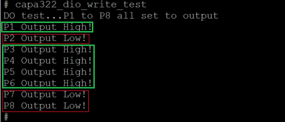

A multimeter can be used to verify the output voltage levels on **Pins 1-8**.


<div align="right">

[**Back to Top**](#test-guide)

</div>


---

## Watchdog


<div align="right">

[**Back to Top**](#test-guide)

</div>

The `WDT_RESET_N` signal is provided by the `EC IT5571`embedded controller.

A shared library, `libax_ec_wdt.so`, is provided to access the watchdog function. 

The following example demonstrates how to use the library:

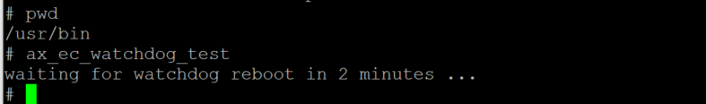


<div align="right">

[**Back to Top**](#test-guide)

</div>


---

## I2C (CN1)


<div align="right">

[**Back to Top**](#test-guide)

</div>


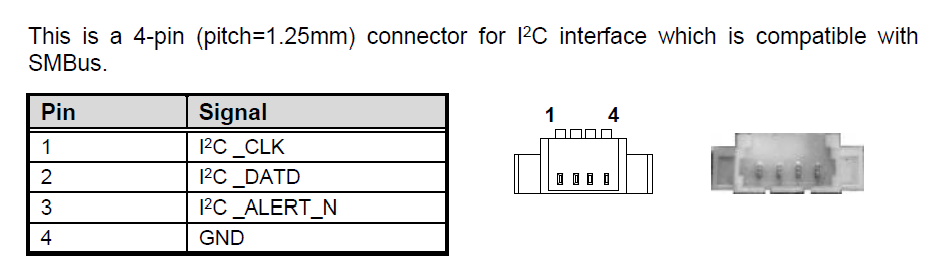
 

The `I2C` interface is provided by the `EC IT5571` embedded controller.

A shared library, `libax_ec_smbus.so`, is provided to access the I2C interface. 

Sample code demonstrating how to use the library is also provided.  


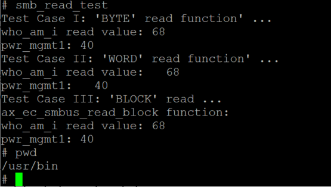


<div align="right">

[**Back to Top**](#test-guide)

</div>

---

[**Back to CAPA322 BSP**](../README.md)
