[**Back to ICO330 BSP**](../README.md)


---


# Test Guide

This guide describes the basic functional tests performed on the Axiomtek ICO330 platform running QNX 8.0.
* [Basic Function Test Items](#basic-function-test-items)
    - [Storage](#storage)
       - [eMMC](#emmc) 
    - [Display](#display)
    - [Ethernet](#ethernet)
    - [USB](#usb)
    - [COM](#com)
    - [SMBus](#smbus)
    - [Digital I/O Connector](#digital-io-connector)
        - [Input Test: Dry Contact](#input-test-dry-contact)
        - [Input Test: Wet Contact](#input-test-wet-contact)
        - [Output Test](#output-test)
    - [Watchdog](#watchdog)
    - [Programmable LEDs](#programmable-leds)
    - [Hardware Monitor](#hardware-monitor)
    - [M.2 Key B Connector (CN4)](#m2-key-b-connector-cn4)  
    - [M.2 Key E Connector (CN7)](#m2-key-e-connector-cn7)

    

> **Note:**

Test platform:  ICO330-X6414-A (P/N: E22C330103)


# Basic Function Test Items


---


## Storage


<div align="right">

[**Back to Top**](#test-guide)

</div>


### eMMC


<div align="right">

[**Back to Top**](#test-guide)

</div>


Check `/dev` directory:

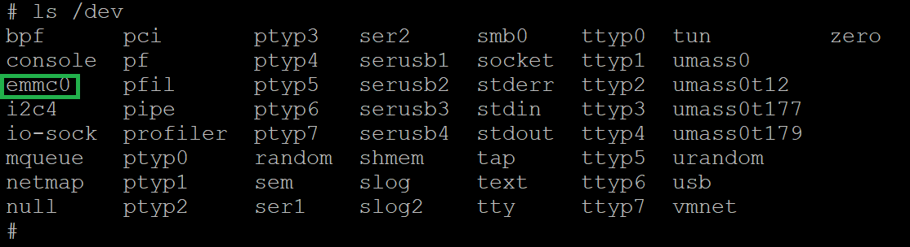


<div align="right">

[**Back to Top**](#test-guide)

</div>


Use `pci-tool -v` to verify that the eMMC controller is detected::

```console
# pci-tool -v

Partition: pci

Managing Server ID: 1, pid: 20487, running
B000:D00:F00 @ idx 0
        vid/did: 8086/452c
                Intel Corporation, <device id - unknown>
        class/subclass/reg: 06/00/00
                Host-to-PCI Bridge Device

B000:D02:F00 @ idx 1
        vid/did: 8086/4555
                Intel Corporation, <device id - unknown>
        class/subclass/reg: 03/00/00
                PC Compatible VGA Display Controller
.
.
.
B000:D26:F00 @ idx 8
        vid/did: 8086/4b47
                Intel Corporation, <device id - unknown>
        class/subclass/reg: 08/05/01
                SD Host Controller Base Systems Peripheral
.
.
.

B003:D00:F00 @ idx 18 in slot 10 of chassis 0
        vid/did: 8086/125d
                Intel Corporation, <device id - unknown>
        class/subclass/reg: 02/00/00
                Ethernet Network Controller
```

<div align="right">

[**Back to Top**](#test-guide)

</div>


---


## Display


<div align="right">

[**Back to Top**](#test-guide)

</div>


|Display Interface|DisplayName shown in QNX8.0|Intel Atom® x6414RE Processor |
| :---: | :---: | :---: | 
|HDMI|display 1: HDMI-A (HDMI-A-1)|OK|


```console
# drm-probe-displays
count_displays : 1
count_pipelines: 3

display 1: HDMI-A (HDMI-A-1), connected
        Mode: "1920x1080" 1920x1080 60
        Mode: "1920x1080" 1920x1080 60
        Mode: "1920x1080i" 1920x1080 60
        Mode: "1920x1080i" 1920x1080 60
        Mode: "1920x1080" 1920x1080 50
        Mode: "1920x1080i" 1920x1080 50
        Mode: "1680x1050" 1680x1050 60
        Mode: "1280x1024" 1280x1024 75
        Mode: "1280x1024" 1280x1024 60
        Mode: "1440x900" 1440x900 60
        Mode: "1280x960" 1280x960 60
        Mode: "1280x800" 1280x800 60
        Mode: "1152x864" 1152x864 75
        Mode: "1280x720" 1280x720 60
        Mode: "1280x720" 1280x720 60
        Mode: "1280x720" 1280x720 50
        Mode: "1440x576" 1440x576 50
        Mode: "1024x768" 1024x768 75
        Mode: "1024x768" 1024x768 70
        Mode: "1024x768" 1024x768 60
        Mode: "1440x480" 1440x480 60
        Mode: "1440x480" 1440x480 60
        Mode: "832x624" 832x624 75
        Mode: "800x600" 800x600 75
        Mode: "800x600" 800x600 72
        Mode: "800x600" 800x600 60
        Mode: "800x600" 800x600 56
        Mode: "720x576" 720x576 50
        Mode: "720x480" 720x480 60
        Mode: "720x480" 720x480 60
        Mode: "640x480" 640x480 75
        Mode: "640x480" 640x480 67
        Mode: "640x480" 640x480 60
        Mode: "640x480" 640x480 60
        Mode: "720x400" 720x400 70
pipeline 1
pipeline 2
pipeline 3
#
```


<div align="right">

[**Back to Top**](#test-guide)

</div>


Run the following commands to start the graphics demo:

```console
$ /scripts/start-graphics.sh
Starting screen
$ /usr/bin/gles2-maze
```


<div align="right">

[**Back to Top**](#test-guide)

</div>


---


## Ethernet


<div align="right">

[**Back to Top**](#test-guide)

</div>


The board provides three Ethernet ports: LAN1, LAN2, and LAN3.

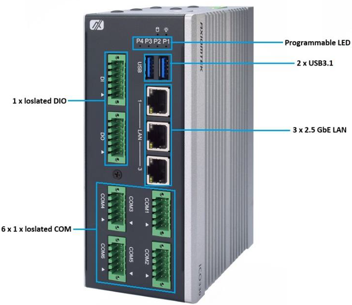

<div align="right">

[**Back to Top**](#test-guide)

</div>

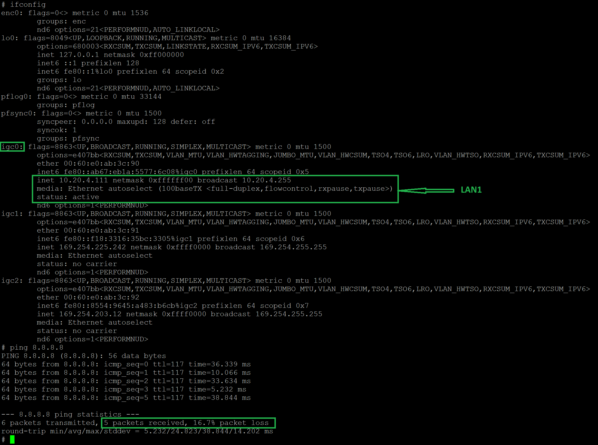

<div align="right">

[**Back to Top**](#test-guide)

</div>

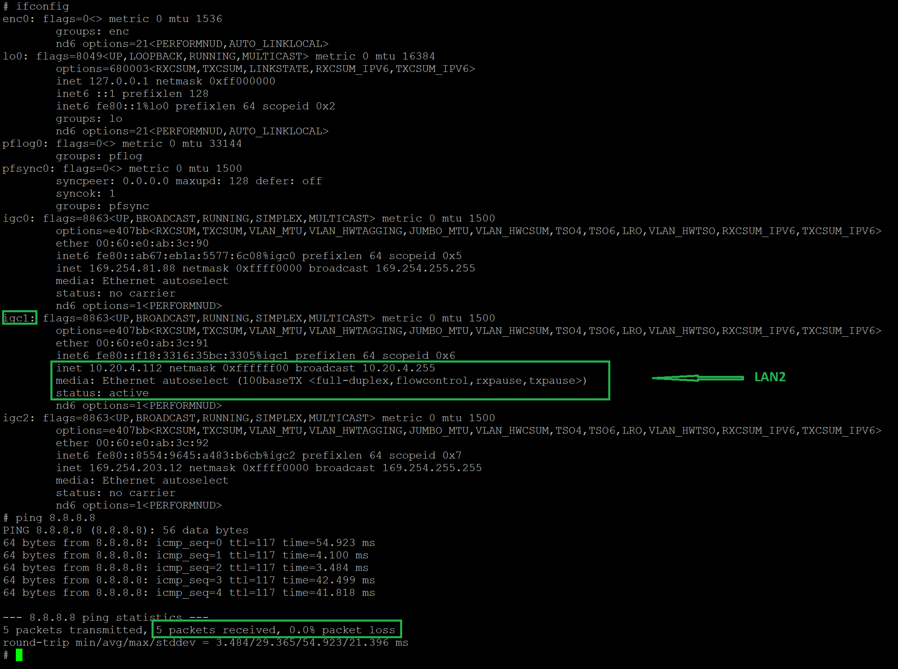

<div align="right">

[**Back to Top**](#test-guide)

</div>

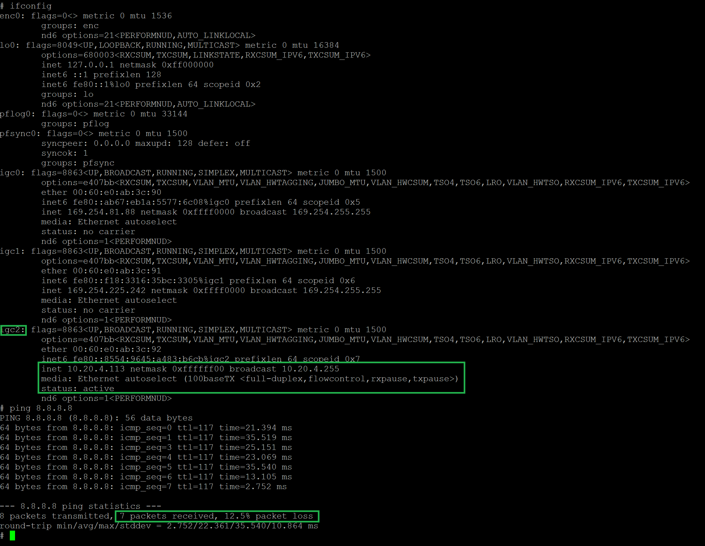


<div align="right">

[**Back to Top**](#test-guide)

</div>

### Throughput Test


<div align="right">

[**Back to Top**](#test-guide)

</div>


Use `iperf3` to test the Ethernet network throughput. In this example, **ICO330** operates as the client, while the Linux test machine operates as the server:

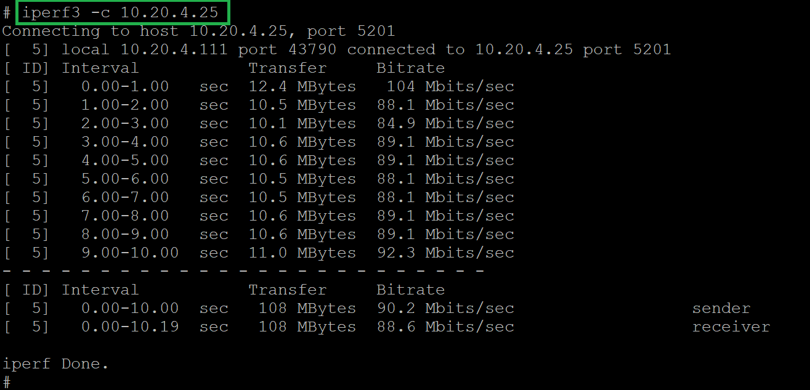


<div align="right">

[**Back to Top**](#test-guide)

</div>


<div align="right">

[**Back to Top**](#test-guide)

</div>


---


## USB


<div align="right">

[**Back to Top**](#test-guide)

</div>


|USB Interface Type|Connector Name|
| :---: | :---: | 
|USB3.1|USB|


<div align="right">

[**Back to Top**](#test-guide)

</div>


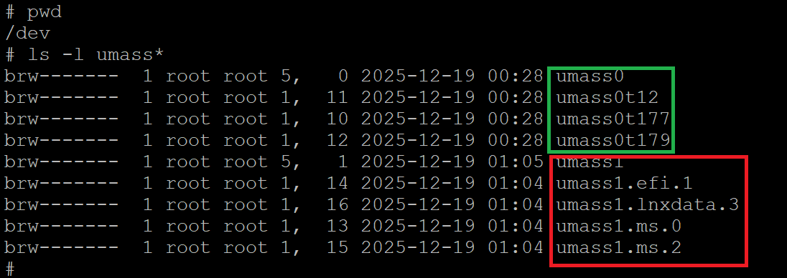

<div align="right">

[**Back to Top**](#test-guide)

</div>

#### USB 3.1 Read Test


<div align="right">

[**Back to Top**](#test-guide)

</div>


Perform a USB 3.1 read test using a USB 3.0 flash drive with `fsync`:

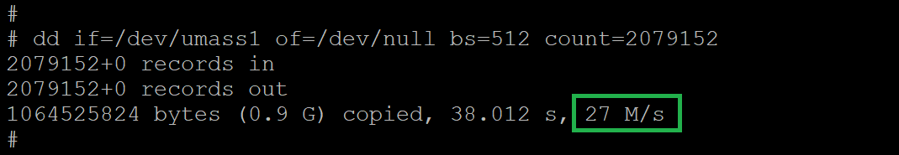

<div align="right">

[**Back to Top**](#test-guide)

</div>

#### USB 3.1 Write Test


<div align="right">

[**Back to Top**](#test-guide)

</div>


Perform a USB 3.1 write test using a USB 3.0 flash drive with `fsync`:

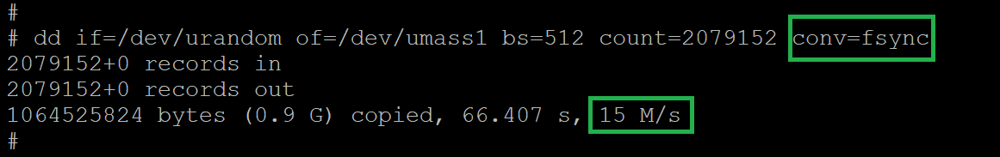

<div align="right">

[**Back to Top**](#test-guide)

</div>


---


## COM


<div align="right">

[**Back to Top**](#test-guide)

</div>


<div align="right">

[**Back to Top**](#test-guide)

</div>


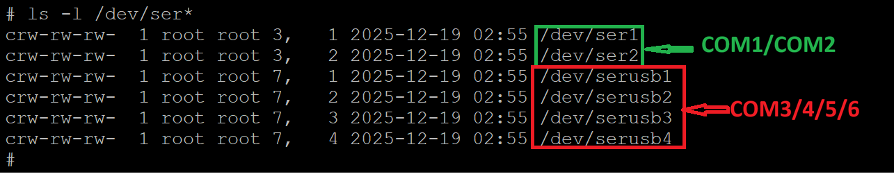

<div align="right">

[**Back to Top**](#test-guide)

</div>


### COM1/COM2


<div align="right">

[**Back to Top**](#test-guide)

</div>


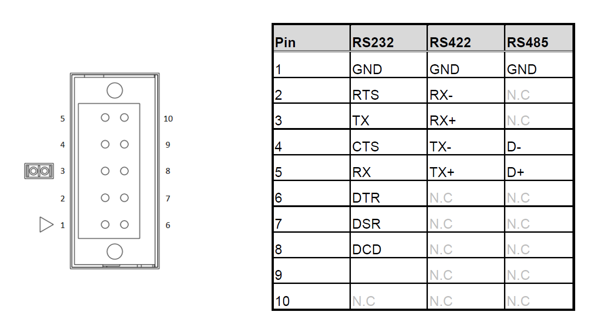

<div align="right">

[**Back to Top**](#test-guide)

</div>

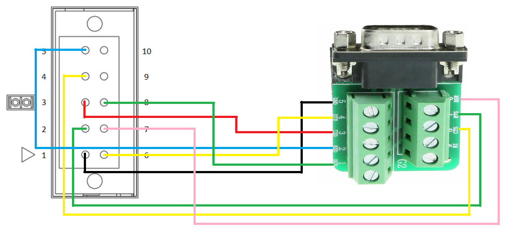

<div align="right">

[**Back to Top**](#test-guide)

</div>

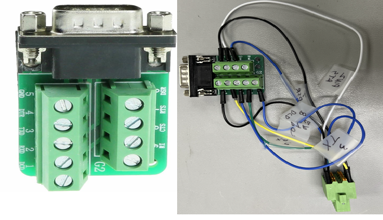

<div align="right">

[**Back to Top**](#test-guide)

</div>

### COM3/COM4/COM5/COM6


<div align="right">

[**Back to Top**](#test-guide)

</div>


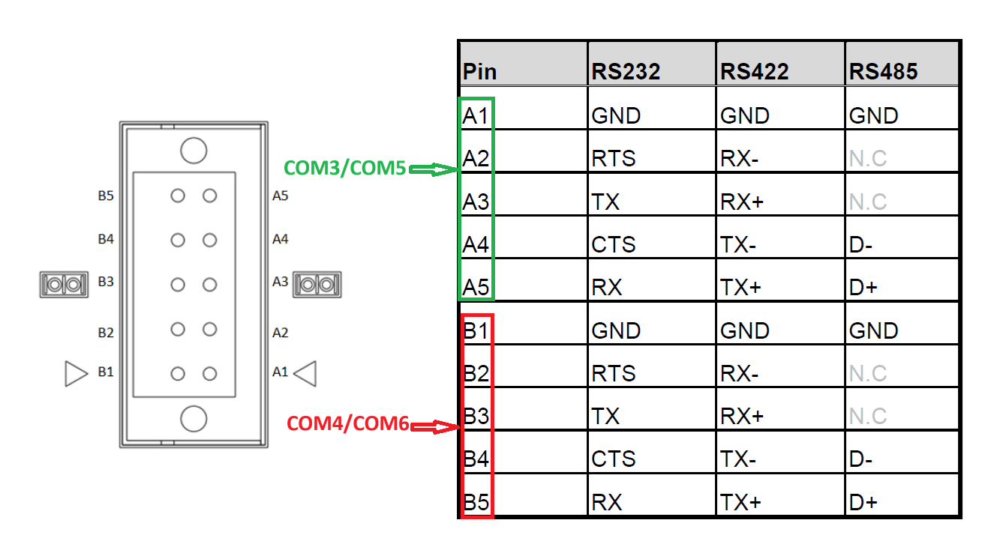

<div align="right">

[**Back to Top**](#test-guide)

</div>


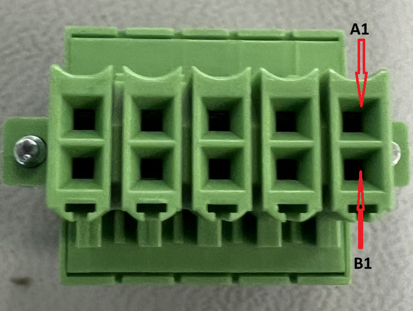

<div align="right">

[**Back to Top**](#test-guide)

</div>


#### COM3/COM5


<div align="right">

[**Back to Top**](#test-guide)

</div>


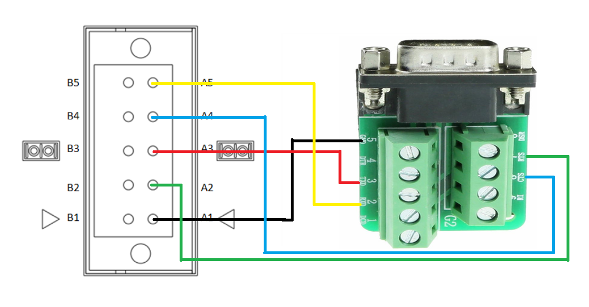

<div align="right">

[**Back to Top**](#test-guide)

</div>

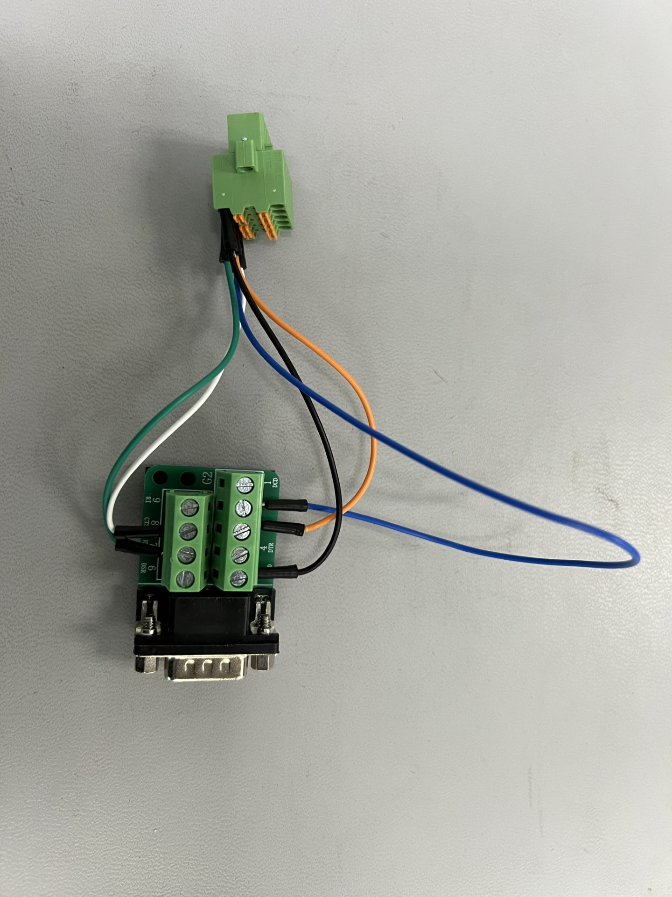

<div align="right">

[**Back to Top**](#test-guide)

</div>

#### COM4/COM6


<div align="right">

[**Back to Top**](#test-guide)

</div>


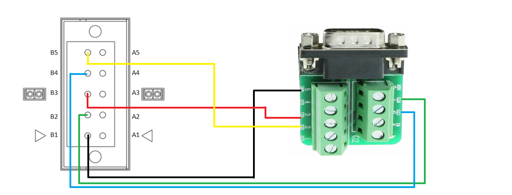

<div align="right">

[**Back to Top**](#test-guide)

</div>

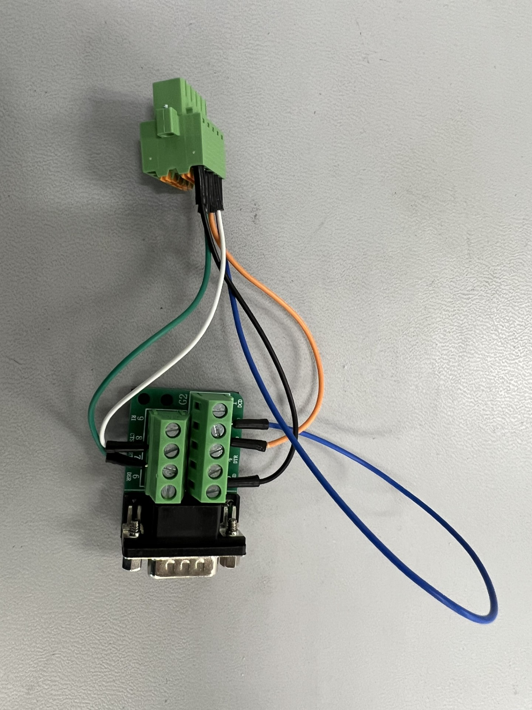

<div align="right">

[**Back to Top**](#test-guide)

</div>

Use a **USB-to-RS232 (male) cable** and connect the USB end to the test PC.  

Verify that the serial devices are available:

```console
# cd dev
# pwd
/dev
# ls -l ser*
crw-rw-rw-  1 root root 3,   1 2025-02-21 06:36 ser1
...
#
```
Assume COM1 is connected: 
```console
# echo hello > /dev/ser1
hello
```

<div align="right">

[**Back to Top**](#test-guide)

</div>

---

## SMBus


<div align="right">

[**Back to Top**](#test-guide)

</div>


<div align="right">

[**Back to Top**](#test-guide)

</div>


---

## Digital I/O Connector


<div align="right">

[**Back to Top**](#test-guide)

</div>


<div align="right">

[**Back to Top**](#test-guide)

</div>


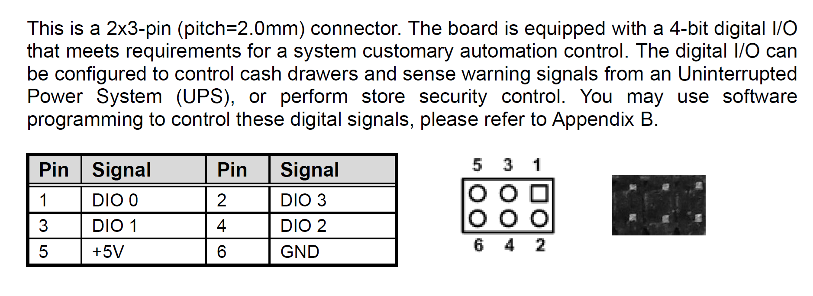


<div align="right">

[**Back to Top**](#test-guide)

</div>


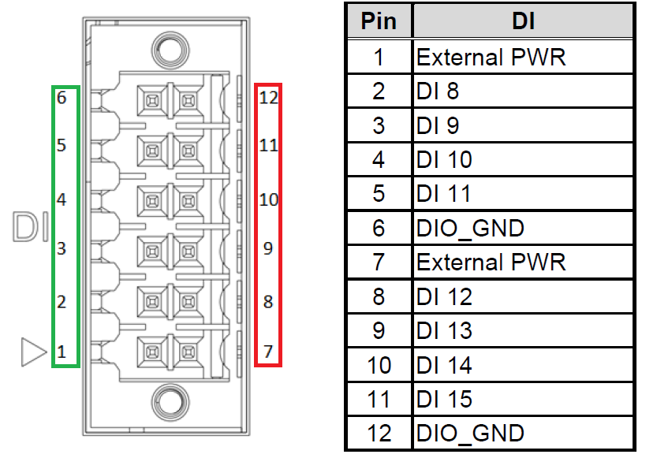


<div align="right">

[**Back to Top**](#test-guide)

</div>


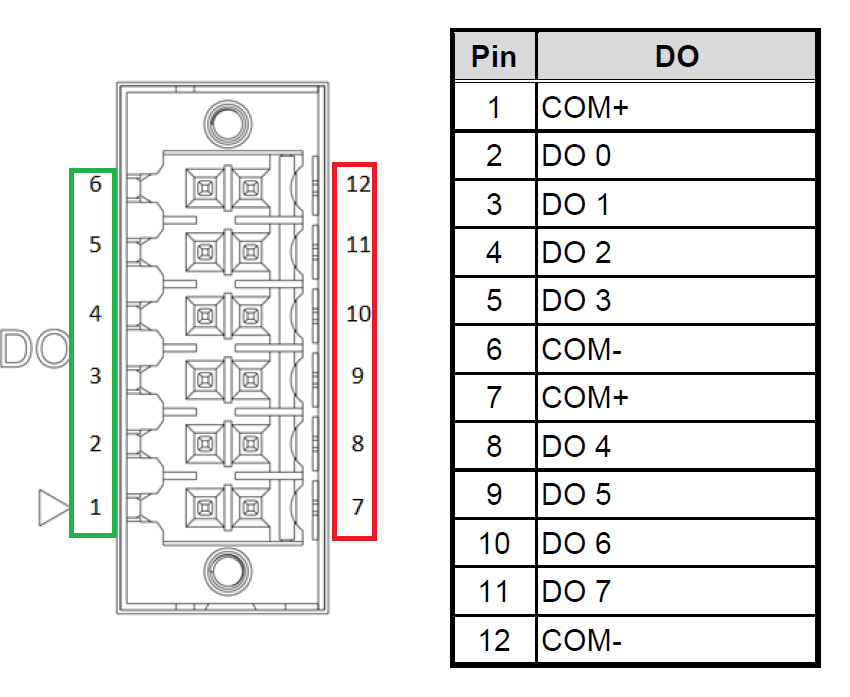


<div align="right">

[**Back to Top**](#test-guide)

</div>


A shared library has been created to configure and control the DI/DO functions.

Two example test applications, `ico330_dio_read_test` and `ico330_dio_write_test`, are provided to demonstrate how to use the library.

### Input Test: Dry Contact 


<div align="right">

[**Back to Top**](#test-guide)

</div>


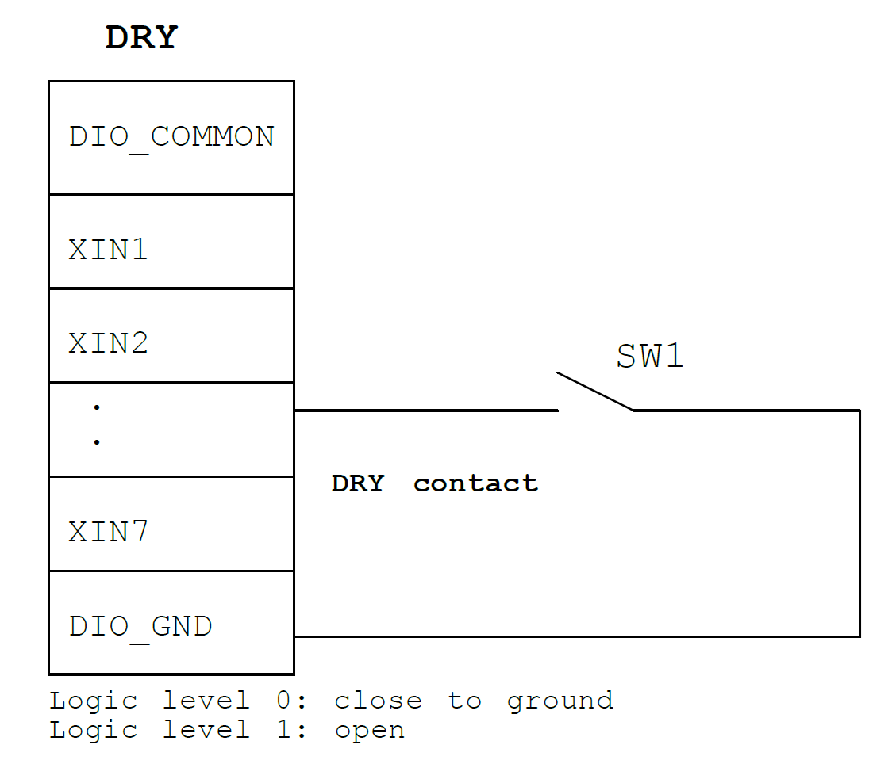


<div align="right">

[**Back to Top**](#test-guide)

</div>


```console
# ls
bin  etc   lib   root  scripts  tmp  var
dev  home  proc  sbin  sys      usr
# ls -al /usr/bin/ico330_dio*
-rwxr-xr-x  1 root root 8192 2025-12-17 01:27 /usr/bin/ico330_dio_read_test
-rwxr-xr-x  1 root root 8192 2025-12-17 01:28 /usr/bin/ico330_dio_write_test
#
```

#### No DI Pins Grounded


With no pins grounded, all digital inputs are pulled high.

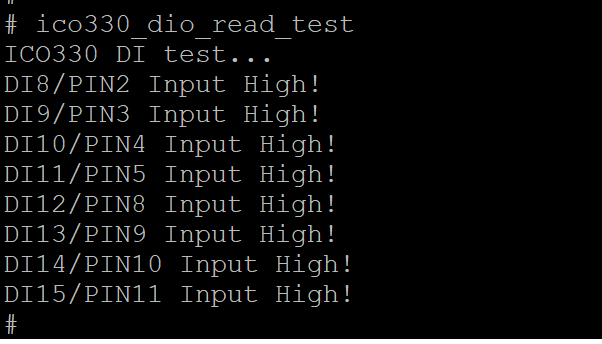


<div align="right">

[**Back to Top**](#test-guide)

</div>

#### Pin 2 Grounded

Connect Pin 2 to Pin 12 (Pin 2 grounded):

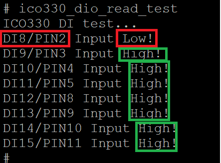


<div align="right">

[**Back to Top**](#test-guide)

</div>

#### Pin 3 Grounded

Connect Pin 3 to Pin 12 (Pin 3 grounded):

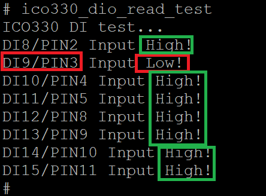


<div align="right">

[**Back to Top**](#test-guide)

</div>

#### Pin 4 Grounded

Connect Pin 4 to Pin 12 (Pin 4 grounded):

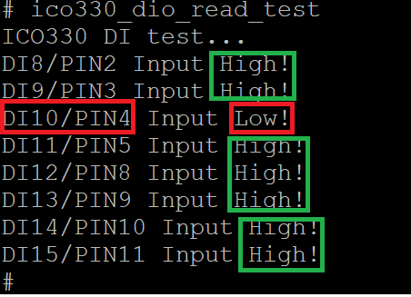


<div align="right">

[**Back to Top**](#test-guide)

</div>

#### Pin 5 Grounded

Connect Pin 5 to Pin 12 (Pin 5 grounded):

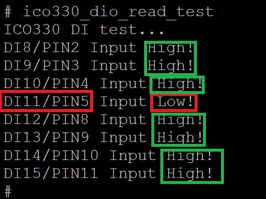


<div align="right">

[**Back to Top**](#test-guide)

</div>

#### Pin 8 Grounded

Connect Pin 8 to Pin 12 (Pin 8 grounded):

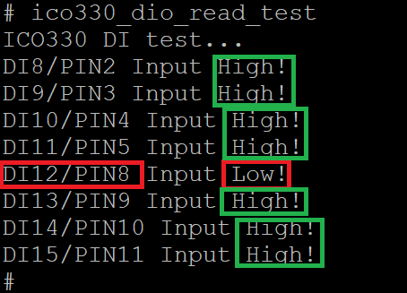


<div align="right">

[**Back to Top**](#test-guide)

</div>

#### Pin 9 Grounded

Connect Pin 9 to Pin 12 (Pin 9 grounded):

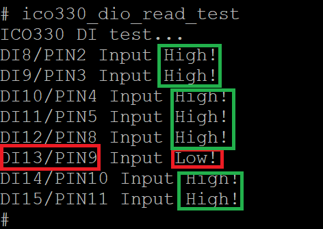


<div align="right">

[**Back to Top**](#test-guide)

</div>

#### Pin 10 Grounded

Connect Pin 10 to Pin 12 (Pin 10 grounded):

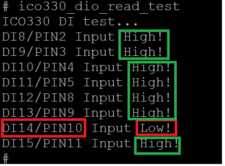


<div align="right">

[**Back to Top**](#test-guide)

</div>


#### Pin 11 Grounded

Connect Pin 11 to Pin 12 (Pin 11 grounded):

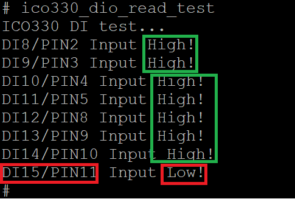


<div align="right">

[**Back to Top**](#test-guide)

</div>


### Input Test: Wet Contact


<div align="right">

[**Back to Top**](#test-guide)

</div>


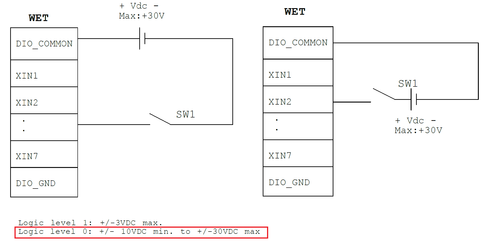


<div align="right">

[**Back to Top**](#test-guide)

</div>


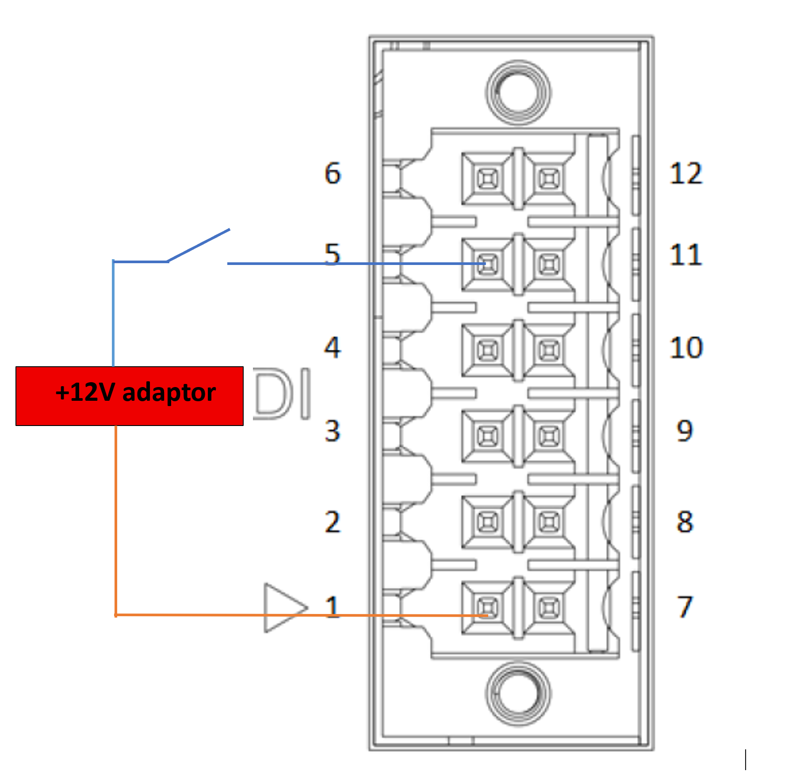


<div align="right">

[**Back to Top**](#test-guide)

</div>


`Switch ON`:

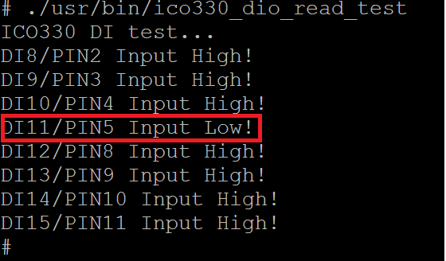


<div align="right">

[**Back to Top**](#test-guide)

</div>


`Switch OFF`:

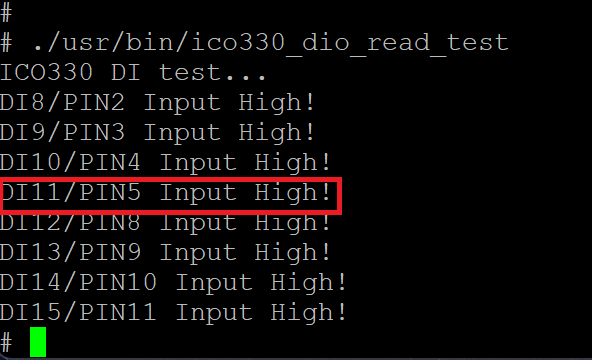


<div align="right">

[**Back to Top**](#test-guide)

</div>


### Output Test


<div align="right">

[**Back to Top**](#test-guide)

</div>


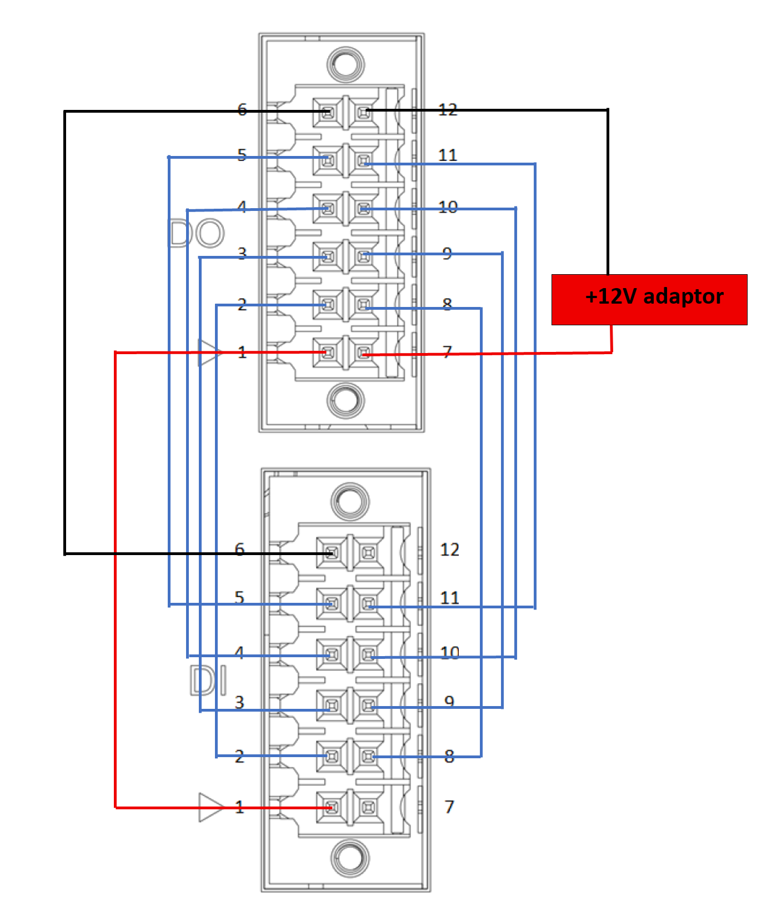


<div align="right">

[**Back to Top**](#test-guide)

</div>


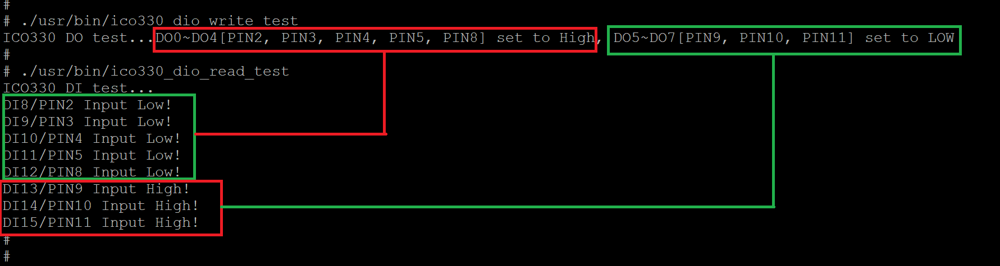


<div align="right">

[**Back to Top**](#test-guide)

</div>


> **Note:**

GPOx = "1" --> XOUTx = "0" --> GPIx = "0"

GPOx = "0" --> XOUTx = "COMM+" = "1" --> GPIx = "1"


<div align="right">

[**Back to Top**](#test-guide)

</div>

---

## Watchdog


<div align="right">

[**Back to Top**](#test-guide)

</div>


The `WDTRST#` signal is generated by the `F81804` Super I/O controller.

A shared library, `libico330_wdt.so`, has been created to support the watchdog function.

The following is an example using this library:


<div align="right">

[**Back to Top**](#test-guide)

</div>

---

## Programmable LEDs


<div align="right">

[**Back to Top**](#test-guide)

</div>


A shared library, libpl-ico330.so, has been created to control the programmable LEDs.

The following example demonstrates how to use this library. In this example, P1, P2, and P4 are ON, while P3 is OFF:
 


<div align="right">

[**Back to Top**](#test-guide)

</div>


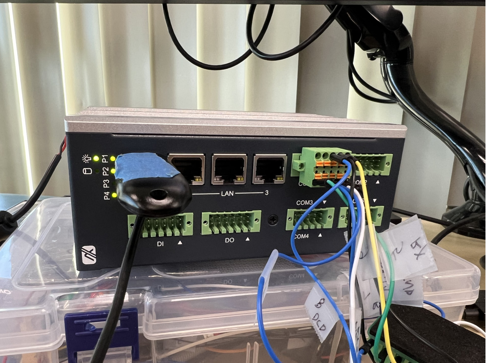


<div align="right">

[**Back to Top**](#test-guide)

</div>

---

## Hardware Monitor


<div align="right">

[**Back to Top**](#test-guide)

</div>


A shared library, `libico330_hw_mon.so`, has been created to support hardware monitoring.

The following example demonstrates how to use this library:

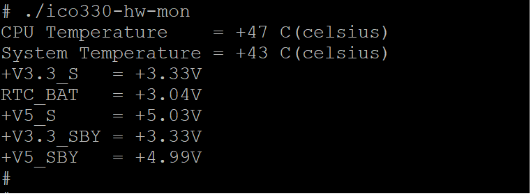


<div align="right">

[**Back to Top**](#test-guide)

</div>

---

## M.2 Key B Connector (CN4)


<div align="right">

[**Back to Top**](#test-guide)

</div>


After inserting the **Transcend TS128GMTE452T2** NVMe storage module:

check the `/dev` directory: 

```console
#
# ls -al /dev/nvme*
brw-------  1 root root 4,   0 2021-01-02 01:06 /dev/nvme0
#
```

Use `pci-tool` to verify that the device is detected:

```console
# pci-tool -v

Partition: pci

Managing Server ID: 1, pid: 20487, running
B000:D00:F00 @ idx 0
        vid/did: 8086/4678
                Intel Corporation, <device id - unknown>
        class/subclass/reg: 06/00/00
                Host-to-PCI Bridge Device

B000:D02:F00 @ idx 1
        vid/did: 8086/46d1
                Intel Corporation, <device id - unknown>
        class/subclass/reg: 03/00/00
                PC Compatible VGA Display Controller

.
.
.
B001:D00:F00 @ idx 15 in slot 4 of chassis 0
        vid/did: 1d79/2263
                <vendor id - unknown>, <device id - unknown>
        class/subclass/reg: 01/08/02
                Non-volatile Memory Subsystem (NVMe Interface IO Controller)
.
.
.

B003:D00:F00 @ idx 17 in slot 14 of chassis 0
        vid/did: 8086/125c
                Intel Corporation, <device id - unknown>
        class/subclass/reg: 02/00/00
                Ethernet Network Controller
```

<div align="right">

[**Back to Top**](#test-guide)

</div>

---

## M.2 Key E Connector (CN7)


<div align="right">

[**Back to Top**](#test-guide)

</div>


After inserting the **Intel® 9260NGW Wi-Fi module**, use `pci-tool` -v to verify that the device is detected::

```console
# pci-tool -v

Partition: pci

Managing Server ID: 1, pid: 20487, running
B000:D00:F00 @ idx 0
        vid/did: 8086/4678
                Intel Corporation, <device id - unknown>
        class/subclass/reg: 06/00/00
                Host-to-PCI Bridge Device

B000:D02:F00 @ idx 1
        vid/did: 8086/46d1
                Intel Corporation, <device id - unknown>
        class/subclass/reg: 03/00/00
                PC Compatible VGA Display Controller

.
.
.
B003:D00:F00 @ idx 17 in slot 15 of chassis 0
        vid/did: 8086/2526
                Intel Corporation, <device id - unknown>
        class/subclass/reg: 02/80/00
                Other Network Controller
```


<div align="right">

[**Back to Top**](#test-guide)

</div>

---

[**Back to ICO330 BSP**](../README.md)
