[**Back to MANO560 BSP**](../README.md)

---

# Test Guide

This guide describes the basic functional tests performed on the Axiomtek MANO560 platform running QNX 8.0.3.


* [Basic Function Test Items](#basic-function-test-items)
    - [SATA (CN7)](#sata-cn7)
    - [Display](#display)
    - [Ethernet](#ethernet)
    - [USB](#usb)
    - [COMx](#comx)
    - [Digital I/O Connector (CN26)](#digital-io-connector-cn26)
    - [Watchdog](#watchdog)
    - [M.2 Key E Socket (CN22)](#m2-key-e-socket-cn22)
    - [M.2 Key B Socket (SCN1)](#m2-key-b-socket-scn1)
    - [PCIe Mini Card Connector (CN21)](#pcie-mini-card-connector-cn21) 
    - [PCIe x16 (CN20)](#pcie-x16-cn20) 
    - [Audio Jack (CN82)](#audio-jack-cn82)
    - [Audio Header (CN52)](#audio-header-cn52)
    - [SPI Header (CN81)](#spi-header-cn81)
    

<div align="right">

[**Back to Top**](#test-guide)

</div>


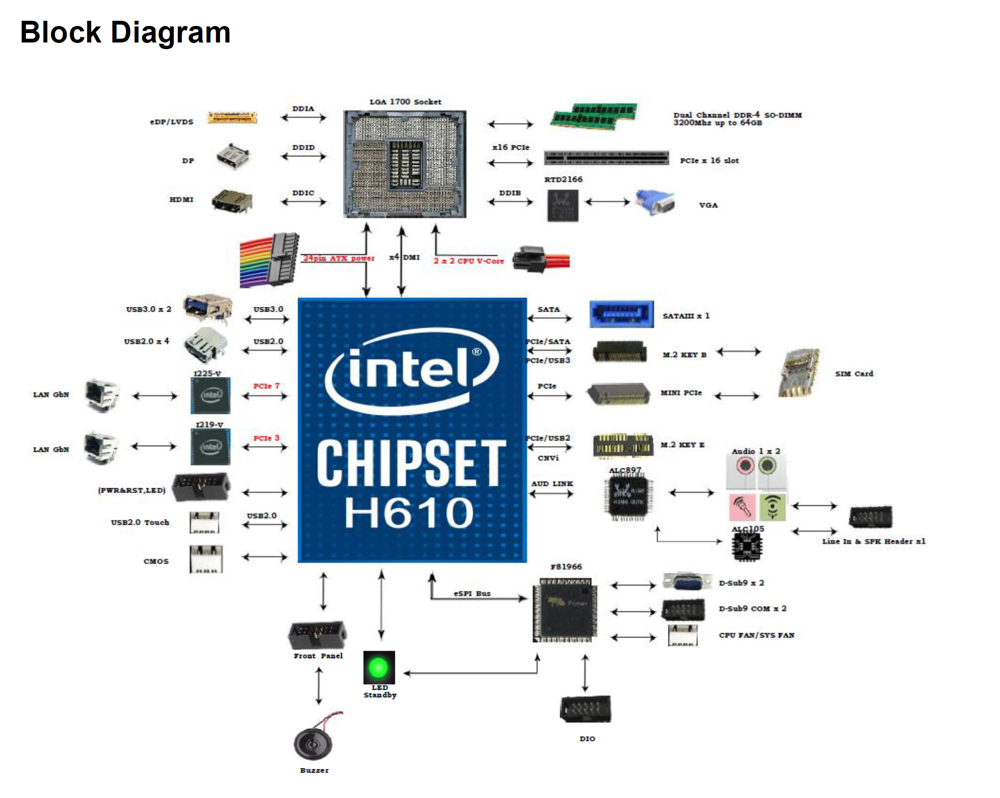


<div align="right">

[**Back to Top**](#test-guide)

</div>


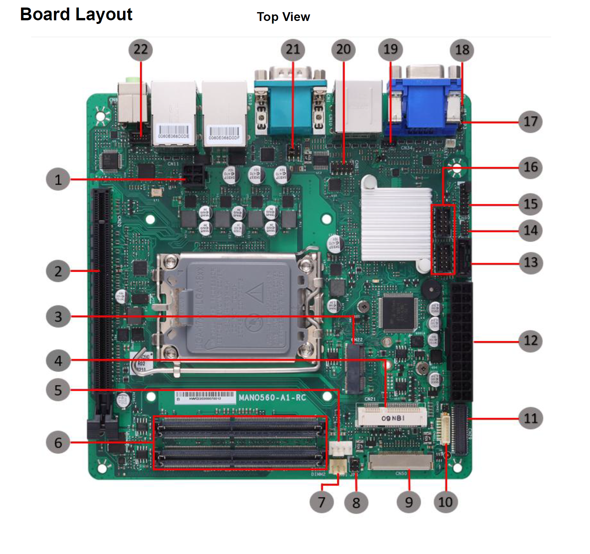


<div align="right">

[**Back to Top**](#test-guide)

</div>


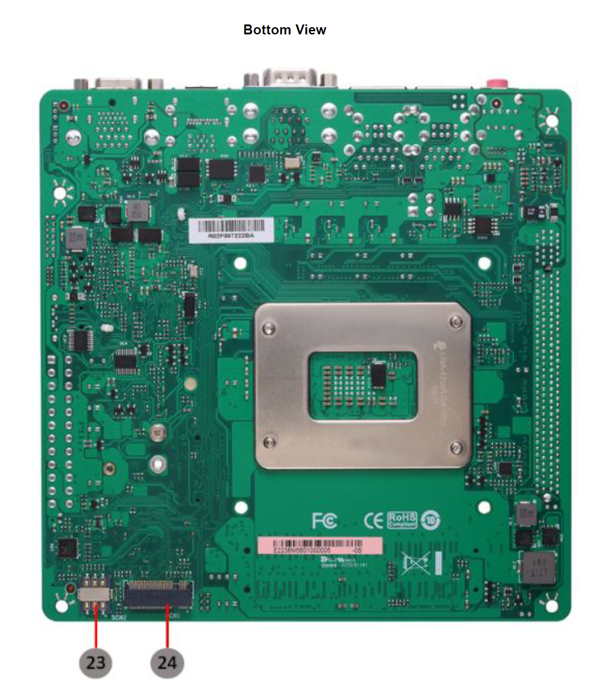


<div align="right">

[**Back to Top**](#test-guide)

</div>


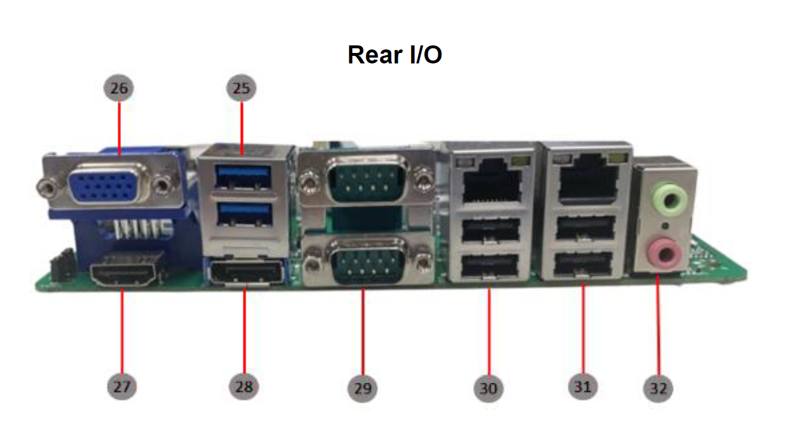


<div align="right">

[**Back to Top**](#test-guide)

</div>


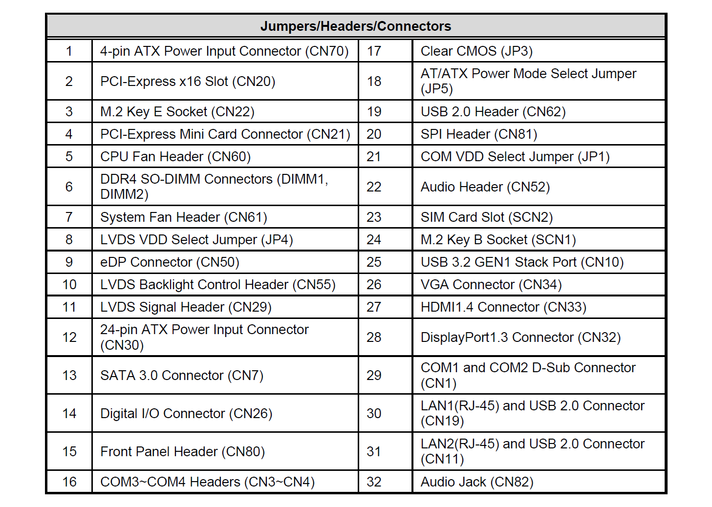


<div align="right">

[**Back to Top**](#test-guide)

</div>


---

# Basic Function Test Items


<div align="right">

[**Back to Top**](#test-guide)

</div>
 


---


## SATA (CN7)


<div align="right">

[**Back to Top**](#test-guide)

</div>
 


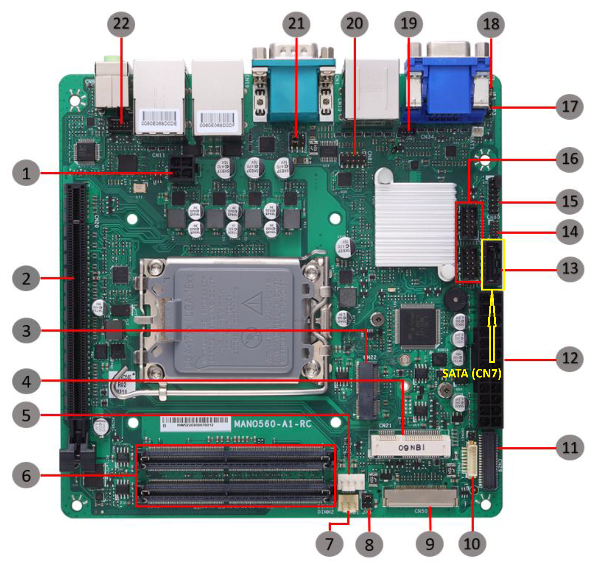


<div align="right">

[**Back to Top**](#test-guide)

</div>


Connect one SATA Disk to the board.

Check `/dev` directory:


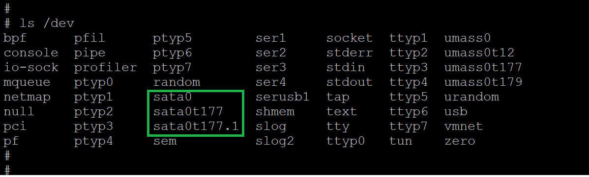


<div align="right">

[**Back to Top**](#test-guide)

</div>


Use `pci-tool -v` to verify that the SATA controller is detected:

```console
# pci-tool -v

Partition: pci

Managing Server ID: 1, pid: 20487, running
B000:D00:F00 @ idx 0
        vid/did: 8086/4668
                Intel Corporation, <device id - unknown>
        class/subclass/reg: 06/00/00
                Host-to-PCI Bridge Device

B000:D02:F00 @ idx 1
        vid/did: 8086/4680
                Intel Corporation, <device id - unknown>
        class/subclass/reg: 03/00/00
                PC Compatible VGA Display Controller

B000:D10:F00 @ idx 2
        vid/did: 8086/467d
                Intel Corporation, <device id - unknown>
        class/subclass/reg: 11/80/00
                Other DA/DSP Controller

B000:D20:F00 @ idx 3
        vid/did: 8086/7ae0
                Intel Corporation, <device id - unknown>
        class/subclass/reg: 0c/03/30
                USB Serial Bus Controller (Intel eXtensible HCI)

.
.
.

B000:D23:F00 @ idx 8
        vid/did: 8086/7ae2
                Intel Corporation, <device id - unknown>
        class/subclass/reg: 01/06/01
                SATA Mass Storage Controller (AHCI Interface)

B000:D31:F06 @ idx 14
        vid/did: 8086/1a1d
                Intel Corporation, <device id - unknown>
        class/subclass/reg: 02/00/00
                Ethernet Network Controller

B001:D00:F00 @ idx 15 in slot 10 of chassis 0
        vid/did: 8086/15f3
                Intel Corporation, <device id - unknown>
        class/subclass/reg: 02/00/00
                Ethernet Network Controller

#
```


<div align="right">

[**Back to Top**](#test-guide)

</div>


---


## Display


<div align="right">

[**Back to Top**](#test-guide)

</div>
 


|Display Interface|Connector Name|DisplayName shown in QNX8.0.3|I7-12700TE|I7-14700T|
| :---: | :---: | :---: | :---: | :---: |
|VGA|CN34|display 2: DisplayPort (DP-1)|OK|OK|
|HDMI|CN33|display 3: HDMI-A (HDMI-A-1)|OK|OK|
|DisplayPort++|CN32|display 4: DisplayPort (DP-2)|OK|OK|


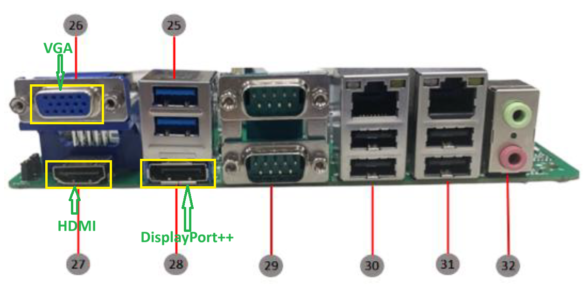


<div align="right">

[**Back to Top**](#test-guide)

</div>


Run the following commands to start the graphics demo:

```text
$ graphics_start.sh

# display_id=3 for HDMI Interface
$ gles2-gears -display=3 &

```


<div align="right">

[**Back to Top**](#test-guide)

</div>


---


## Ethernet


<div align="right">

[**Back to Top**](#test-guide)

</div>
 


The board provides two Ethernet ports: LAN1 and LAN2..


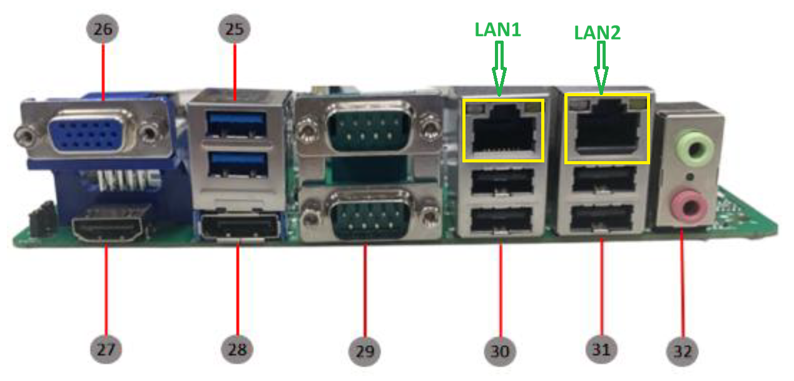


<div align="right">

[**Back to Top**](#test-guide)

</div>


### LAN1


<div align="right">

[**Back to Top**](#test-guide)

</div>
 


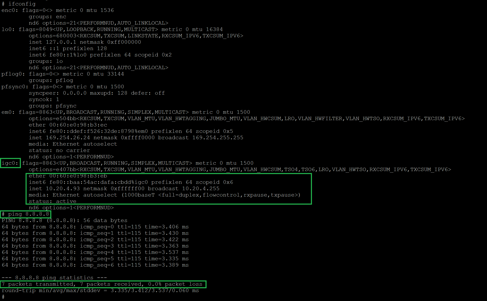


<div align="right">

[**Back to Top**](#test-guide)

</div>


#### Throughput Test


<div align="right">

[**Back to Top**](#test-guide)

</div>
 


Use `iperf3` to test the LAN1 network throughput. In this example, **MANO560** operates as the client, while the Linux test machine operates as the server:

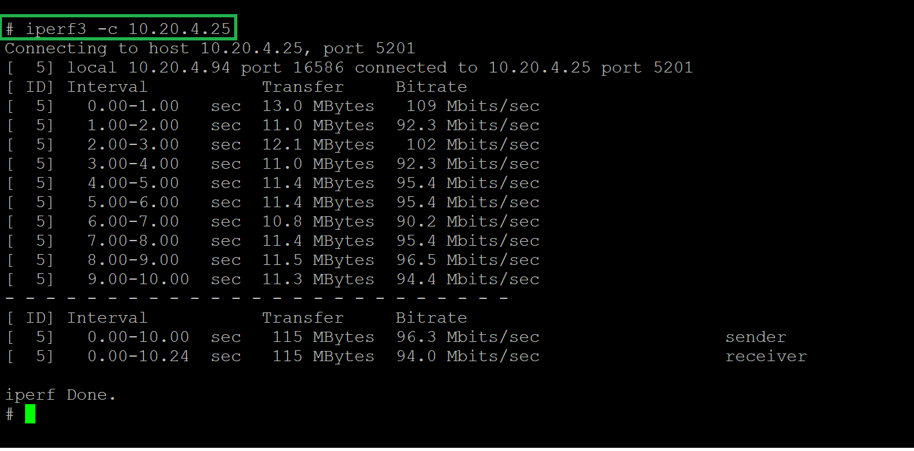


<div align="right">

[**Back to Top**](#test-guide)

</div>


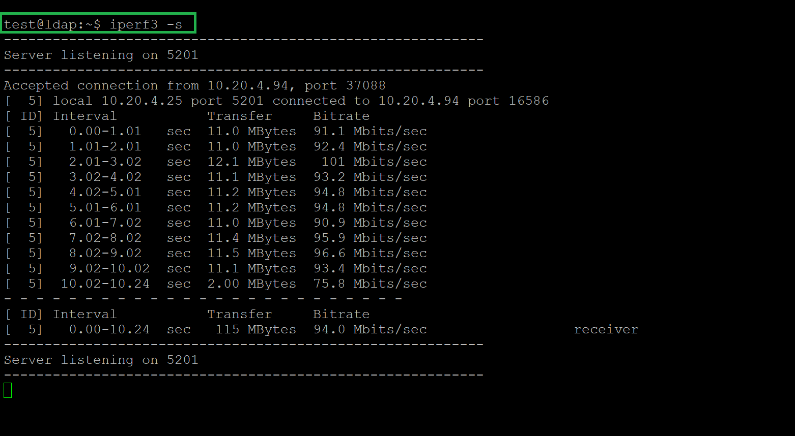


<div align="right">

[**Back to Top**](#test-guide)

</div>


### LAN2


<div align="right">

[**Back to Top**](#test-guide)

</div>
 


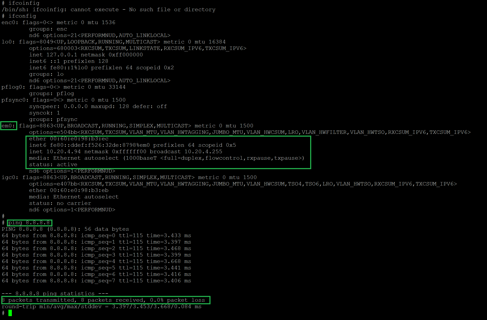


<div align="right">

[**Back to Top**](#test-guide)

</div>


#### Throughput Test


<div align="right">

[**Back to Top**](#test-guide)

</div>
 


Use `iperf3` to test the LAN2 network throughput:

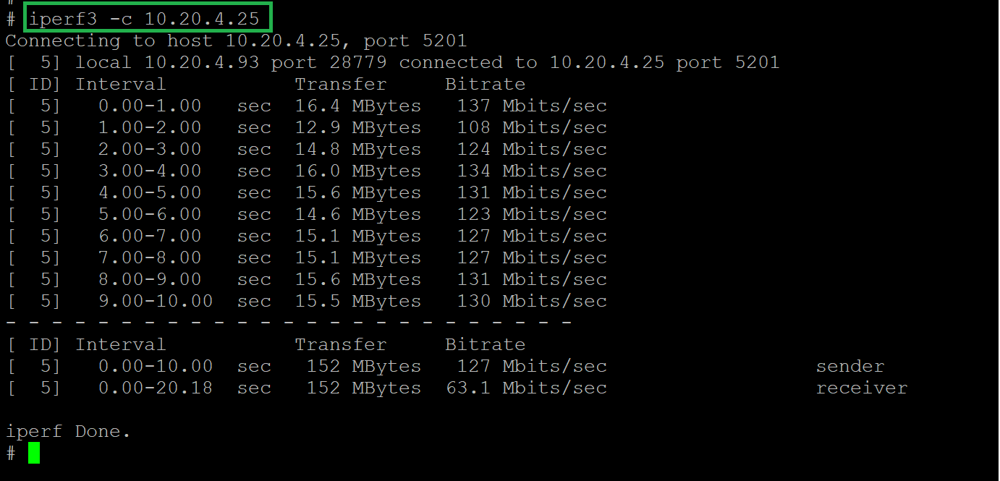


<div align="right">

[**Back to Top**](#test-guide)

</div>


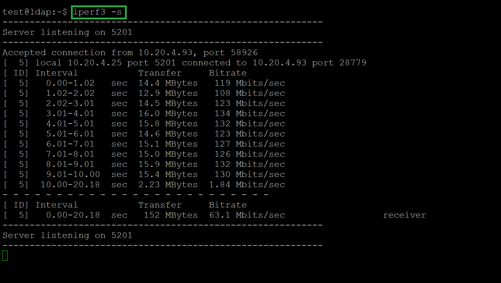


<div align="right">

[**Back to Top**](#test-guide)

</div>


---


## USB


<div align="right">

[**Back to Top**](#test-guide)

</div>
 


|USB Interface Type|Connector Name|
|:---:|:---:|
|USB2.0|CN11/CN19|
|USB2.0|CN62|
|USB3.2|CN10|


<div align="right">

[**Back to Top**](#test-guide)

</div>


### USB2.0


<div align="right">

[**Back to Top**](#test-guide)

</div>
 


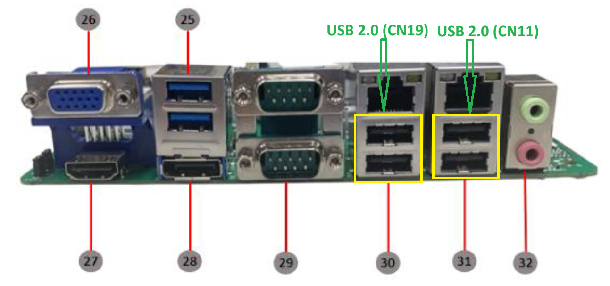


<div align="right">

[**Back to Top**](#test-guide)

</div>


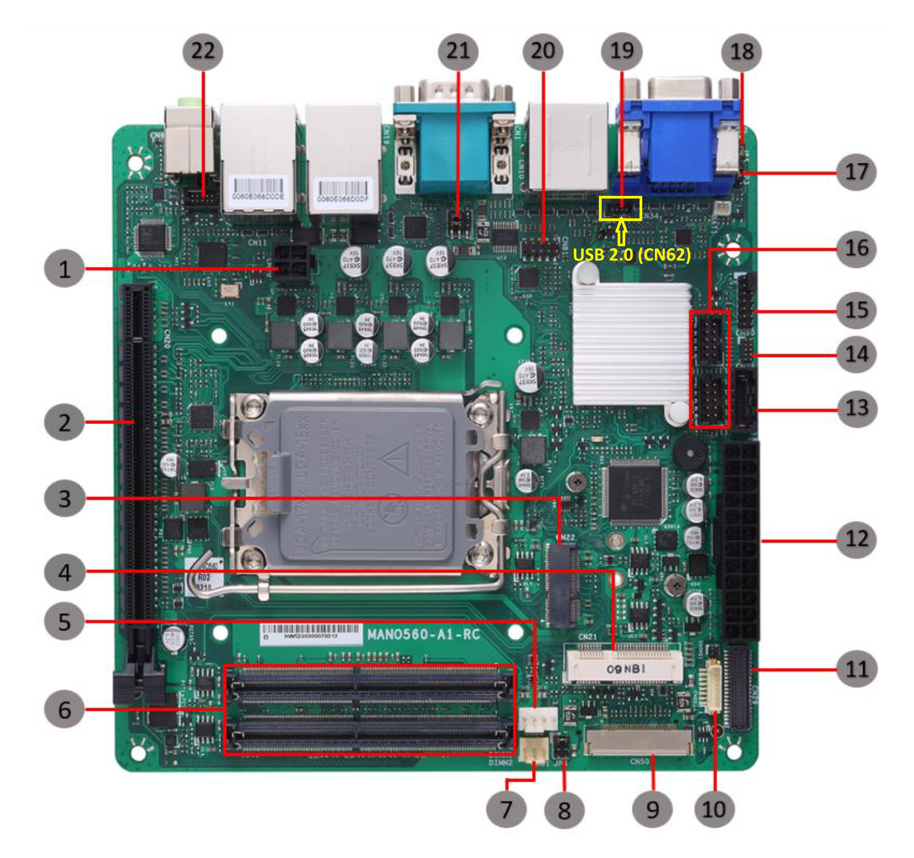


<div align="right">

[**Back to Top**](#test-guide)

</div>


A USB cable (P/N: **594P8802810E**) is required to test the USB 2.0 header (CN62)..

Before inserting a USB flash drive into a USB 2.0 port:

```console
# cd dev
# ls -l umass*
brw-------  1 root root 4,   0 2026-03-19 08:37 umass0
brw-------  1 root root 1,  11 2026-03-19 08:37 umass0t12
brw-------  1 root root 1,  10 2026-03-19 08:37 umass0t177
brw-------  1 root root 1,  12 2026-03-19 08:37 umass0t179
#

# pwd
/dev
```
After inserting a USB flash drive into a USB 2.0 port:

```console
# ls -l umass*
brw-------  1 root root 4,   0 2026-03-19 08:37 umass0
brw-------  1 root root 1,  11 2026-03-19 08:37 umass0t12
brw-------  1 root root 1,  10 2026-03-19 08:37 umass0t177
brw-------  1 root root 1,  12 2026-03-19 08:37 umass0t179
brw-------  1 root root 4,   1 2026-03-19 08:44 umass1
brw-------  1 root root 1,  13 2026-03-19 08:44 umass1t179
#
```


<div align="right">

[**Back to Top**](#test-guide)

</div>


After inserting two USB flash drives into USB 2.0 ports:

```console
# ls -l umass*
brw-------  1 root root 4,   0 2026-03-19 08:37 umass0
brw-------  1 root root 1,  11 2026-03-19 08:37 umass0t12
brw-------  1 root root 1,  10 2026-03-19 08:37 umass0t177
brw-------  1 root root 1,  12 2026-03-19 08:37 umass0t179
brw-------  1 root root 4,   1 2026-03-19 08:44 umass1
brw-------  1 root root 1,  13 2026-03-19 08:44 umass1t179
brw-------  1 root root 4,   2 2026-03-19 08:46 umass2
brw-------  1 root root 1,  14 2026-03-19 08:45 umass2t11
#
```


<div align="right">

[**Back to Top**](#test-guide)

</div>


USB 2.0 port reading test (USB 2.0 flash drive):

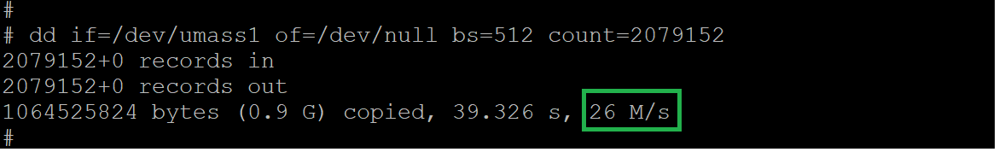


<div align="right">

[**Back to Top**](#test-guide)

</div>


USB 2.0 port writing test with 'fsync'(USB 2.0 flash drive):

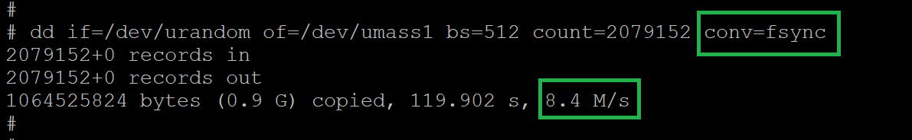


<div align="right">

[**Back to Top**](#test-guide)

</div>


### USB3.2


<div align="right">

[**Back to Top**](#test-guide)

</div>
 


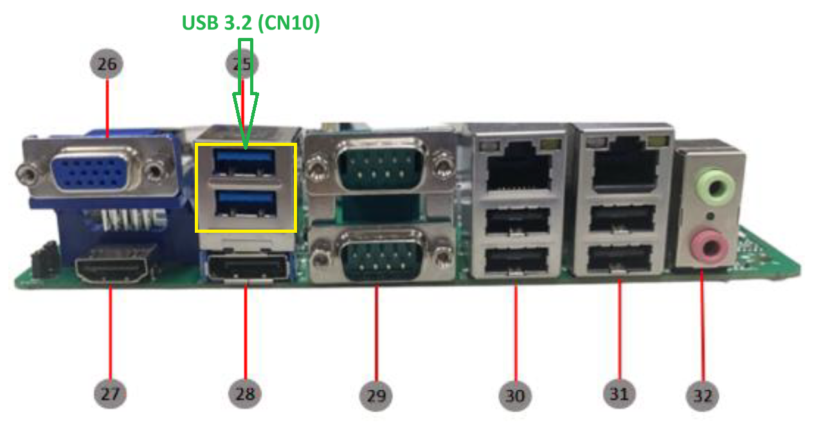


<div align="right">

[**Back to Top**](#test-guide)

</div>


Perform the same read and write tests described for USB 2.0.


---


## COMx


<div align="right">

[**Back to Top**](#test-guide)

</div>
 


| COM Number | DevName | COM Wafer Connectors On Board |
|:---------:|:-----------------:|:-----------------:|
| 1 | /dev/ser1 | CN1 (Lower) |
| 2 | /dev/ser2 | CN1 (Upper) |
| 3 | /dev/ser3 | CN3 |
| 4 | /dev/ser4 | CN4 |

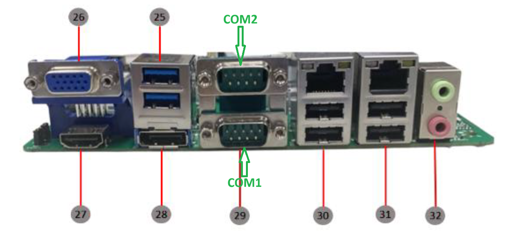


<div align="right">

[**Back to Top**](#test-guide)

</div>


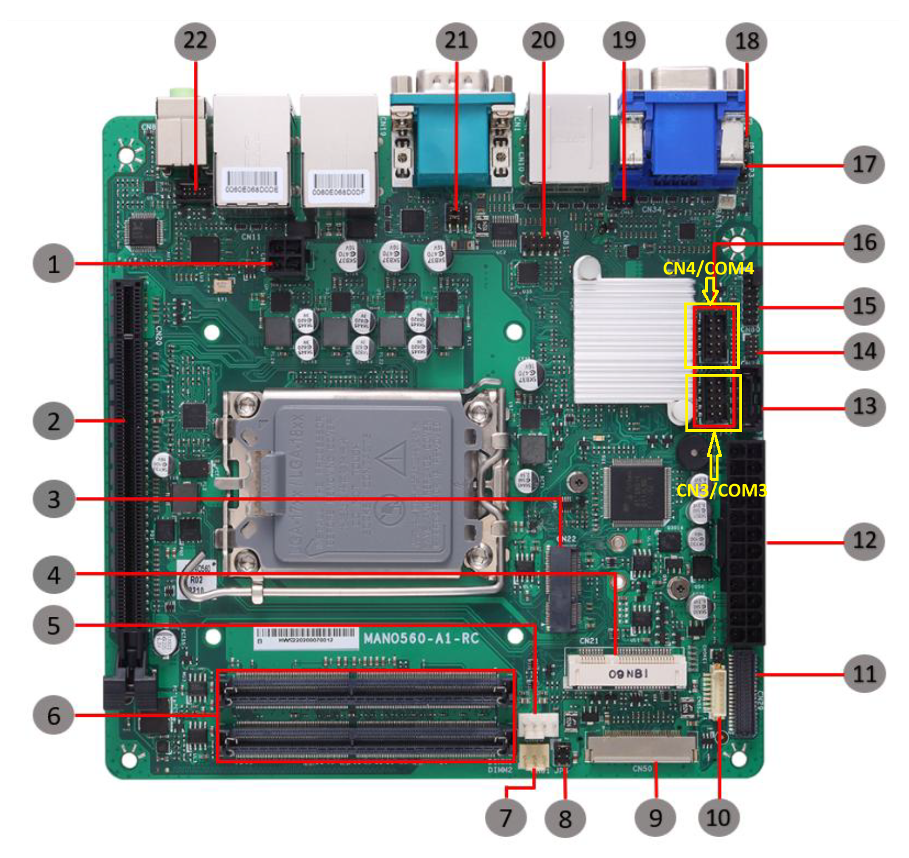


<div align="right">

[**Back to Top**](#test-guide)

</div>


Use a **USB-to-RS232 (male) cable**. Connect the USB end to the test PC.  

```console
# cd dev
# pwd
/dev
# ls -l ser?
crw-rw-rw-  1 root root 3,   1 2026-03-18 13:40 ser1
crw-rw-rw-  1 root root 3,   2 2026-03-18 13:40 ser2
crw-rw-rw-  1 root root 3,   3 2026-03-18 13:40 ser3
crw-rw-rw-  1 root root 3,   4 2026-03-18 13:40 ser4
#
```
Assume COM1 is connected: 
```console
# echo hello > /dev/ser1
hello
# echo hello > /dev/ser2
# echo hello > /dev/ser3
# echo hello > /dev/ser4
```


<div align="right">

[**Back to Top**](#test-guide)

</div>


---


## Digital I/O Connector (CN26)


<div align="right">

[**Back to Top**](#test-guide)

</div>
 


<div align="right">

[**Back to Top**](#test-guide)

</div>


According to the MANO560 User's Manual (page 17):

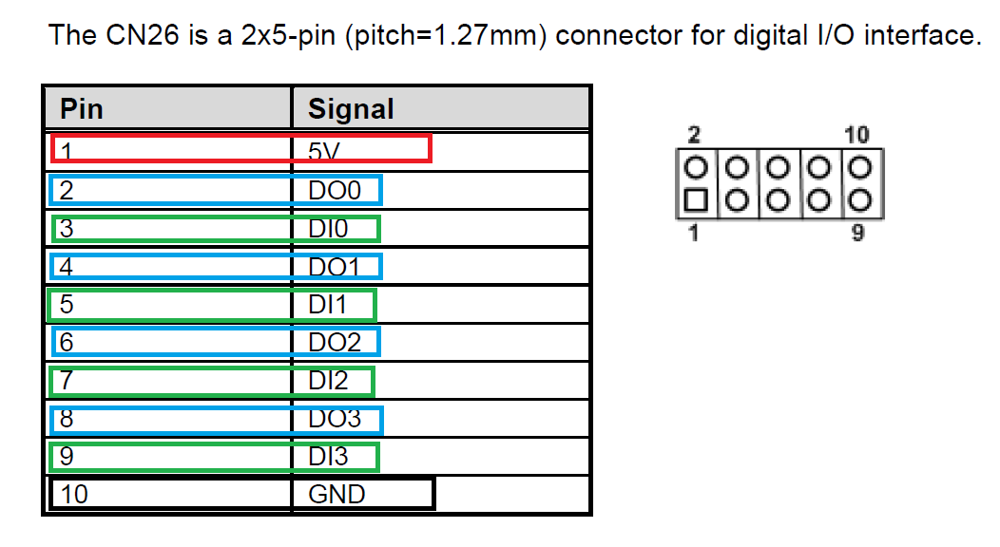


<div align="right">

[**Back to Top**](#test-guide)

</div>


A shared library has been created to configure and control the DIOs.

Two example test applications, `MANO560_input_test` and `MANO560_output_test`, are provided to demonstrate how to use the library.


```console
# ls
bin  etc   lib   root  scripts  tmp  var
dev  home  proc  sbin  sys      usr
# cd usr/bin
# pwd
/usr/bin
# ls -al /usr/bin/MANO*
-rwxr-xr-x  1 root root 8192 2025-07-31 20:39 /usr/bin/MANO560_input_test
-rwxr-xr-x  1 root root 8192 2025-07-31 20:39 /usr/bin/MANO560_output_test
```

<div align="right">

[**Back to Top**](#test-guide)

</div>


### Input Test


<div align="right">

[**Back to Top**](#test-guide)

</div>
 


#### No Pins Grounded 

With no pins grounded, all digital inputs are pulled high.

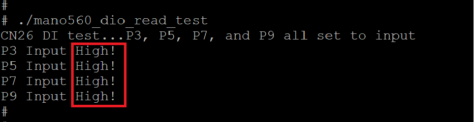


<div align="right">

[**Back to Top**](#test-guide)

</div>


#### Pin 3 Grounded

Connect Pin 10 to Pin 3 (Pin 3 is Grounded):

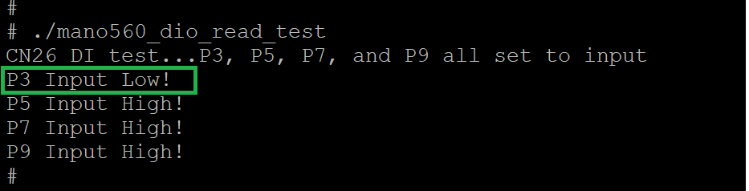


<div align="right">

[**Back to Top**](#test-guide)

</div>


#### Pin 5 Grounded

Connect Pin 10 to Pin 5 (Pin 5 is Grounded):

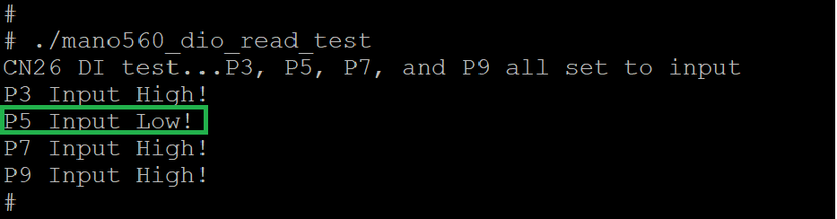


<div align="right">

[**Back to Top**](#test-guide)

</div>


#### Pin 7 Grounded

Connect Pin 10 to Pin 7 (Pin 7 is Grounded):

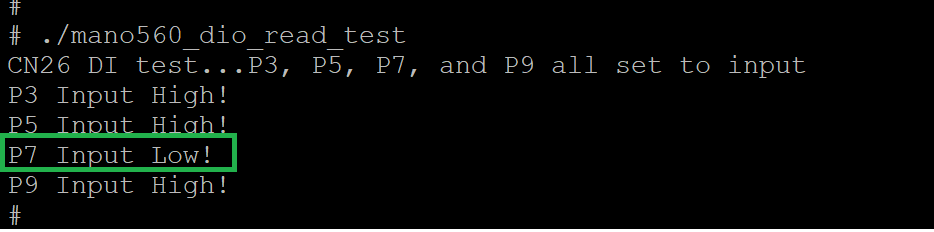


<div align="right">

[**Back to Top**](#test-guide)

</div>


#### Pin 9 Grounded

Connect Pin 10 to Pin 9 (Pin 9 is Grounded):

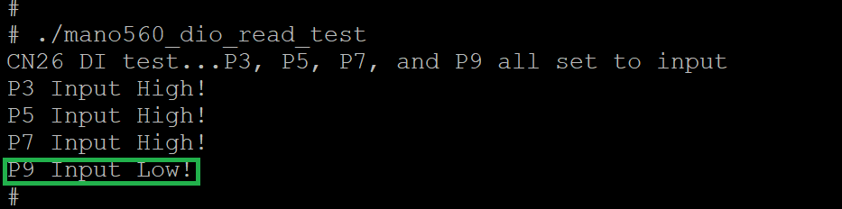


<div align="right">

[**Back to Top**](#test-guide)

</div>


### Output Test


<div align="right">

[**Back to Top**](#test-guide)

</div>
 


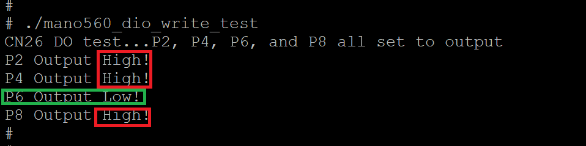

Use a multimeter to verify the output voltages on Pins 2, 4, 6, and 8.


<div align="right">

[**Back to Top**](#test-guide)

</div>


---


## Watchdog


<div align="right">

[**Back to Top**](#test-guide)

</div>
 


The `WDTRST#` signal is generated by the `F81966` Super I/O controller.

A shared library, `libmano560_wdt.so`, has been created to support the watchdog function.

The following example demonstrates how to use this library:


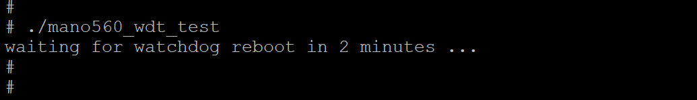


<div align="right">

[**Back to Top**](#test-guide)

</div>


---


## M.2 Key E Socket (CN22)


<div align="right">

[**Back to Top**](#test-guide)

</div>
 


<div align="right">

[**Back to Top**](#test-guide)

</div>


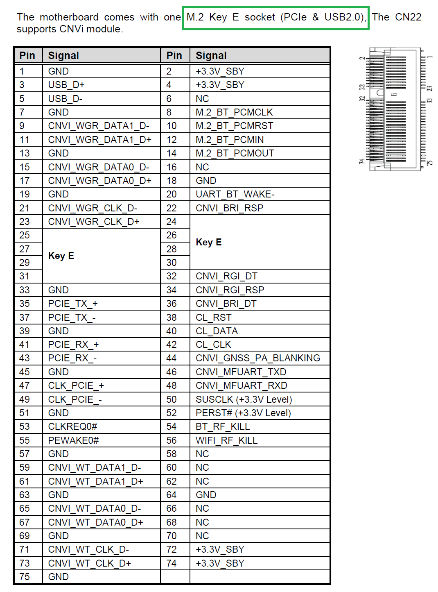


<div align="right">

[**Back to Top**](#test-guide)

</div>


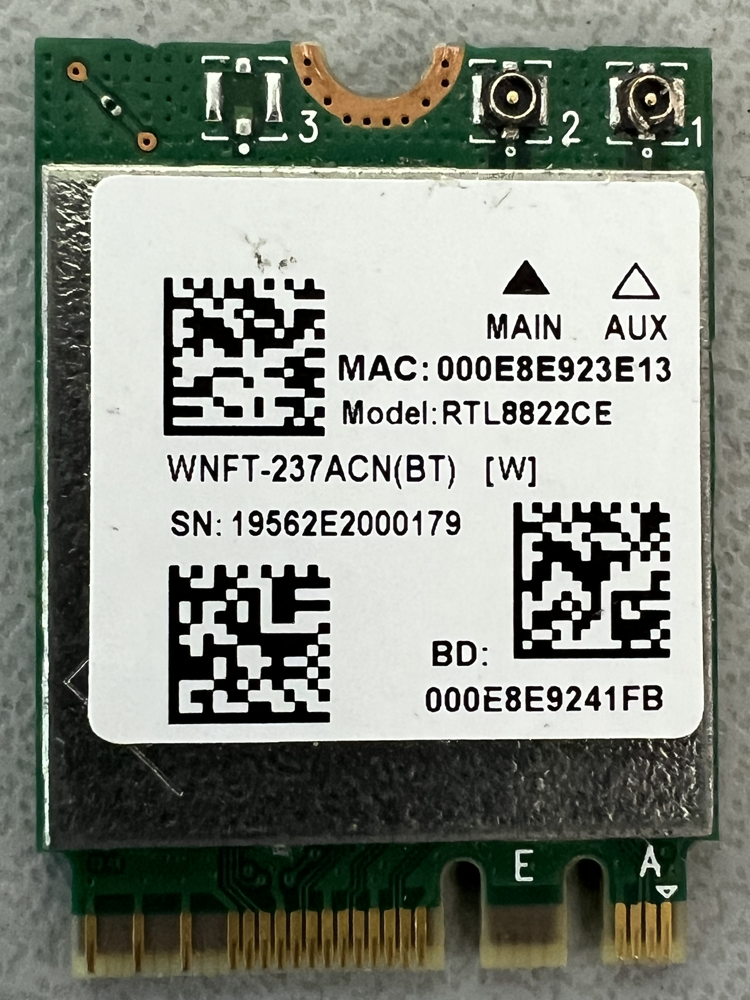


<div align="right">

[**Back to Top**](#test-guide)

</div>


After inserting the **Realtek RTL8822CE** wireless module, use `pci-tool` to verify that the device is detected:


```console
# pci-tool -v

Partition: pci

Managing Server ID: 1, pid: 20487, running
B000:D00:F00 @ idx 0
        vid/did: 8086/4668
                Intel Corporation, <device id - unknown>
        class/subclass/reg: 06/00/00
                Host-to-PCI Bridge Device

B000:D02:F00 @ idx 1
        vid/did: 8086/4680
                Intel Corporation, <device id - unknown>
        class/subclass/reg: 03/00/00
                PC Compatible VGA Display Controller

B000:D10:F00 @ idx 2
        vid/did: 8086/467d
                Intel Corporation, <device id - unknown>
        class/subclass/reg: 11/80/00
                Other DA/DSP Controller

B000:D20:F00 @ idx 3
        vid/did: 8086/7ae0
                Intel Corporation, <device id - unknown>
        class/subclass/reg: 0c/03/30
                USB Serial Bus Controller (Intel eXtensible HCI)

.
.
.
B000:D31:F06 @ idx 15
        vid/did: 8086/1a1d
                Intel Corporation, <device id - unknown>
        class/subclass/reg: 02/00/00
                Ethernet Network Controller

B001:D00:F00 @ idx 16 in slot 8 of chassis 0
        vid/did: 10ec/c822
                Realtek Semiconductor Corp., <device id - unknown>
        class/subclass/reg: 02/80/00
                Other Network Controller

B002:D00:F00 @ idx 17 in slot 10 of chassis 0
        vid/did: 8086/15f3
                Intel Corporation, <device id - unknown>
        class/subclass/reg: 02/00/00
                Ethernet Network Controller

```


<div align="right">

[**Back to Top**](#test-guide)

</div>


---


## M.2 Key B Socket (SCN1)


<div align="right">

[**Back to Top**](#test-guide)

</div>
 


| Bus Type | Test Results | Notes |
|:---------:|:-----------------:|:-----------------:|
|PCIe x2 | Not Supported | BOM option with hardware change |
| SATA | Should Support | No test card found |
| USB 2.0 | OK | Test card: WNFQ-262ACNI(BT) |   


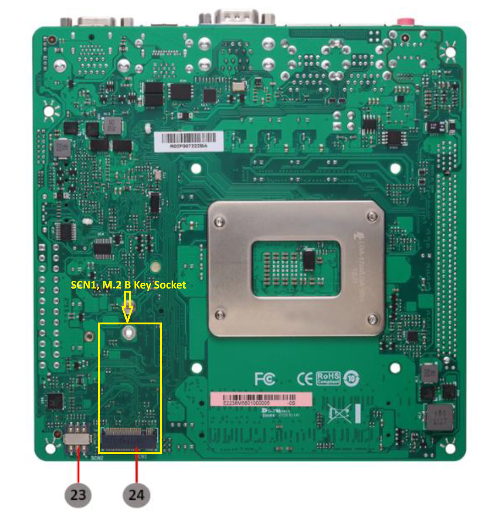


<div align="right">

[**Back to Top**](#test-guide)

</div>


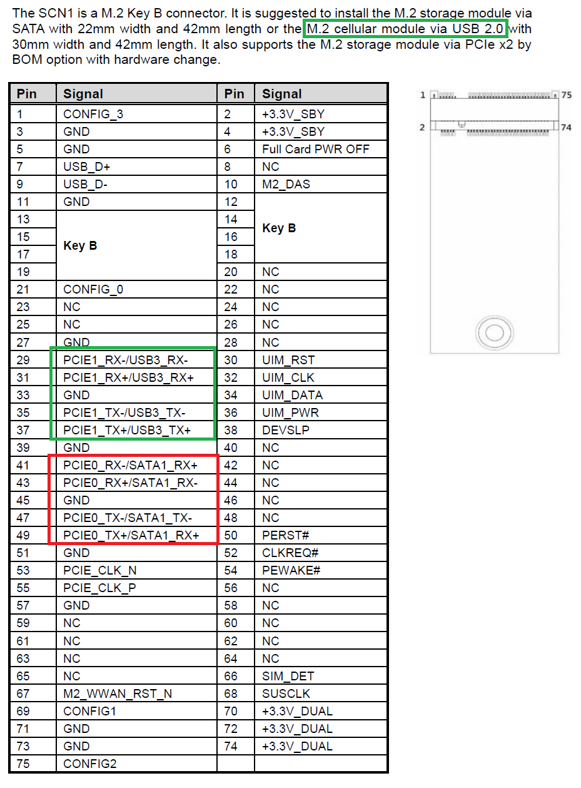


<div align="right">

[**Back to Top**](#test-guide)

</div>


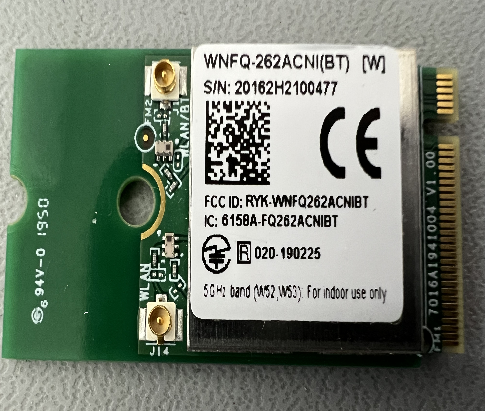


<div align="right">

[**Back to Top**](#test-guide)

</div>


After inserting the **WNFQ-262ACNI(BT)** Wi-Fi module (22 mm × 42 mm), use `pci-tool` to verify that the device is detected:


```console
# pci-tool -v

Partition: pci

Managing Server ID: 1, pid: 20487, running
B000:D00:F00 @ idx 0
        vid/did: 8086/4668
                Intel Corporation, <device id - unknown>
        class/subclass/reg: 06/00/00
                Host-to-PCI Bridge Device

B000:D02:F00 @ idx 1
        vid/did: 8086/4680
                Intel Corporation, <device id - unknown>
        class/subclass/reg: 03/00/00
                PC Compatible VGA Display Controlle
.
.
.
B000:D31:F06 @ idx 15
        vid/did: 8086/1a1d
                Intel Corporation, <device id - unknown>
        class/subclass/reg: 02/00/00
                Ethernet Network Controller

B001:D00:F00 @ idx 16 in slot 4 of chassis 0
        vid/did: 168c/003e
                Atheros Communications Inc., <device id - unknown>
        class/subclass/reg: 02/80/00
                Other Network Controller

B002:D00:F00 @ idx 17 in slot 10 of chassis 0
        vid/did: 8086/15f3
                Intel Corporation, <device id - unknown>
        class/subclass/reg: 02/00/00
                Ethernet Network Controller
```


<div align="right">

[**Back to Top**](#test-guide)

</div>


---


## PCIe Mini Card Connector (CN21)


<div align="right">

[**Back to Top**](#test-guide)

</div>
 


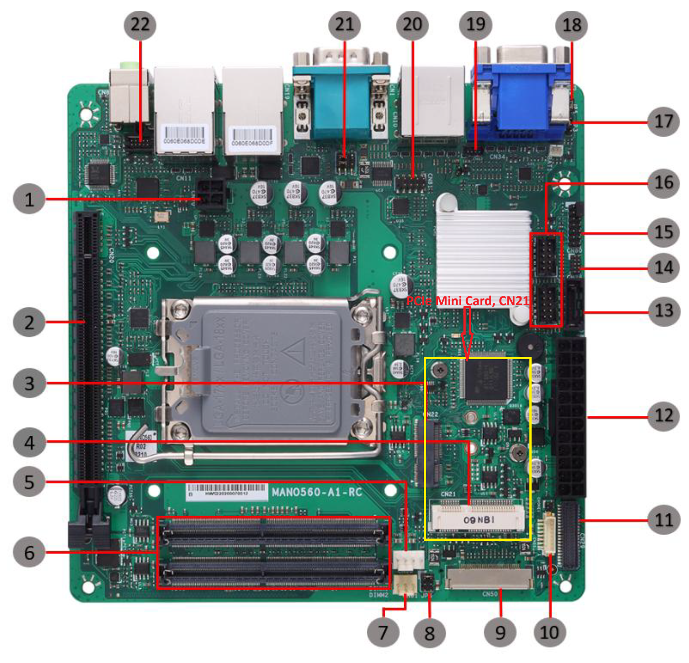


<div align="right">

[**Back to Top**](#test-guide)

</div>


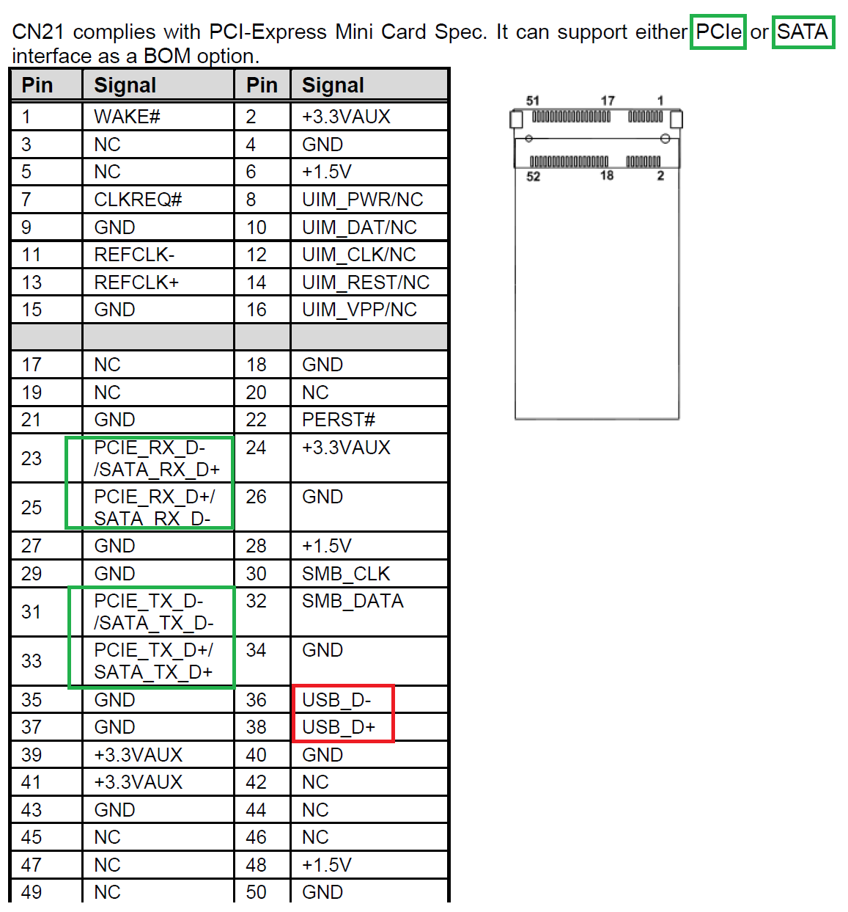


<div align="right">

[**Back to Top**](#test-guide)

</div>


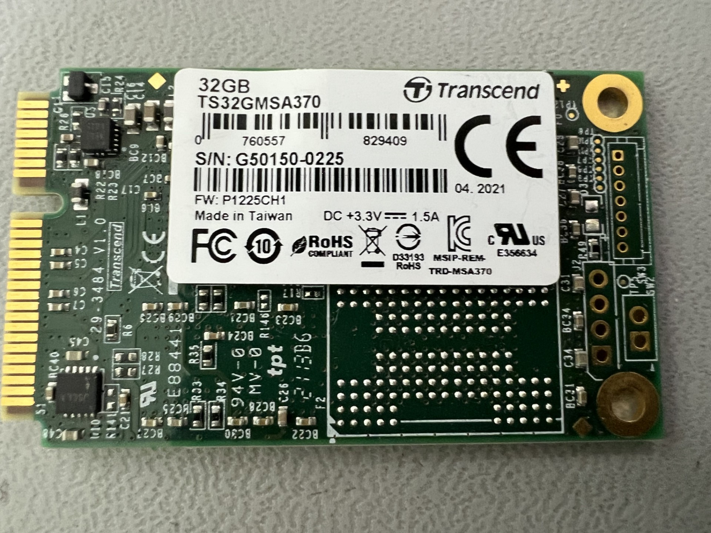


<div align="right">

[**Back to Top**](#test-guide)

</div>


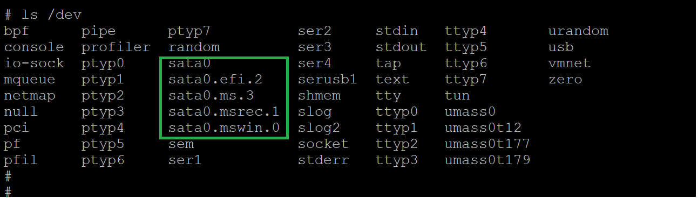


<div align="right">

[**Back to Top**](#test-guide)

</div>


Use `pci-tool -v` to verify that the device is detected:

```console
# pci-tool -v

Partition: pci

Managing Server ID: 1, pid: 20487, running
B000:D00:F00 @ idx 0
        vid/did: 8086/4668
                Intel Corporation, <device id - unknown>
        class/subclass/reg: 06/00/00
                Host-to-PCI Bridge Device

B000:D02:F00 @ idx 1
        vid/did: 8086/4680
                Intel Corporation, <device id - unknown>
        class/subclass/reg: 03/00/00
                PC Compatible VGA Display Controller

B000:D10:F00 @ idx 2
        vid/did: 8086/467d
                Intel Corporation, <device id - unknown>
        class/subclass/reg: 11/80/00
                Other DA/DSP Controller

B000:D20:F00 @ idx 3
        vid/did: 8086/7ae0
                Intel Corporation, <device id - unknown>
        class/subclass/reg: 0c/03/30
                USB Serial Bus Controller (Intel eXtensible HCI)

.
.
.

B000:D23:F00 @ idx 8
        vid/did: 8086/7ae2
                Intel Corporation, <device id - unknown>
        class/subclass/reg: 01/06/01
                SATA Mass Storage Controller (AHCI Interface)

B000:D31:F06 @ idx 14
        vid/did: 8086/1a1d
                Intel Corporation, <device id - unknown>
        class/subclass/reg: 02/00/00
                Ethernet Network Controller

B001:D00:F00 @ idx 15 in slot 10 of chassis 0
        vid/did: 8086/15f3
                Intel Corporation, <device id - unknown>
        class/subclass/reg: 02/00/00
                Ethernet Network Controller

#
```


<div align="right">

[**Back to Top**](#test-guide)

</div>


---


## PCIe x16 (CN20)


<div align="right">

[**Back to Top**](#test-guide)

</div>
 


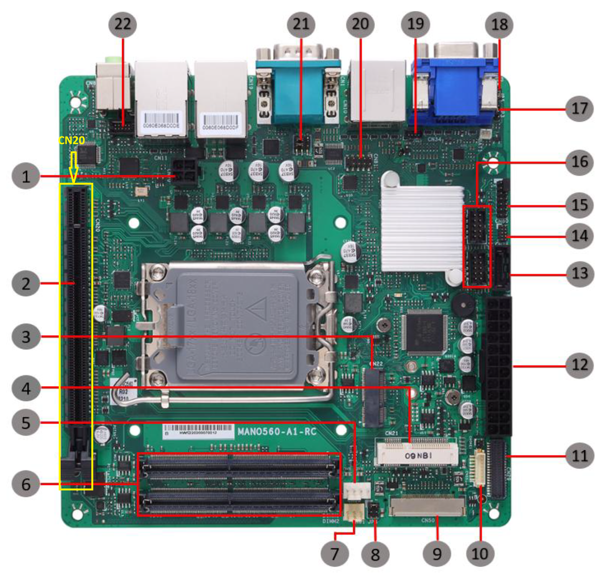


<div align="right">

[**Back to Top**](#test-guide)

</div>


<div align="right">

[**Back to Top**](#test-guide)

</div>


After inserting the **NVIDIA Quadro P620** graphics card, use `pci-tool -v` to verify that the device is detected:


```console
# pci-tool -v

Partition: pci

Managing Server ID: 1, pid: 20487, running
B000:D00:F00 @ idx 0
        vid/did: 8086/4668
                Intel Corporation, <device id - unknown>
        class/subclass/reg: 06/00/00
                Host-to-PCI Bridge Device

B000:D01:F00 @ idx 1
        vid/did: 8086/460d
                Intel Corporation, <device id - unknown>
        class/subclass/reg: 06/04/00
                PCI-to-PCI Bridge Device

B000:D10:F00 @ idx 2
        vid/did: 8086/467d
                Intel Corporation, <device id - unknown>
        class/subclass/reg: 11/80/00
                Other DA/DSP Controller

B000:D20:F00 @ idx 3
        vid/did: 8086/7ae0
                Intel Corporation, <device id - unknown>
        class/subclass/reg: 0c/03/30
                USB Serial Bus Controller (Intel eXtensible HCI)

B000:D20:F02 @ idx 4
        vid/did: 8086/7aa7
                Intel Corporation, <device id - unknown>
        class/subclass/reg: 05/00/00
                RAM Memory Controller

B000:D21:F00 @ idx 5
        vid/did: 8086/7acc
                Intel Corporation, <device id - unknown>
        class/subclass/reg: 0c/80/00
                Other Serial Bus Controller
.
.
.
B001:D00:F00 @ idx 15 in slot 1 of chassis 0
        vid/did: 10de/1cb6
                NVIDIA Corporation, <device id - unknown>
        class/subclass/reg: 03/00/00
                PC Compatible VGA Display Controller

B001:D00:F01 @ idx 16 in slot 1 of chassis 0
        vid/did: 10de/0fb9
                NVIDIA Corporation, <device id - unknown>
        class/subclass/reg: 04/03/00
                Mixed Mode Multi-media Device

B002:D00:F00 @ idx 17 in slot 10 of chassis 0
        vid/did: 8086/15f3
                Intel Corporation, <device id - unknown>
        class/subclass/reg: 02/00/00
                Ethernet Network Controller

```


<div align="right">

[**Back to Top**](#test-guide)

</div>


---


## Audio Jack (CN82)


<div align="right">

[**Back to Top**](#test-guide)

</div>
 


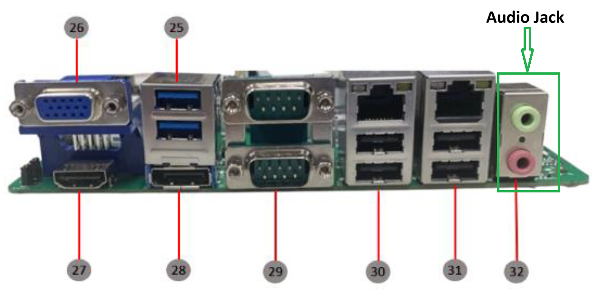


The audio interface is not supported in QNX 8.0. 


<div align="right">

[**Back to Top**](#test-guide)

</div>


---


## Audio Header (CN52)


<div align="right">

[**Back to Top**](#test-guide)

</div>
 


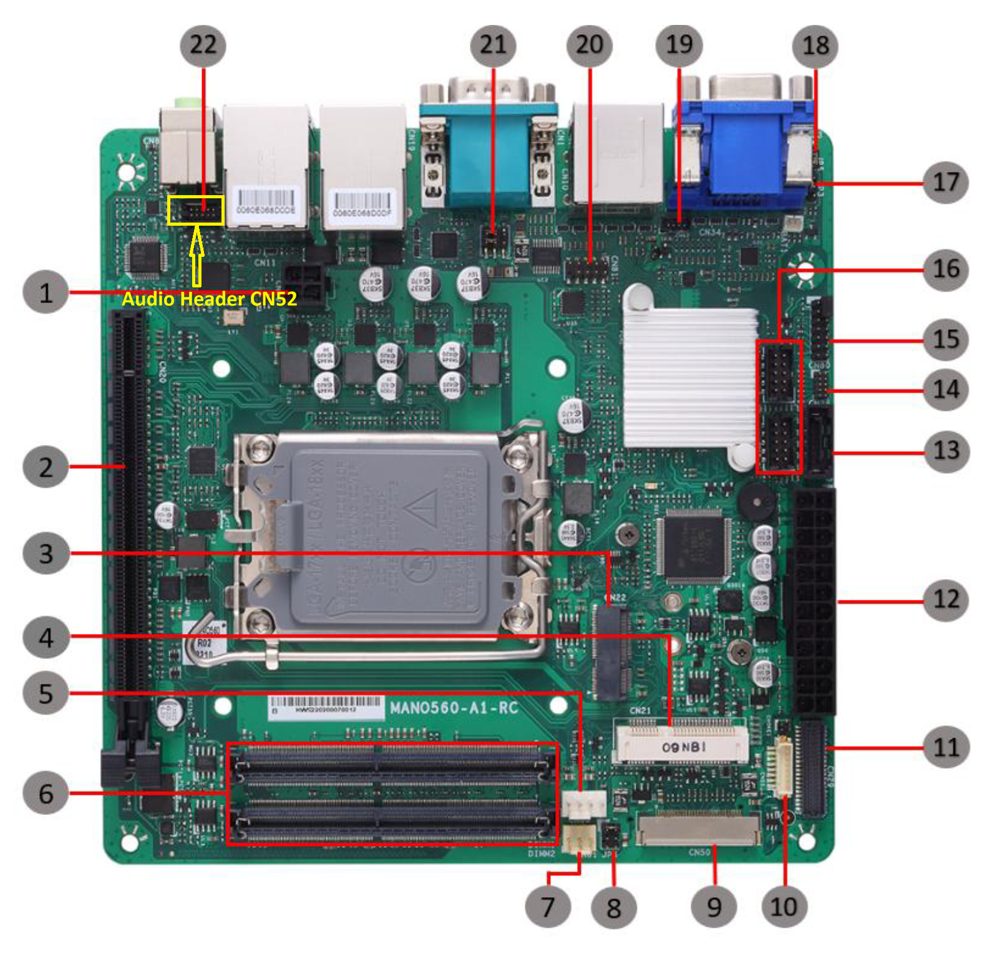


<div align="right">

[**Back to Top**](#test-guide)

</div>


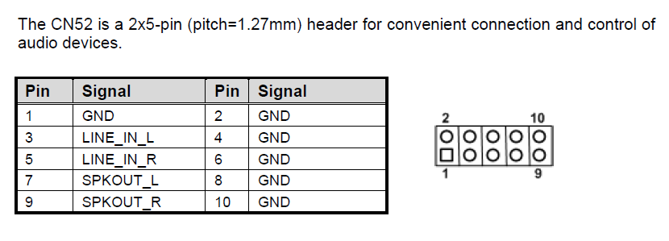


<div align="right">

[**Back to Top**](#test-guide)

</div>


---


## SPI Header (CN81)


<div align="right">

[**Back to Top**](#test-guide)

</div>
 


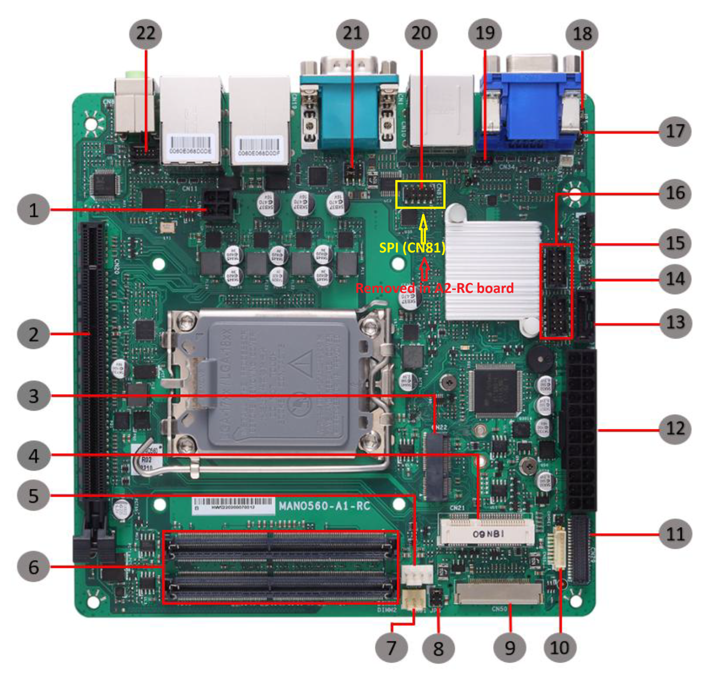


<div align="right">

[**Back to Top**](#test-guide)

</div>


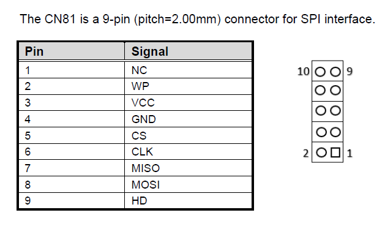


> **NOTE:**

The CN81 SPI header is **not installed on the MANO560-A2-RC board**. 


<div align="right">

[**Back to Top**](#test-guide)

</div>


---

[**Back to MANO560 BSP**](../README.md)
