[**Back to MANO566 BSP**](../README.md)


---


# Test Guide

This guide describes the basic functional tests performed on the Axiomtek MANO566 platform running QNX 8.0.5.

* [Basic Function Test Items](#basic-function-test-items)
    - [Storage](#storage)
       - [SATA](#sata)  
       - [NVME](#nvme) 
    - [Display](#display)
    - [Ethernet](#ethernet)
    - [USB](#usb)
    - [COMx](#comx)
    - [Digital I/O Wafer Connector (CN15)](#digital-io-wafer-connector-cn15)
    - [Watchdog](#watchdog)
    - [M.2 Key E Connector (CN8)](#m2-key-e-connector-cn8)
    - [M.2 Key B Connector (CN13)](#m2-key-b-connector-cn13)  
    - [PCIe x16 (CN24)](#pcie-x16-cn24) 
    - [Audio Jack (CN20)](#audio-jack-cn20)

> **NOTE**:

**Test CPU platform:** I7-12700TE / I7-14700T.


    

<div align="right">

[**Back to Top**](#test-guide)

</div>


---

# Basic Function Test Items


<div align="right">

[**Back to Top**](#test-guide)

</div>
 


---


## Storage


<div align="right">

[**Back to Top**](#test-guide)

</div>
 


### SATA


<div align="right">

[**Back to Top**](#test-guide)

</div>
 


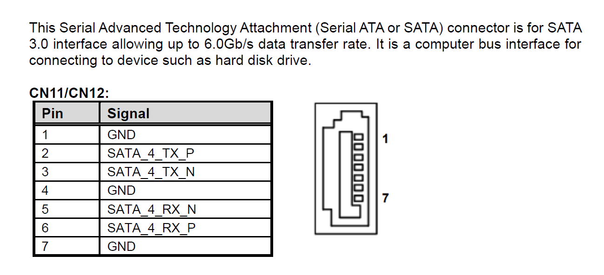


<div align="right">

[**Back to Top**](#test-guide)

</div>


Connect a SATA device to the board.

Check the `/dev` directory:

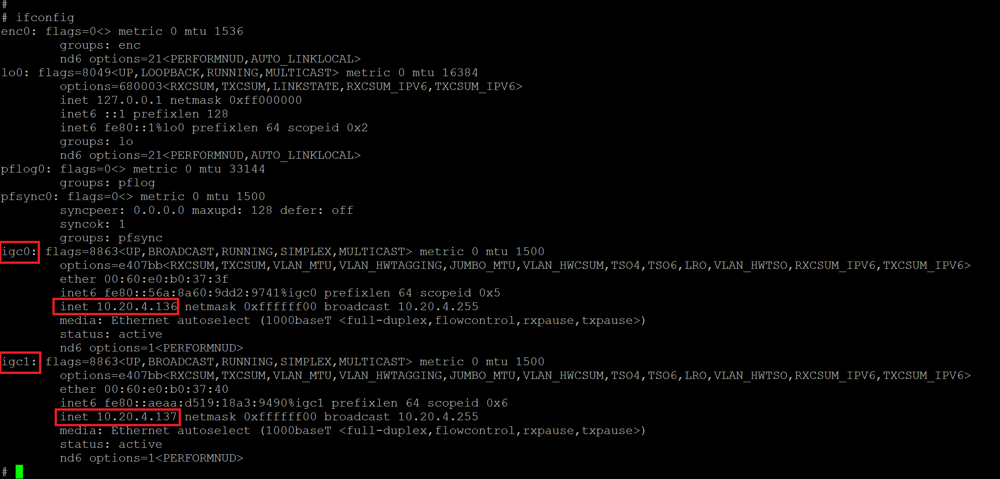


<div align="right">

[**Back to Top**](#test-guide)

</div>


Use `pci-tool -v` to verify that the SATA device is detected:

```console
# pci-tool -v

Partition: pci

Managing Server ID: 1, pid: 20487, running
B000:D00:F00 @ idx 0
        vid/did: 8086/a740
                Intel Corporation, <device id - unknown>
        class/subclass/reg: 06/00/00
                Host-to-PCI Bridge Device

.
.
.
B000:D23:F00 @ idx 12
        vid/did: 8086/7ae2
                Intel Corporation, <device id - unknown>
        class/subclass/reg: 01/06/01
                SATA Mass Storage Controller (AHCI Interface)
.
.
.
```

<div align="right">

[**Back to Top**](#test-guide)

</div>


### NVME


<div align="right">

[**Back to Top**](#test-guide)

</div>
 

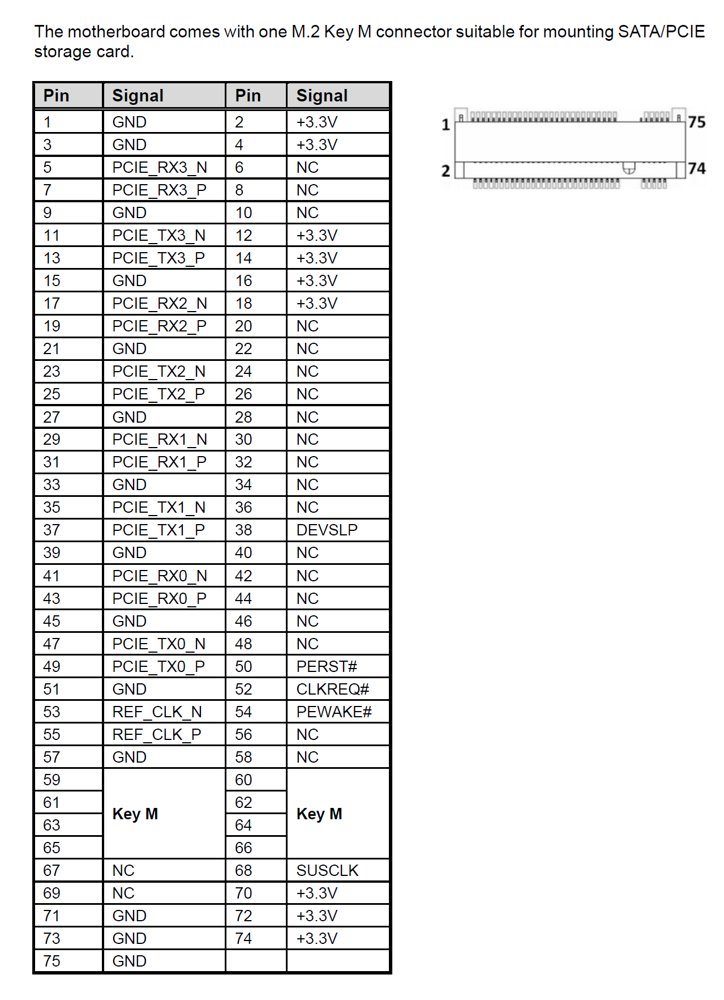


<div align="right">

[**Back to Top**](#test-guide)

</div>


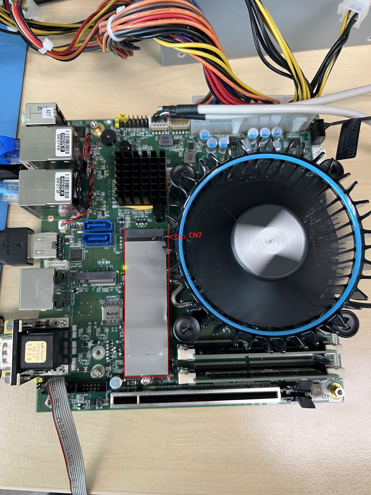


<div align="right">

[**Back to Top**](#test-guide)

</div>


Install an NVMe drive on the board.

Check the `/dev` directory:

```console
# ls -al /dev/nvme*
brw-------  1 root root 4,   0 2021-01-01 02:37 /dev/nvme0
brw-------  1 root root 1,  10 2021-01-01 02:37 /dev/nvme0.efi.0
brw-------  1 root root 1,  11 2021-01-01 02:37 /dev/nvme0.lnxdata.1
```
Use `pci-tool -v` to verify that the NVMe drive is detected:

```console
# pci-tool -v

Partition: pci

Managing Server ID: 1, pid: 20487, running
B000:D00:F00 @ idx 0
        vid/did: 8086/a740
                Intel Corporation, <device id - unknown>
        class/subclass/reg: 06/00/00
                Host-to-PCI Bridge Device

B000:D02:F00 @ idx 1
        vid/did: 8086/a780
                Intel Corporation, <device id - unknown>
        class/subclass/reg: 03/00/00
                PC Compatible VGA Display Controller
.
.
.
B018:D00:F00 @ idx 26 in slot 8 of chassis 0
        vid/did: 15b7/5017
                Sandisk Corp., <device id - unknown>
        class/subclass/reg: 01/08/02
                Non-volatile Memory Subsystem (NVMe Interface IO Controller)

```

<div align="right">

[**Back to Top**](#test-guide)

</div>


---


## Display


<div align="right">

[**Back to Top**](#test-guide)

</div>
 


|Display Interface|Connector Name|DisplayName shown in QNX8.0|I9-13900TE|I7-14700T|
| --- | --- | --- | --- | --- | 
|DP++|CN19 (upper)|display 2: HDMI-A (HDMI-A-1)|OK|OK|
|HDMI|CN19 (lower)|display 3: HDMI-A (HDMI-A-2)|OK|OK|
|HDMI|CN22|display 4: HDMI-A (HDMI-A-3)|OK|OK|
|embedded DisplayPort(eDP)|SCN2 (on the back of board)|display 1: DisplayPort (DP-1)|N/A|N/A|

> **NOTE**:

Cannot find a monitor with eDP interface for testing. 

```console
# drm-probe-displays
count_displays : 4
count_pipelines: 4

display 1: DisplayPort (DP-1), disconnected
display 2: HDMI-A (HDMI-A-1), connected
        Mode: "2560x1080" 2560x1080 60
        Mode: "2560x1080" 2560x1080 60
        Mode: "1920x1080" 1920x1080 60
        Mode: "1920x1080" 1920x1080 60
        Mode: "1920x1080i" 1920x1080 60
        Mode: "1920x1080i" 1920x1080 60
        Mode: "1920x1080" 1920x1080 50
        Mode: "1280x720" 1280x720 60
        Mode: "1280x720" 1280x720 60
        Mode: "1280x720" 1280x720 50
        Mode: "1024x768" 1024x768 60
        Mode: "800x600" 800x600 60
        Mode: "720x576" 720x576 50
        Mode: "720x480" 720x480 60
        Mode: "720x480" 720x480 60
        Mode: "640x480" 640x480 60
        Mode: "640x480" 640x480 60
display 3: HDMI-A (HDMI-A-2), disconnected
display 4: HDMI-A (HDMI-A-3), disconnected

pipeline 1
pipeline 2
pipeline 3
pipeline 4
```


<div align="right">

[**Back to Top**](#test-guide)

</div>


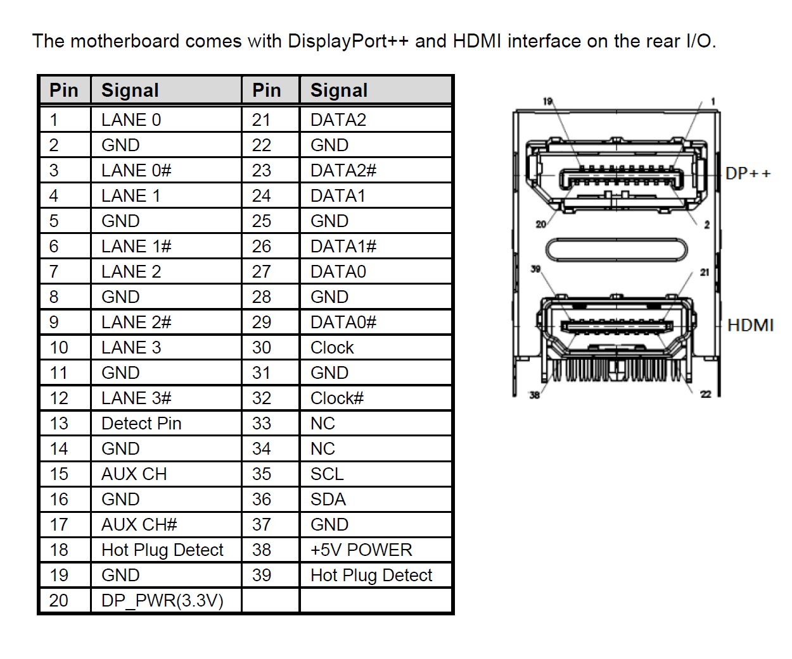


<div align="right">

[**Back to Top**](#test-guide)

</div>


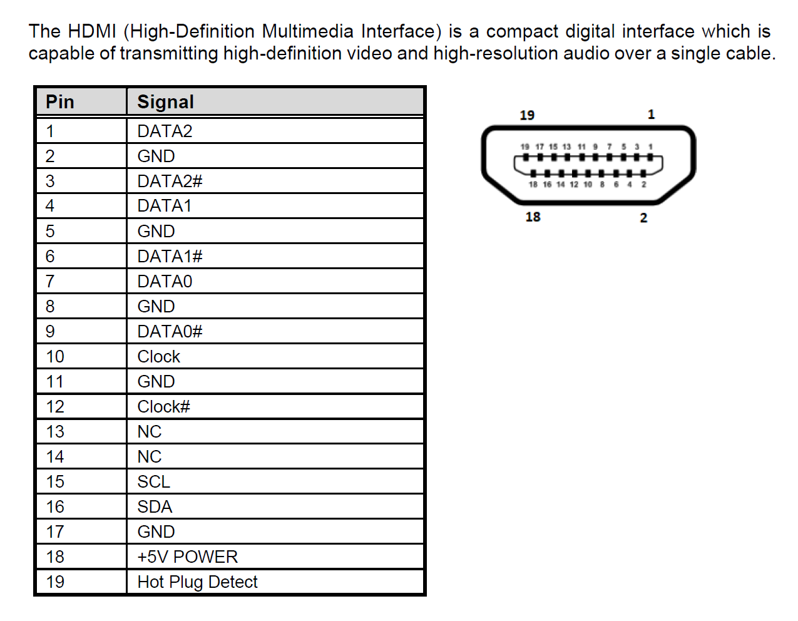


<div align="right">

[**Back to Top**](#test-guide)

</div>


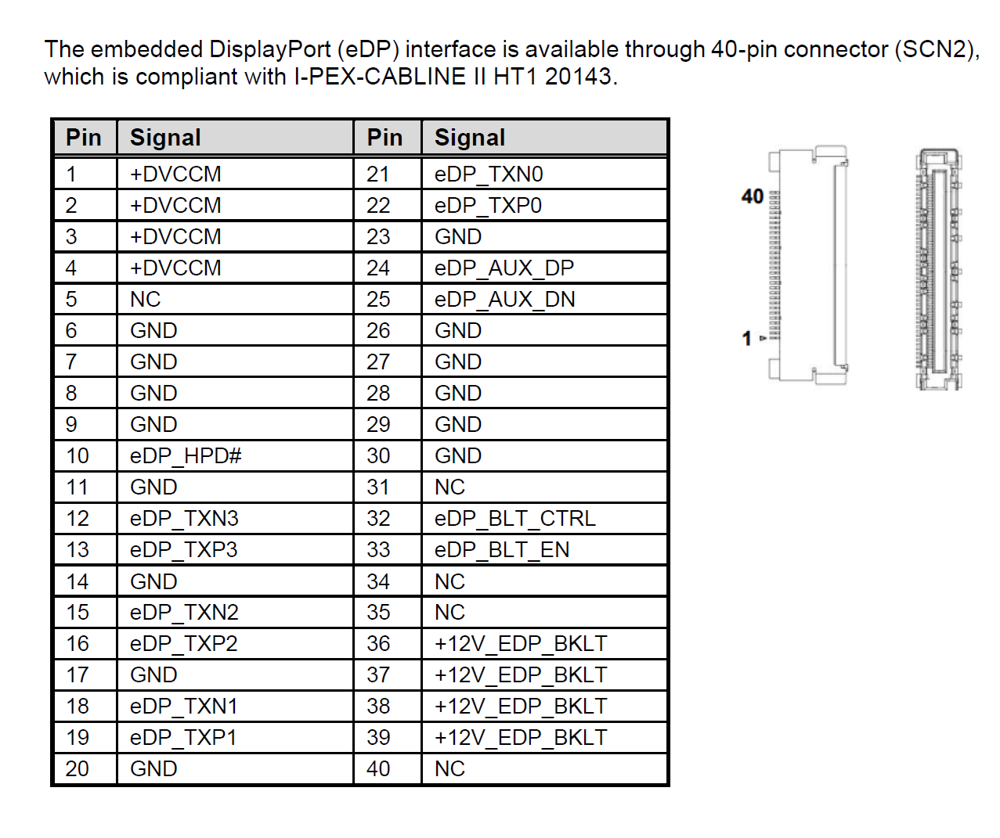


<div align="right">

[**Back to Top**](#test-guide)

</div>

Start the QNX graphics system using the following commands:


```console
# cd scripts
# ls
graphics_start.sh
# pwd
/scripts
# cat graphics_start.sh
#!/bin/sh
 LD_LIBRARY_PATH=/lib:/usr/lib:/lib/dll:/lib/dll/pci:/proc/boot:/usr/lib/graphics/intel-drm
 PATH=/sbin:/bin:/usr/sbin:/usr/bin:/opt/sbin:/opt/bin:/proc/boot
 echo "Starting screen"
 drm-intel-518 sleep 6
 screen -c /usr/lib/graphics/intel-drm/graphics.conf
 waitfor /dev/screen
#
# /usr/bin/gles2-maze &
```


<div align="right">

[**Back to Top**](#test-guide)

</div>


<div align="right">

[**Back to Top**](#test-guide)

</div>


---


## Ethernet


<div align="right">

[**Back to Top**](#test-guide)

</div>
 


The board provides two Ethernet ports: **LAN1** and **LAN2**.

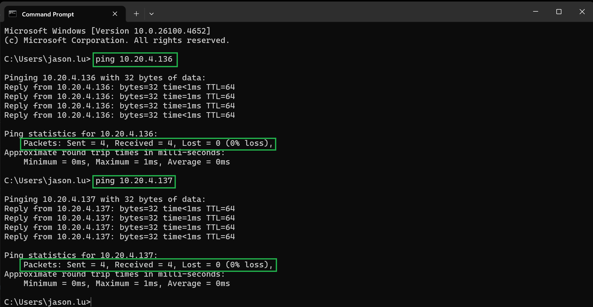


<div align="right">

[**Back to Top**](#test-guide)

</div>


<div align="right">

[**Back to Top**](#test-guide)

</div>


---

## USB


<div align="right">

[**Back to Top**](#test-guide)

</div>
 


|USB Interface Type|Connector Name|
| --- | --- | 
|USB2.0|CN5, CN6|
|USB3.2|CN17, CN18|


### USB2.0


<div align="right">

[**Back to Top**](#test-guide)

</div>
 


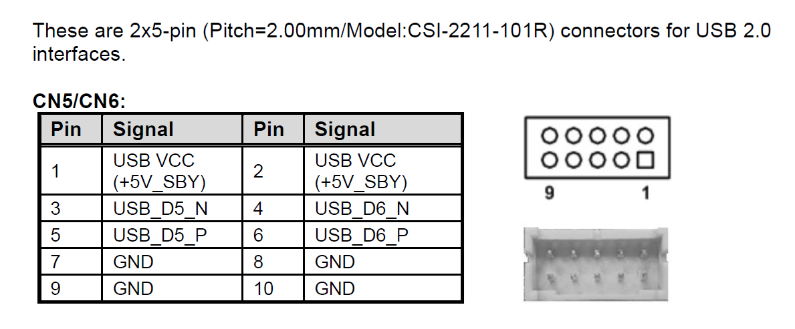


<div align="right">

[**Back to Top**](#test-guide)

</div>


A USB 2.0 wafer cable (P/N: **594E8422800**, 2 USB 2.0 wafer cables with bracket, 180 mm) is required for testing.

Before inserting a USB flash drive into a USB 2.0 port:


```console
# cd /dev
# ls -l umass*
brw-------  1 root root 4,   0 2021-01-01 21:40 umass0
brw-------  1 root root 1,  11 2021-01-01 21:40 umass0t12
brw-------  1 root root 1,  10 2021-01-01 21:40 umass0t177
brw-------  1 root root 1,  12 2021-01-01 21:40 umass0t179

# pwd
/dev
```

After inserting a USB flash drive into a USB 2.0 port:

```console
# ls -l umass*
brw-------  1 root root 4,   0 2021-01-01 21:40 umass0
brw-------  1 root root 1,  11 2021-01-01 21:40 umass0t12
brw-------  1 root root 1,  10 2021-01-01 21:40 umass0t177
brw-------  1 root root 1,  12 2021-01-01 21:40 umass0t179
brw-------  1 root root 4,   1 2021-01-01 23:16 umass1
brw-------  1 root root 1,  14 2021-01-01 23:16 umass1.efi.1
brw-------  1 root root 1,  16 2021-01-01 23:16 umass1.lnxdata.3
brw-------  1 root root 1,  13 2021-01-01 23:16 umass1.ms.0
brw-------  1 root root 1,  15 2021-01-01 23:16 umass1.ms.2

```


<div align="right">

[**Back to Top**](#test-guide)

</div>


After inserting two USB flash drives into USB 2.0 ports:

```console
# ls -l umass*
brw-------  1 root root 4,   0 2021-01-01 21:40 umass0
brw-------  1 root root 1,  11 2021-01-01 21:40 umass0t12
brw-------  1 root root 1,  10 2021-01-01 21:40 umass0t177
brw-------  1 root root 1,  12 2021-01-01 21:40 umass0t179
brw-------  1 root root 4,   1 2021-01-01 23:16 umass1
brw-------  1 root root 1,  14 2021-01-01 23:16 umass1.efi.1
brw-------  1 root root 1,  16 2021-01-01 23:16 umass1.lnxdata.3
brw-------  1 root root 1,  13 2021-01-01 23:16 umass1.ms.0
brw-------  1 root root 1,  15 2021-01-01 23:16 umass1.ms.2
brw-------  1 root root 4,   2 2021-01-01 23:17 umass2
brw-------  1 root root 1,  17 2021-01-01 23:17 umass2t11
#

```


<div align="right">

[**Back to Top**](#test-guide)

</div>


### USB3.2


<div align="right">

[**Back to Top**](#test-guide)

</div>
 


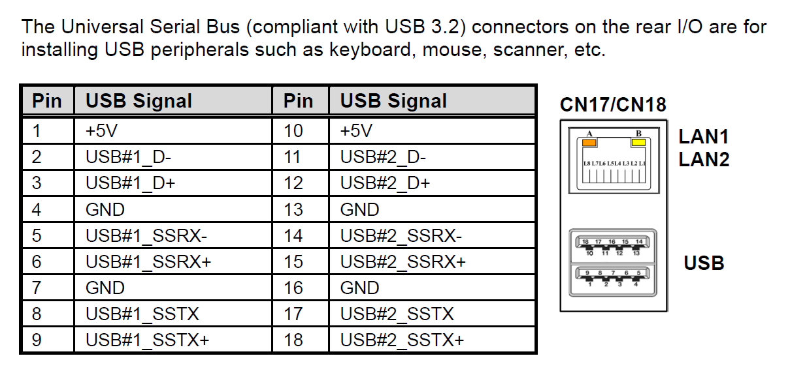


<div align="right">

[**Back to Top**](#test-guide)

</div>


Perform the same tests described for USB 2.0.


<div align="right">

[**Back to Top**](#test-guide)

</div>


---


## COMx


<div align="right">

[**Back to Top**](#test-guide)

</div>
 


| **COM Number** | **DevName** | **COM Wafer Connectors On Board** |
|---------|:-----------------:|:-----------------:|
| 1 | /dev/ser1 | CN21 (Upper) |
| 2 | /dev/ser2 | CN21 (Lower) |
| 3 | /dev/ser3 | CN14 |
| 4 | /dev/ser4 | CN16 |

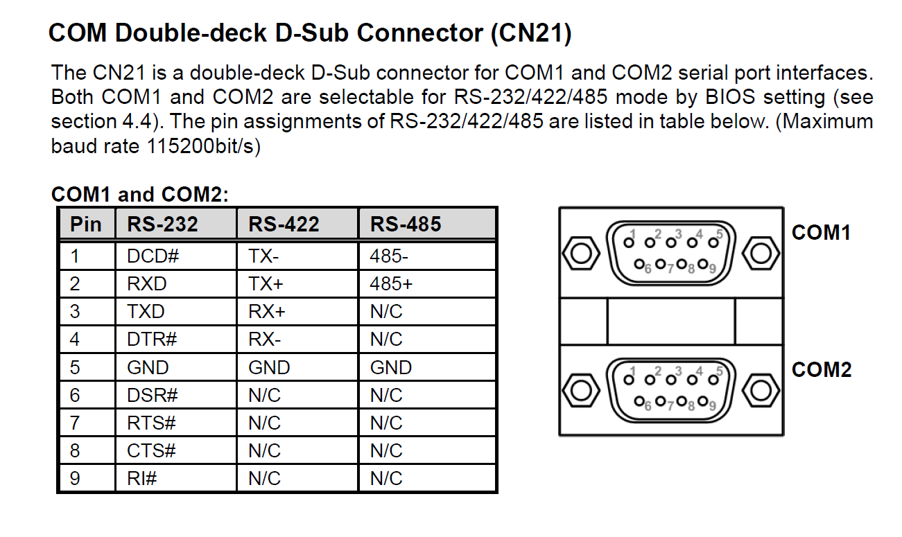


<div align="right">

[**Back to Top**](#test-guide)

</div>


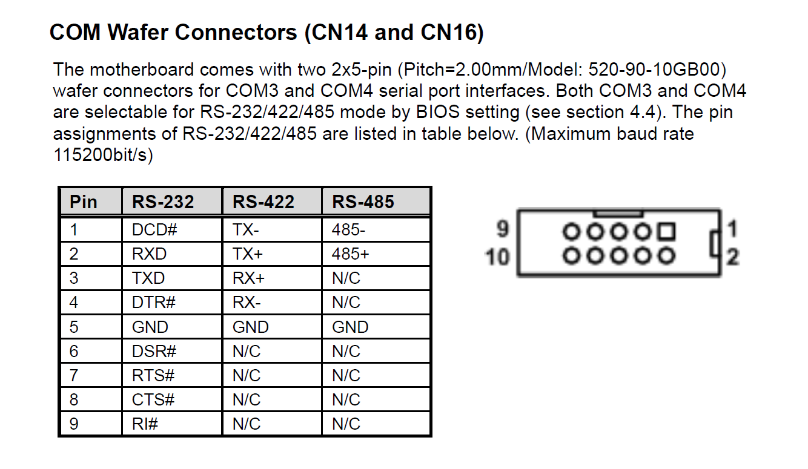


<div align="right">

[**Back to Top**](#test-guide)

</div>


Use a **USB-to-RS232 (male)** cable. Connect the USB end to the test PC.


```console
# cd dev
# pwd
/dev
# ls -l ser*
crw-rw-rw-  1 root root 3,   1 2025-02-21 06:36 ser1
crw-rw-rw-  1 root root 3,   2 2025-02-21 06:36 ser2
crw-rw-rw-  1 root root 3,   3 2025-02-21 06:36 ser3
crw-rw-rw-  1 root root 3,   4 2025-02-21 06:36 ser4
...
#
```
Assume COM1 is connected: 
```console
# echo hello > /dev/ser1
hello
# echo hello > /dev/ser2
# echo hello > /dev/ser3
# echo hello > /dev/ser4
```


<div align="right">

[**Back to Top**](#test-guide)

</div>


---


## Digital I/O Wafer Connector (CN15)


<div align="right">

[**Back to Top**](#test-guide)

</div>
 


According to the **MANO566 User's Manual** (page 17):


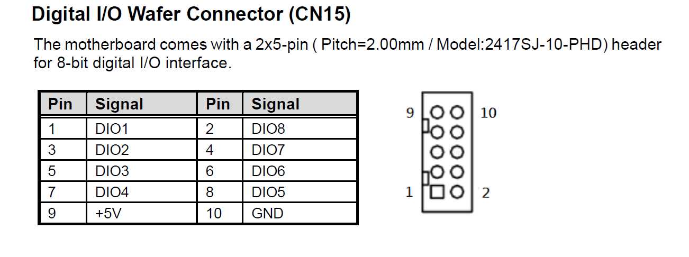


<div align="right">

[**Back to Top**](#test-guide)

</div>


A shared library has been created to configure and control the DIOs. Pins 1–8 can be configured as either inputs or outputs.

Two example test applications, `MANO566_input_test` and `MANO566_output_test`, are provided to demonstrate how to use the library.

### Input Test 


<div align="right">

[**Back to Top**](#test-guide)

</div>
 


```console
# ls
bin  etc   lib   root  scripts  tmp  var
dev  home  proc  sbin  sys      usr
# cd usr/bin
# pwd
/usr/bin
# ls -al /usr/bin/MANO*
-rwxr-xr-x  1 root root 8192 2025-07-31 20:39 /usr/bin/MANO566_input_test
-rwxr-xr-x  1 root root 8192 2025-07-31 20:39 /usr/bin/MANO566_output_test
```

#### No Pins Grounded

With no pins grounded, all digital inputs are pulled high:

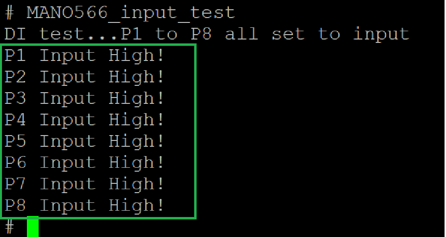


<div align="right">

[**Back to Top**](#test-guide)

</div>

#### Pin 1 Grounded

Connect Pin 10 to Pin 1 (Pin 1 is grounded):


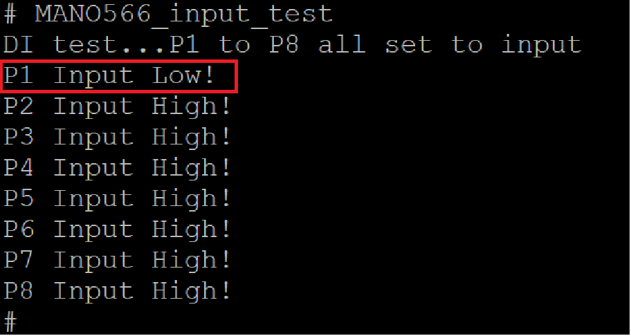


<div align="right">

[**Back to Top**](#test-guide)

</div>


#### Pin 2 Grounded

Connect Pin 10 to Pin 2 (Pin 2 is grounded):


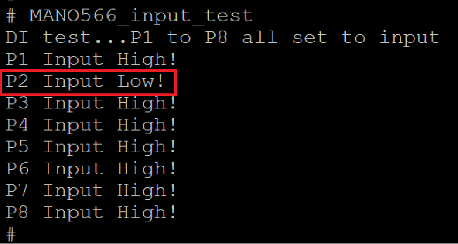


<div align="right">

[**Back to Top**](#test-guide)

</div>


#### Pin 3 Grounded

Connect Pin 10 to Pin 3 (Pin 3 is grounded):


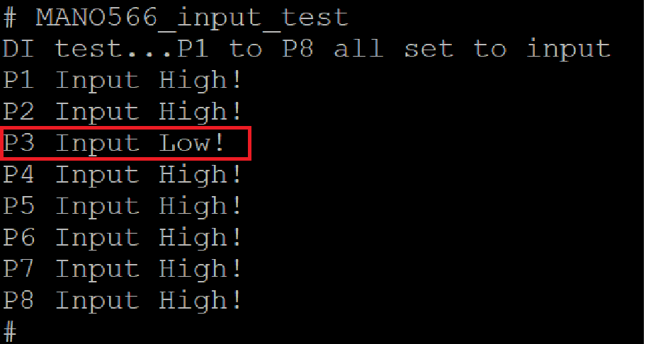


<div align="right">

[**Back to Top**](#test-guide)

</div>


#### Pin 8 Grounded

Connect Pin 10 to Pin 8 (Pin 8 is grounded):


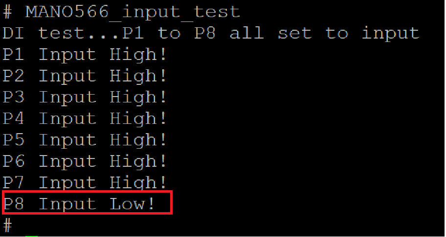


<div align="right">

[**Back to Top**](#test-guide)

</div>


### Output Test


<div align="right">

[**Back to Top**](#test-guide)

</div>
 


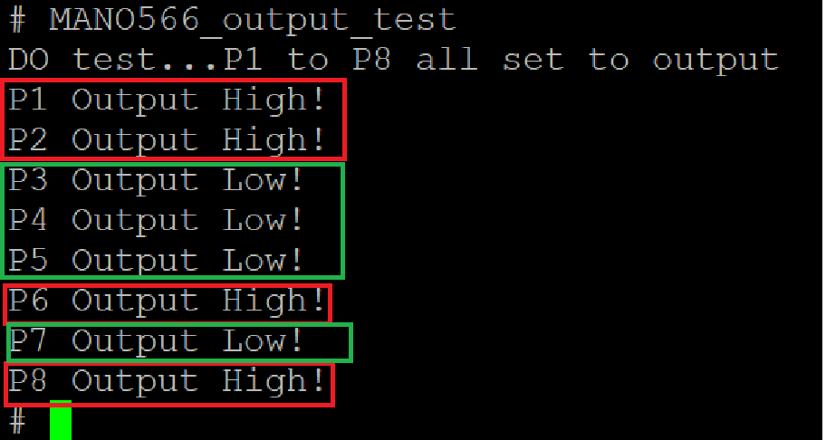

Use a multimeter to verify the output voltages on Pins 1-8.

<div align="right">

[**Back to Top**](#test-guide)

</div>


---


## Watchdog


<div align="right">

[**Back to Top**](#test-guide)

</div>
 


The `WDTRST#` signal is generated by the `F81966` Super I/O controller.

A shared library, `libmano566_wdt.so`, has been created to support the watchdog function.

The following example demonstrates how to use this library:


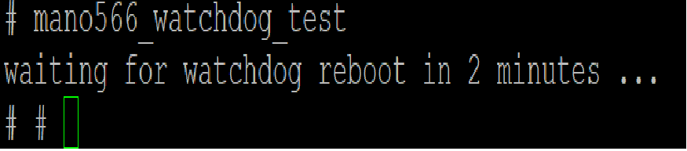


<div align="right">

[**Back to Top**](#test-guide)

</div>


---


## M.2 Key E Connector (CN8)


<div align="right">

[**Back to Top**](#test-guide)

</div>
 


After inserting the **Intel® 9260NGW** Wi-Fi module, use `pci-tool -v` to verify that the device is detected:

```console
# pci-tool -v

Partition: pci

Managing Server ID: 1, pid: 20487, running
B000:D00:F00 @ idx 0
        vid/did: 8086/a740
                Intel Corporation, <device id - unknown>
        class/subclass/reg: 06/00/00
                Host-to-PCI Bridge Device

B000:D02:F00 @ idx 1
        vid/did: 8086/a780
                Intel Corporation, <device id - unknown>
        class/subclass/reg: 03/00/00
                PC Compatible VGA Display Controller

.
.
.
B018:D00:F00 @ idx 26 in slot 7 of chassis 0
        vid/did: 8086/2526
                Intel Corporation, <device id - unknown>
        class/subclass/reg: 02/80/00
                Other Network Controller
```


<div align="right">

[**Back to Top**](#test-guide)

</div>


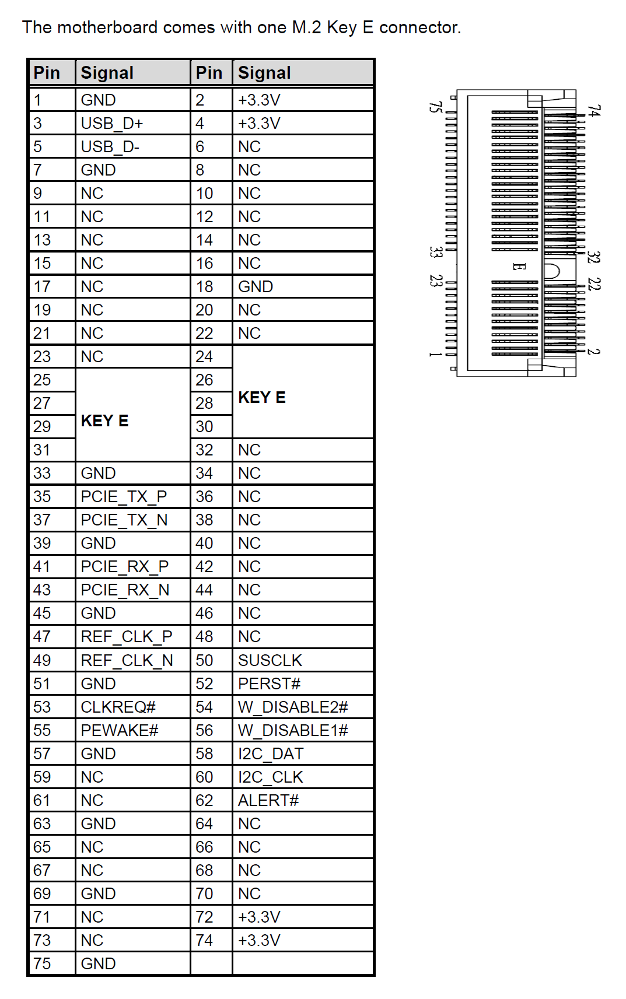


<div align="right">

[**Back to Top**](#test-guide)

</div>


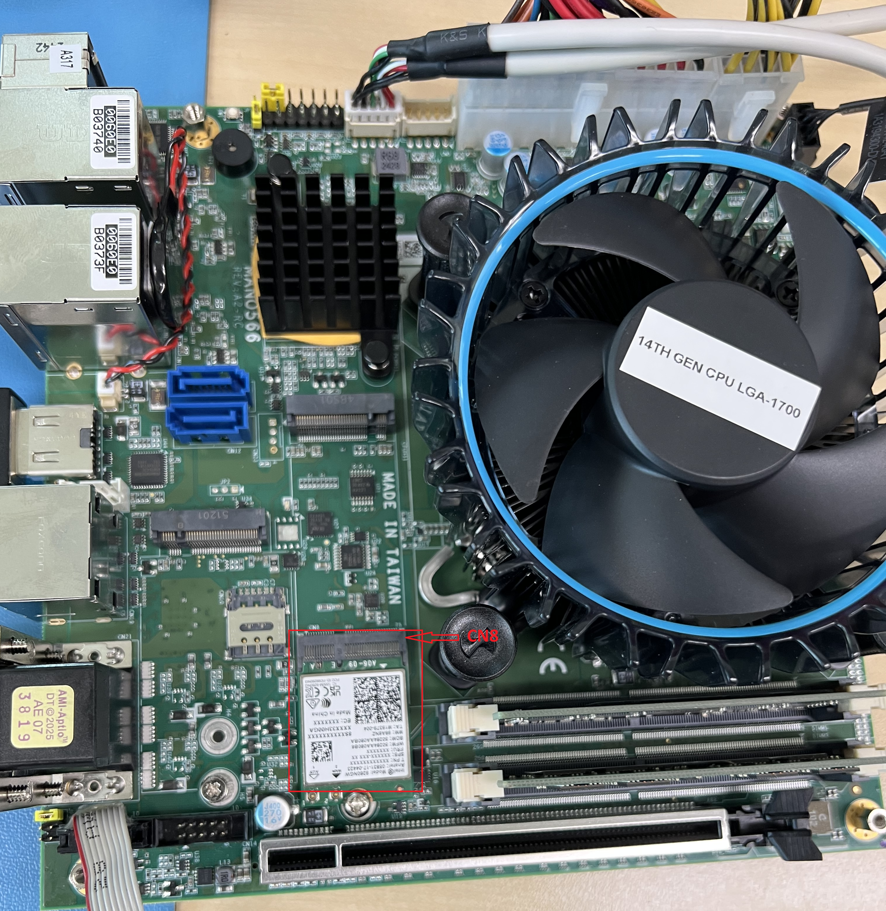


<div align="right">

[**Back to Top**](#test-guide)

</div>


---


## M.2 Key B Connector (CN13)


<div align="right">

[**Back to Top**](#test-guide)

</div>
 


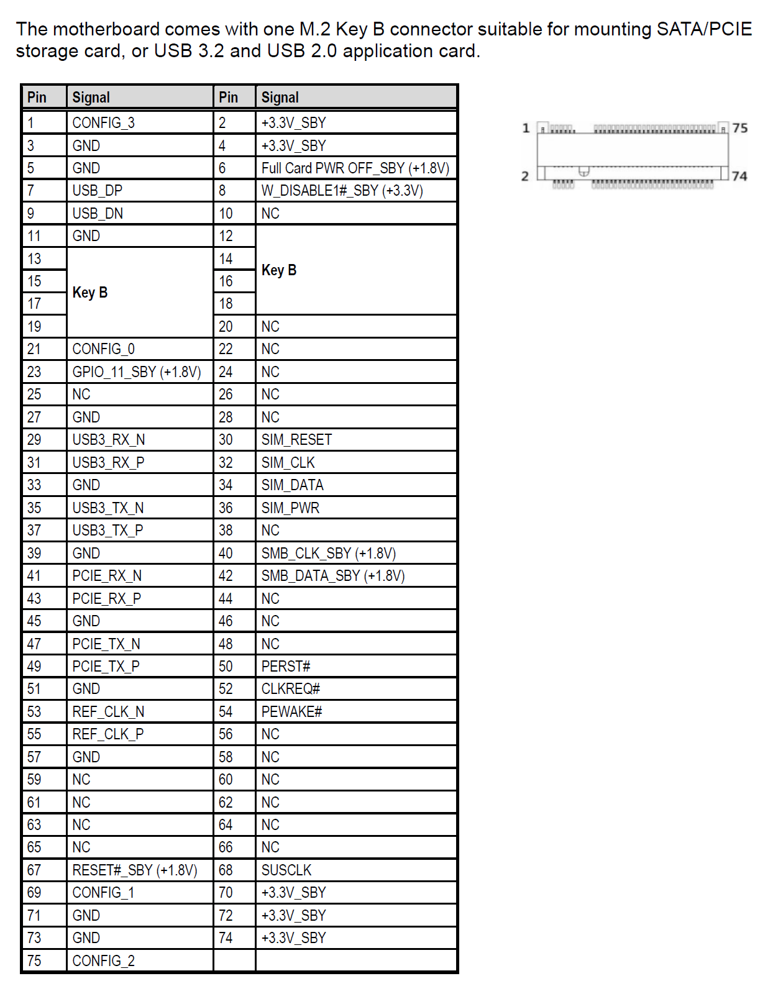


<div align="right">

[**Back to Top**](#test-guide)

</div>


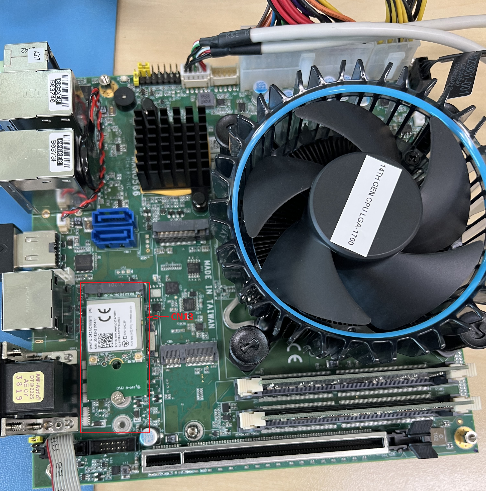


<div align="right">

[**Back to Top**](#test-guide)

</div>


After inserting the **WNFQ-262ACNI** Wi-Fi module, use `pci-tool -v` to verify that the device is detected:

```console
# pci-tool -v

Partition: pci

Managing Server ID: 1, pid: 20487, running
B000:D00:F00 @ idx 0
        vid/did: 8086/a740
                Intel Corporation, <device id - unknown>
        class/subclass/reg: 06/00/00
                Host-to-PCI Bridge Device
.
.
.
B016:D00:F00 @ idx 24 in slot 4 of chassis 0
        vid/did: 168c/003e
                Atheros Communications Inc., <device id - unknown>
        class/subclass/reg: 02/80/00
                Other Network Controller
.
.
.
B018:D00:F00 @ idx 26 in slot 6 of chassis 0
        vid/did: 8086/125b
                Intel Corporation, <device id - unknown>
        class/subclass/reg: 02/00/00
                Ethernet Network Controller
```


<div align="right">

[**Back to Top**](#test-guide)

</div>


---


## PCIe x16 (CN24)


<div align="right">

[**Back to Top**](#test-guide)

</div>
 


After inserting the **NVIDIA Quadro P620** graphics card, use `pci-tool -v` to verify that the device is detected:

```console
# pci-tool -v

Partition: pci

Managing Server ID: 1, pid: 20487, running
B000:D00:F00 @ idx 0
        vid/did: 8086/a740
                Intel Corporation, <device id - unknown>
        class/subclass/reg: 06/00/00
                Host-to-PCI Bridge Device
.
.
.
B000:D31:F04 @ idx 21
        vid/did: 8086/7aa3
                Intel Corporation, <device id - unknown>
        class/subclass/reg: 0c/05/00
                SMBus Serial Bus Controller

B000:D31:F05 @ idx 22
        vid/did: 8086/7aa4
                Intel Corporation, <device id - unknown>
        class/subclass/reg: 0c/80/00
                Other Serial Bus Controller
.
.
.
B001:D00:F00 @ idx 23 in slot 1 of chassis 0
        vid/did: 10de/1cb6
                NVIDIA Corporation, <device id - unknown>
        class/subclass/reg: 03/00/00
                PC Compatible VGA Display Controller

B001:D00:F01 @ idx 24 in slot 1 of chassis 0
        vid/did: 10de/0fb9
                NVIDIA Corporation, <device id - unknown>
        class/subclass/reg: 04/03/00
                Mixed Mode Multi-media Device
.
.
.
B017:D00:F00 @ idx 26 in slot 6 of chassis 0
        vid/did: 8086/125b
                Intel Corporation, <device id - unknown>
        class/subclass/reg: 02/00/00
                Ethernet Network Controller
```


<div align="right">

[**Back to Top**](#test-guide)

</div>


---


## Audio Jack (CN20)


<div align="right">

[**Back to Top**](#test-guide)

</div>
 


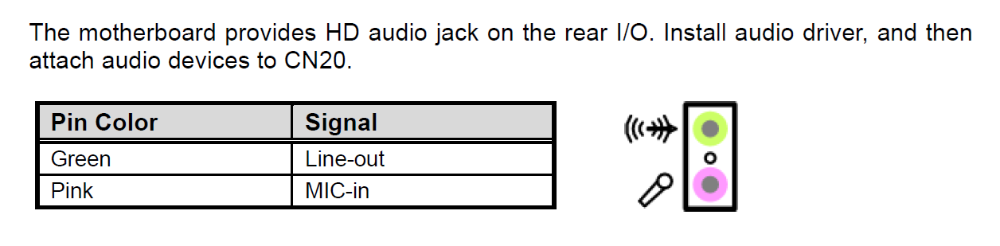

Audio interfaces are not supported in QNX 8.0.


<div align="right">

[**Back to Top**](#test-guide)

</div>


---

[**Back to MANO566 BSP**](../README.md)
