[**Back to SHB160 BSP**](../README.md)


---


# Test Guide

This guide describes the basic functional tests performed on the Axiomtek SHB160 platform running QNX 8.0.5.

* [Basic Function Test Items](#basic-function-test-items)
    - [Storage](#storage)
    	- [NVMe](#nvme) 
    	- [SATA](#sata) 
    - [Display](#display)
    - [Ethernet](#ethernet)
    - [USB](#usb)
    - [COM](#com)
    - [SMBus](#smbus)
    - [Watchdog](#watchdog)
    - [Hardware Monitor](#hardware-monitor)
    - [M.2 E Key (2230, CN27)](#m2-e-key-2230-cn27) 
    - [Audio Connector (CN5)](#audio-connector-cn5)
    - [Parallel Port Connector (CN2)](#parallel-port-connector-cn2)
    - [Temperal Sensors (CN15, CN16)](#temperal-sensors-cn15-cn16)
    - [Internal Mouse/Keyboard Connectors (CN28, CN29)](#internal-mousekeyboard-connectors-cn28-cn29)
    - [PCI-Express/PCI Slots on FAB118](#pci-expresspci-slots-on-fab118)
    	- [PCI-Express x4 Slots (PCIEB1, PCIEB2, PCIEB3, PCIEB4, PCIEB5)](#pci-express-x4-slots-pcieb1-pcieb2-pcieb3-pcieb4-pcieb5)
    	- [PCI-Express x16 Slots (PCIE1)](#pci-express-x16-slots-pcie1)
    	- [PCI Slots (PPCI1, PPCI2, PPCI3, SPCI1, SPCI2, SPCI3, SPCI4)](#pci-slots-ppci1-ppci2-ppci3-spci1-spci2-spci3-spci4)

> **NOTE**:
> 
> **Mainboard**:       SHB160 (Rev. A3-RC) 
> 
> **Backplane Board**: FAB118-14B5P7 (Rev. A1-RC)
> 
> **Intel CPU**:       I7-14700T (Raptor-Lake)


    

<div align="right">

[**Back to Top**](#test-guide)

</div>


---

# Basic Function Test Items


<div align="right">

[**Back to Top**](#test-guide)

</div>


---


## Storage


<div align="right">

[**Back to Top**](#test-guide)

</div>


### NVMe


<div align="right">

[**Back to Top**](#test-guide)

</div>


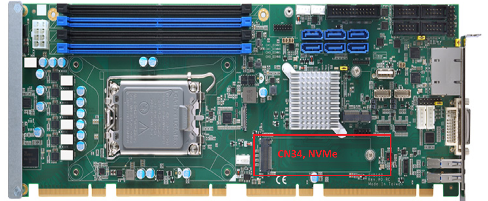


<div align="right">

[**Back to Top**](#test-guide)

</div>


Install an NVMe card and transfer the `image` file to it. After the system boots, 
check the /dev directory:

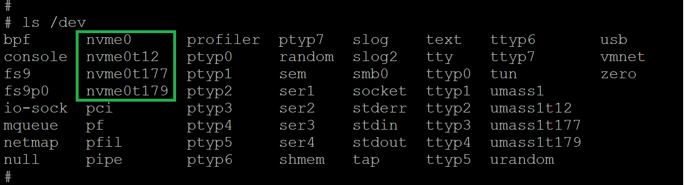


<div align="right">

[**Back to Top**](#test-guide)

</div>


### SATA


<div align="right">

[**Back to Top**](#test-guide)

</div>


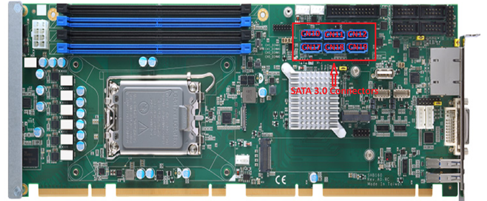


<div align="right">

[**Back to Top**](#test-guide)

</div>


Connect a test SATA drive to the board, then check the `/dev` directory:

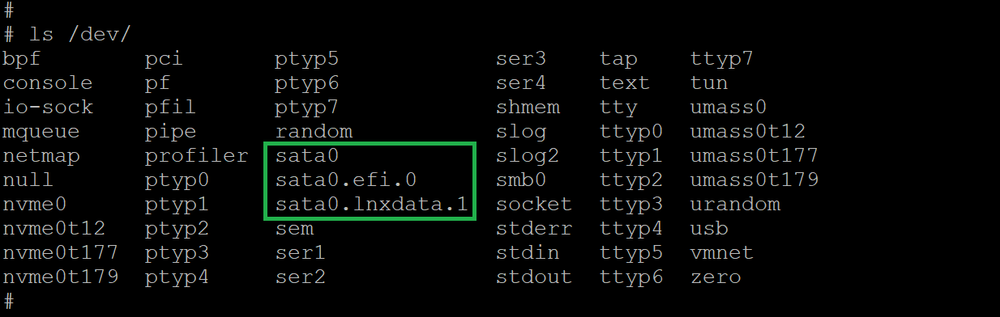


<div align="right">

[**Back to Top**](#test-guide)

</div>


---


## Display


<div align="right">

[**Back to Top**](#test-guide)

</div>


|Display Interface|Connector Name|CPU|Graphics| 
| :---: | :---: | :---: | :---: | 
|DisplayPort++|CN30|I7-14700T|N/A|
|DVI-I|CN31|I7-14700T|OK|

 
> **NOTE:**
> The DisplayPort kit cable (E398709102) was not available for verifying the DisplayPort (CN30).


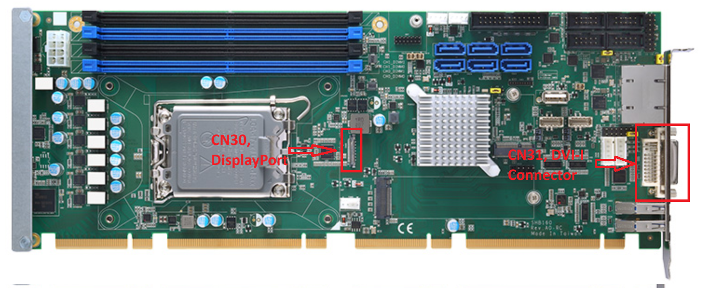


<div align="right">

[**Back to Top**](#test-guide)

</div>


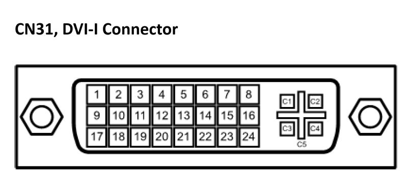


<div align="right">

[**Back to Top**](#test-guide)

</div>


Use the following commands to start the graphics demo:


```console
# ls
bin  dev  etc  home  lib  proc  root  sbin  scripts  tmp  usr  var

# cd scripts
# ./start-graphics.sh
Starting screen
```


<div align="right">

[**Back to Top**](#test-guide)

</div>


---


## Ethernet


<div align="right">

[**Back to Top**](#test-guide)

</div>


There are two Ethernet Ports:  LAN1, and LAN2. 


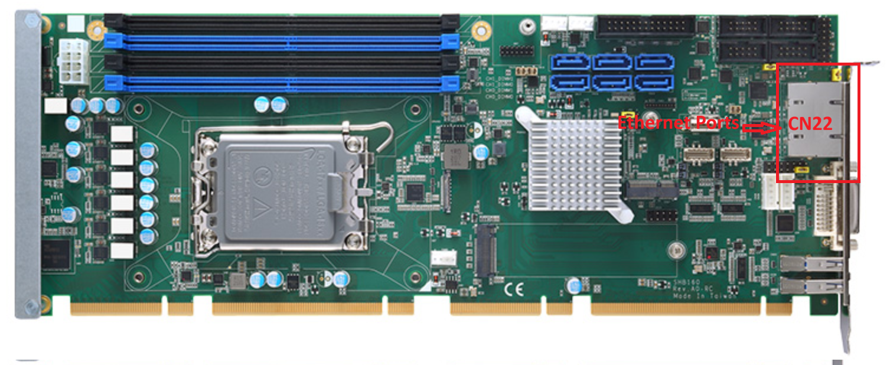


<div align="right">

[**Back to Top**](#test-guide)

</div>


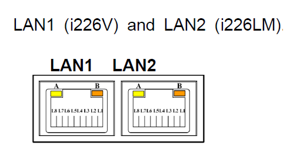


<div align="right">

[**Back to Top**](#test-guide)

</div>


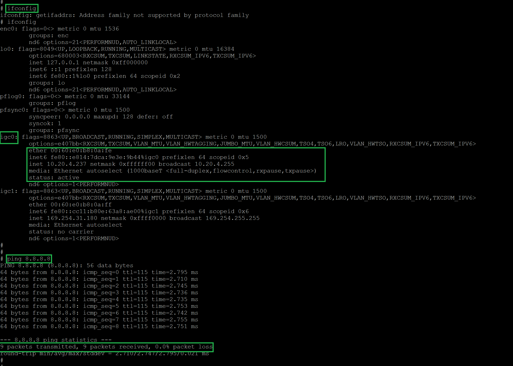


<div align="right">

[**Back to Top**](#test-guide)

</div>


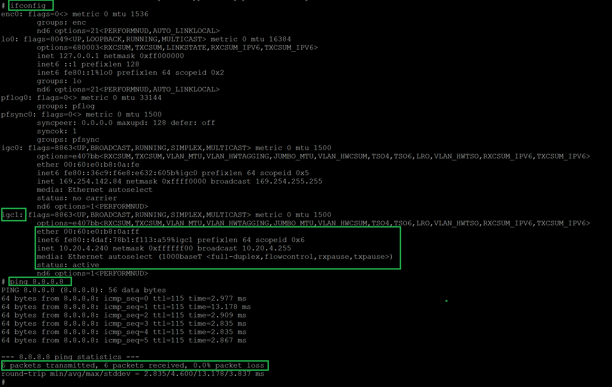


<div align="right">

[**Back to Top**](#test-guide)

</div>


### Throughtput Test

Use `iperf3` to measure network throughput. In this example, the **SHB160** operates as the client, while the **Linux test machine** operates as the server:


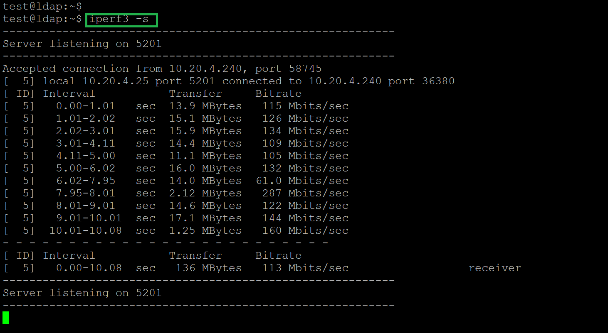


<div align="right">

[**Back to Top**](#test-guide)

</div>


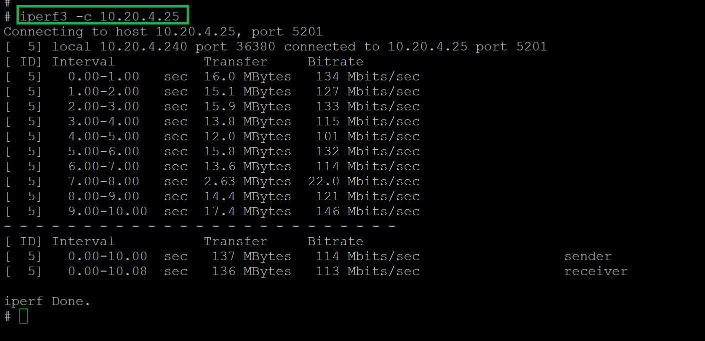


<div align="right">

[**Back to Top**](#test-guide)

</div>


---


## USB


<div align="right">

[**Back to Top**](#test-guide)

</div>


|Board Name|USB Type|Connector Name|Results|
| :---: | :---: | :---: | :---: |
|SHB160|USB3.2|CN35/CN36|OK|
|SHB160|USB3.2|CN24/CN25|OK|
|SHB160|USB2.0|CN33|OK|
|SHB160|USB1.1|CN23|OK|
|FAB118|USB2.0|USB1/USB2|OK|


<div align="right">

[**Back to Top**](#test-guide)

</div>


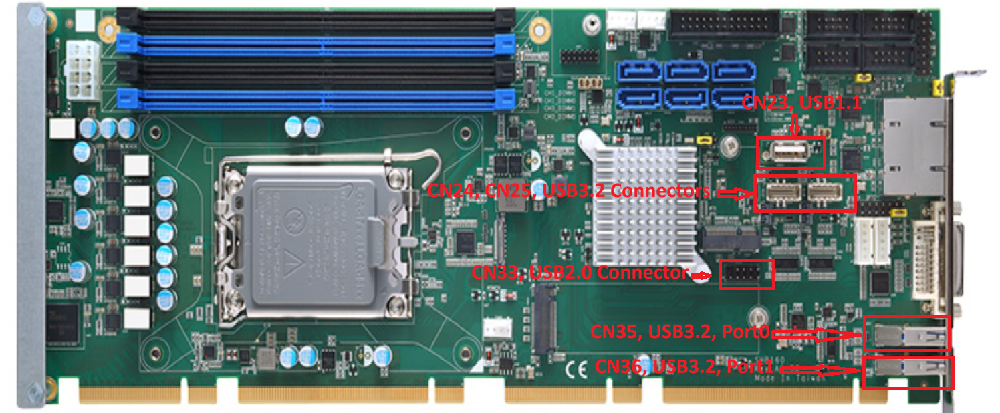


<div align="right">

[**Back to Top**](#test-guide)

</div>


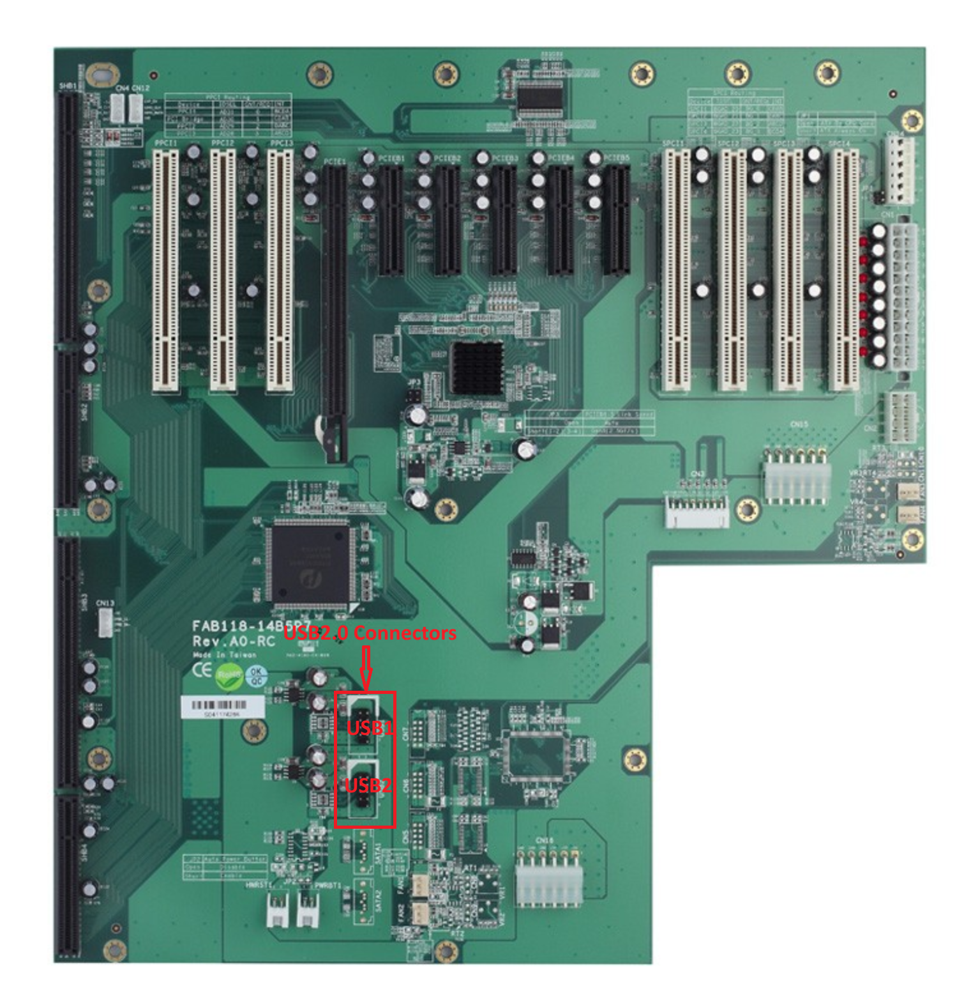


<div align="right">

[**Back to Top**](#test-guide)

</div>


---


## COM


<div align="right">

[**Back to Top**](#test-guide)

</div>


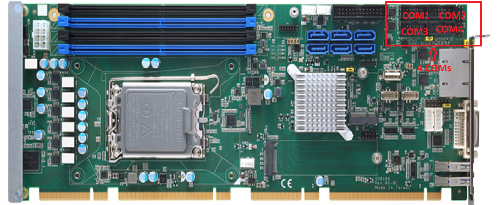


<div align="right">

[**Back to Top**](#test-guide)

</div>


||Tx|Rx|Used as Console|
| :---: | :---: | :---: | :---: |
|COM1|OK|OK|OK|
|COM2|OK|OK|OK|
|COM3|OK|NO|NO|
|COM4|OK|NO|NO|


<div align="right">

[**Back to Top**](#test-guide)

</div>


---


## SMBus


<div align="right">

[**Back to Top**](#test-guide)

</div>


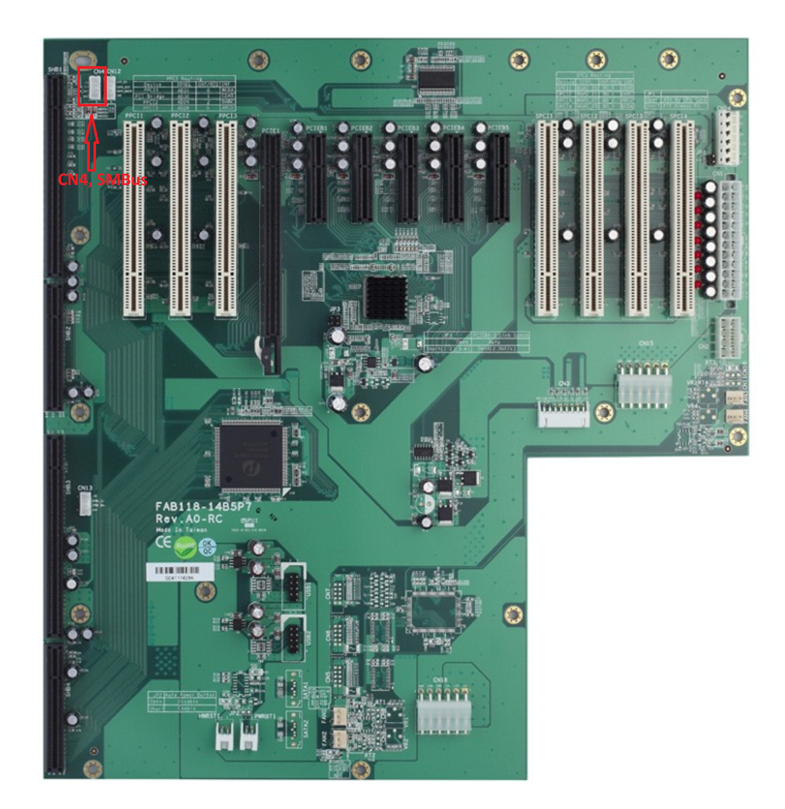


<div align="right">

[**Back to Top**](#test-guide)

</div>


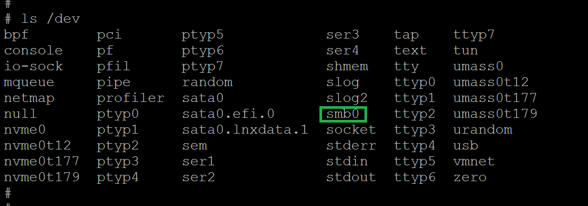


<div align="right">

[**Back to Top**](#test-guide)

</div>


> **NOTE:**
> 
> SMBus does not work as expected.  The root cause has been located to the SHB160 schematics: 


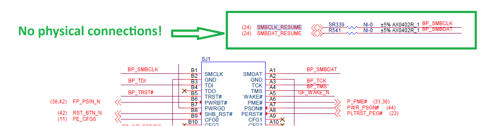


<div align="right">

[**Back to Top**](#test-guide)

</div>


---


## Watchdog


<div align="right">

[**Back to Top**](#test-guide)

</div>


A shared library, `libshb160_wdt.so`, has been created to support the watchdog function.

The following example demonstrates how to use this library:
`
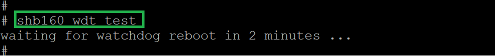


<div align="right">

[**Back to Top**](#test-guide)

</div>


---


## Hardware Monitor


<div align="right">

[**Back to Top**](#test-guide)

</div>


A shared library, `libshb160_hw_mon.so`, has been created to support the hardware monitoring function.

The following example demonstrates how to use this library:


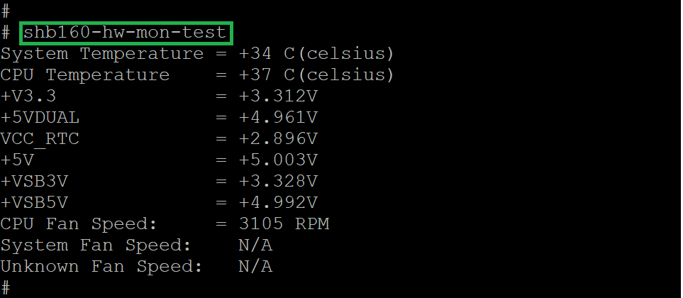


<div align="right">

[**Back to Top**](#test-guide)

</div>


---


## M.2 E Key (2230, CN27)


<div align="right">

[**Back to Top**](#test-guide)

</div>


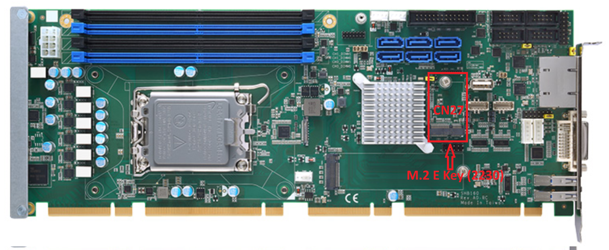


<div align="right">

[**Back to Top**](#test-guide)

</div>


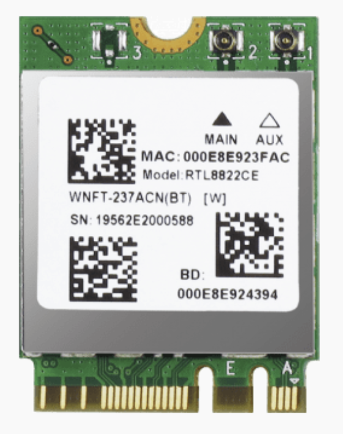


<div align="right">

[**Back to Top**](#test-guide)

</div>


Before attaching the test card:

```console
# pci-tool -v

Partition: pci

Managing Server ID: 1, pid: 20487, running
B000:D00:F00 @ idx 0
        vid/did: 8086/a705
                Intel Corporation, <device id - unknown>
        class/subclass/reg: 06/00/00
                Host-to-PCI Bridge Device

B000:D02:F00 @ idx 1
        vid/did: 8086/a782
                Intel Corporation, <device id - unknown>
        class/subclass/reg: 03/00/00
                PC Compatible VGA Display Controller

B000:D06:F00 @ idx 2
        vid/did: 8086/a74d
                Intel Corporation, <device id - unknown>
        class/subclass/reg: 06/04/00
                PCI-to-PCI Bridge Device

B000:D10:F00 @ idx 3
        vid/did: 8086/a77d
                Intel Corporation, <device id - unknown>
        class/subclass/reg: 11/80/00
                Other DA/DSP Controller
.
.
.

B011:D14:F00 @ idx 33 in slot 8 of chassis 0
        vid/did: 12d8/8152
                Pericom Semiconductor, PI7C8152 2-Port PCI-To-PCI Bridge
        class/subclass/reg: 06/04/00
                PCI-to-PCI Bridge Device

B013:D00:F00 @ idx 34 in slot 10 of chassis 0
        vid/did: 8086/125c
                Intel Corporation, <device id - unknown>
        class/subclass/reg: 02/00/00
                Ethernet Network Controller

B014:D00:F00 @ idx 35 in slot 12 of chassis 0
        vid/did: 8086/125b
                Intel Corporation, <device id - unknown>
        class/subclass/reg: 02/00/00
                Ethernet Network Controller

#
```

<div align="right">

[**Back to Top**](#test-guide)

</div>


After attaching the test card, use `pci-tool -v` to verify that the card is detected:

```console
# pci-tool -v

Partition: pci

Managing Server ID: 1, pid: 20487, running
B000:D00:F00 @ idx 0
        vid/did: 8086/a705
                Intel Corporation, <device id - unknown>
        class/subclass/reg: 06/00/00
                Host-to-PCI Bridge Device

B000:D02:F00 @ idx 1
        vid/did: 8086/a782
                Intel Corporation, <device id - unknown>
        class/subclass/reg: 03/00/00
                PC Compatible VGA Display Controller

B000:D06:F00 @ idx 2
        vid/did: 8086/a74d
                Intel Corporation, <device id - unknown>
        class/subclass/reg: 06/04/00
                PCI-to-PCI Bridge Device

B000:D10:F00 @ idx 3
        vid/did: 8086/a77d
                Intel Corporation, <device id - unknown>
        class/subclass/reg: 11/80/00
                Other DA/DSP Controller
.
.
.
B011:D14:F00 @ idx 34 in slot 8 of chassis 0
        vid/did: 12d8/8152
                Pericom Semiconductor, PI7C8152 2-Port PCI-To-PCI Bridge
        class/subclass/reg: 06/04/00
                PCI-to-PCI Bridge Device

B013:D00:F00 @ idx 35 in slot 9 of chassis 0
        vid/did: 10ec/c822
                Realtek Semiconductor Corp., <device id - unknown>
        class/subclass/reg: 02/80/00
                Other Network Controller

B014:D00:F00 @ idx 36 in slot 10 of chassis 0
        vid/did: 8086/125c
                Intel Corporation, <device id - unknown>
        class/subclass/reg: 02/00/00
                Ethernet Network Controller

B015:D00:F00 @ idx 37 in slot 12 of chassis 0
        vid/did: 8086/125b
                Intel Corporation, <device id - unknown>
        class/subclass/reg: 02/00/00
                Ethernet Network Controller


#
```

<div align="right">

[**Back to Top**](#test-guide)

</div>


---


## Audio Connector (CN5)


<div align="right">

[**Back to Top**](#test-guide)

</div>


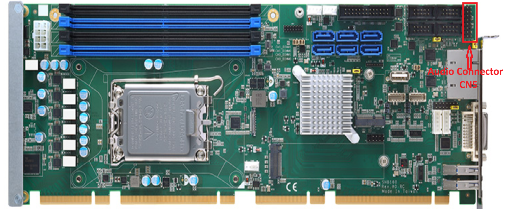

> **NOTE**
> 
> The QNX 8.0 audio driver does not support Intel® processors. 


<div align="right">

[**Back to Top**](#test-guide)

</div>


---


## Parallel Port Connector (CN2)


<div align="right">

[**Back to Top**](#test-guide)

</div>


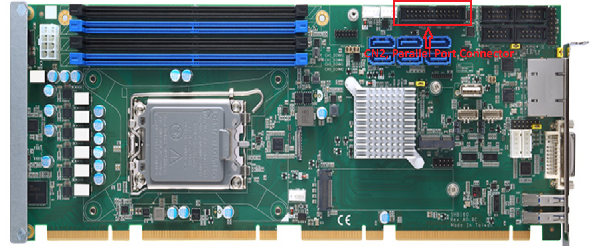


> **NOTE**
> 
> The required connecting cable and test drive were not available for testing.


<div align="right">

[**Back to Top**](#test-guide)

</div>


---


## Temperal Sensors (CN15, CN16)


<div align="right">

[**Back to Top**](#test-guide)

</div>


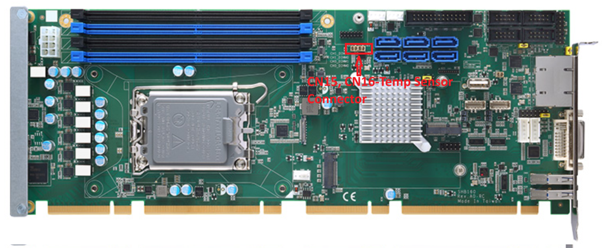


<div align="right">

[**Back to Top**](#test-guide)

</div>


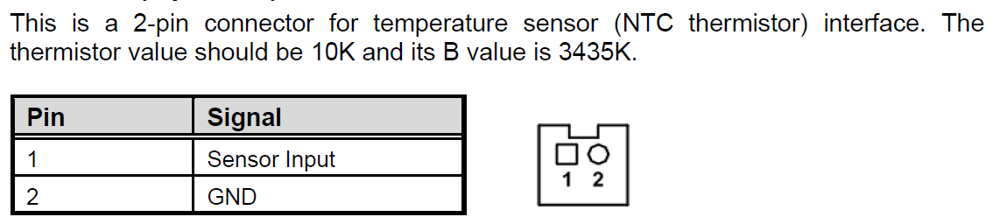


<div align="right">

[**Back to Top**](#test-guide)

</div>


---


## Internal Mouse/Keyboard Connectors (CN28, CN29)


<div align="right">

[**Back to Top**](#test-guide)

</div>


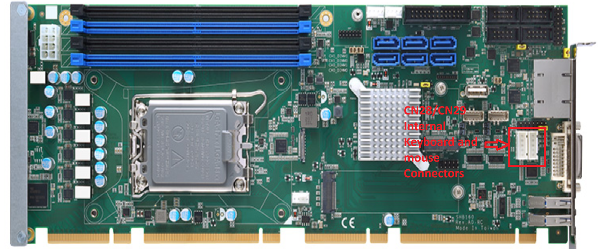


<div align="right">

[**Back to Top**](#test-guide)

</div>


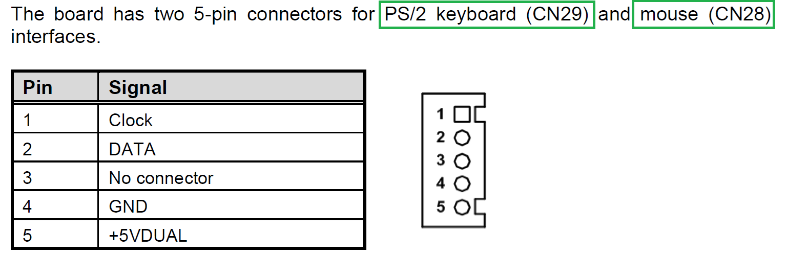


<div align="right">

[**Back to Top**](#test-guide)

</div>


---


## PCI-Express/PCI Slots on FAB118


<div align="right">

[**Back to Top**](#test-guide)

</div>


### PCI-Express x4 Slots (PCIEB1, PCIEB2, PCIEB3, PCIEB4, PCIEB5)


<div align="right">

[**Back to Top**](#test-guide)

</div>


<div align="right">

[**Back to Top**](#test-guide)

</div>


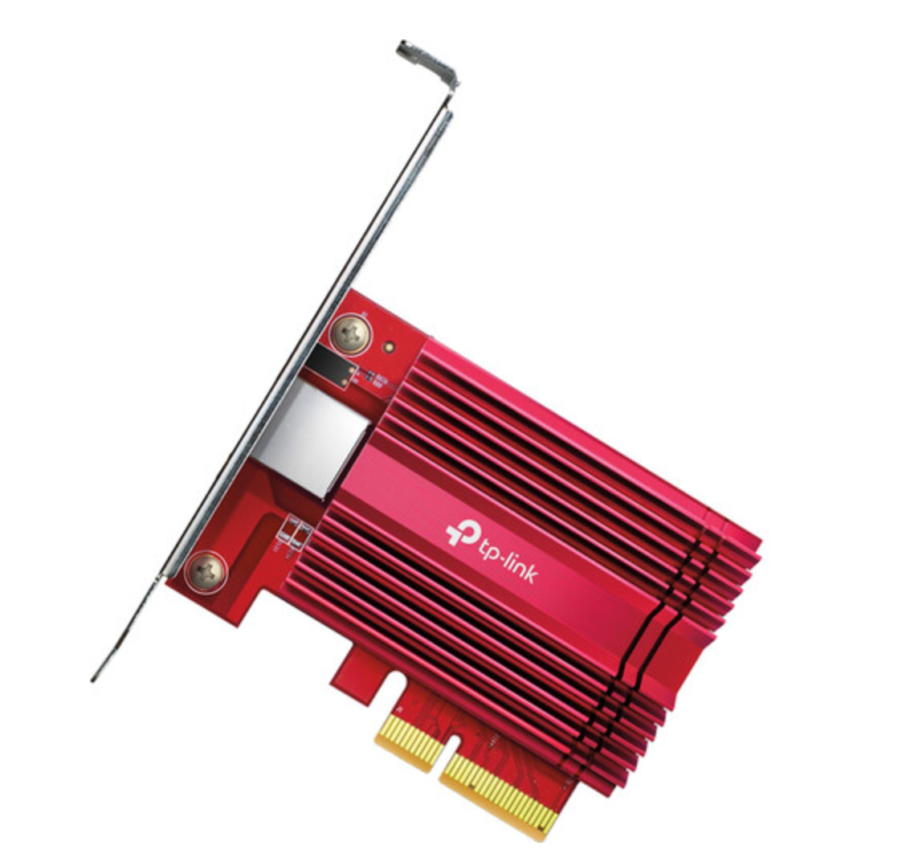


<div align="right">

[**Back to Top**](#test-guide)

</div>


Before inserting the test card:

```console
# pci-tool -v

Partition: pci

Managing Server ID: 1, pid: 20487, running
B000:D00:F00 @ idx 0
        vid/did: 8086/a705
                Intel Corporation, <device id - unknown>
        class/subclass/reg: 06/00/00
                Host-to-PCI Bridge Device

B000:D02:F00 @ idx 1
        vid/did: 8086/a782
                Intel Corporation, <device id - unknown>
        class/subclass/reg: 03/00/00
                PC Compatible VGA Display Controller
.
.
.
B003:D09:F00 @ idx 31 in slot 4 of chassis 0
        vid/did: 10b5/8624
                PLX Technology Inc., <device id - unknown>
        class/subclass/reg: 06/04/00
                PCI-to-PCI Bridge Device

B010:D00:F00 @ idx 33 in slot 8 of chassis 0
        vid/did: 104c/8240
                Texas Instruments, <device id - unknown>
        class/subclass/reg: 06/04/00
                PCI-to-PCI Bridge Device

B011:D14:F00 @ idx 34 in slot 8 of chassis 0
        vid/did: 12d8/8152
                Pericom Semiconductor, PI7C8152 2-Port PCI-To-PCI Bridge
        class/subclass/reg: 06/04/00
                PCI-to-PCI Bridge Device

B013:D00:F00 @ idx 35 in slot 10 of chassis 0
        vid/did: 8086/125c
                Intel Corporation, <device id - unknown>
        class/subclass/reg: 02/00/00
                Ethernet Network Controller

B014:D00:F00 @ idx 36 in slot 12 of chassis 0
        vid/did: 8086/125b
                Intel Corporation, <device id - unknown>
        class/subclass/reg: 02/00/00
                Ethernet Network Controller
#
```


<div align="right">

[**Back to Top**](#test-guide)

</div>


After inserting the test card, use `pci-tool -v` to verify that the card is detected:

```console
# pci-tool -v

Partition: pci

Managing Server ID: 1, pid: 20487, running
B000:D00:F00 @ idx 0
        vid/did: 8086/a705
                Intel Corporation, <device id - unknown>
        class/subclass/reg: 06/00/00
                Host-to-PCI Bridge Device

B000:D02:F00 @ idx 1
        vid/did: 8086/a782
                Intel Corporation, <device id - unknown>
        class/subclass/reg: 03/00/00
                PC Compatible VGA Display Controller
.
.
.
B003:D09:F00 @ idx 31 in slot 4 of chassis 0
        vid/did: 10b5/8624
                PLX Technology Inc., <device id - unknown>
        class/subclass/reg: 06/04/00
                PCI-to-PCI Bridge Device

B009:D00:F00 @ idx 32 in slot 9 of chassis 0
        vid/did: 1d6a/07b1
                Aquantia Corporation, AQC107 NBase-T/IEEE 802.3bz Ethernet Controller [10G/5G/2.5G/1G/100M                                                                                                                                   , rev. B1]
        class/subclass/reg: 02/00/00
                Ethernet Network Controller

B010:D00:F00 @ idx 33 in slot 8 of chassis 0
        vid/did: 104c/8240
                Texas Instruments, <device id - unknown>
        class/subclass/reg: 06/04/00
                PCI-to-PCI Bridge Device

B011:D14:F00 @ idx 34 in slot 8 of chassis 0
        vid/did: 12d8/8152
                Pericom Semiconductor, PI7C8152 2-Port PCI-To-PCI Bridge
        class/subclass/reg: 06/04/00
                PCI-to-PCI Bridge Device

B013:D00:F00 @ idx 35 in slot 10 of chassis 0
        vid/did: 8086/125c
                Intel Corporation, <device id - unknown>
        class/subclass/reg: 02/00/00
                Ethernet Network Controller

B014:D00:F00 @ idx 36 in slot 12 of chassis 0
        vid/did: 8086/125b
                Intel Corporation, <device id - unknown>
        class/subclass/reg: 02/00/00
                Ethernet Network Controller
#
```


<div align="right">

[**Back to Top**](#test-guide)

</div>


### PCI-Express x16 Slots (PCIE1)


<div align="right">

[**Back to Top**](#test-guide)

</div>


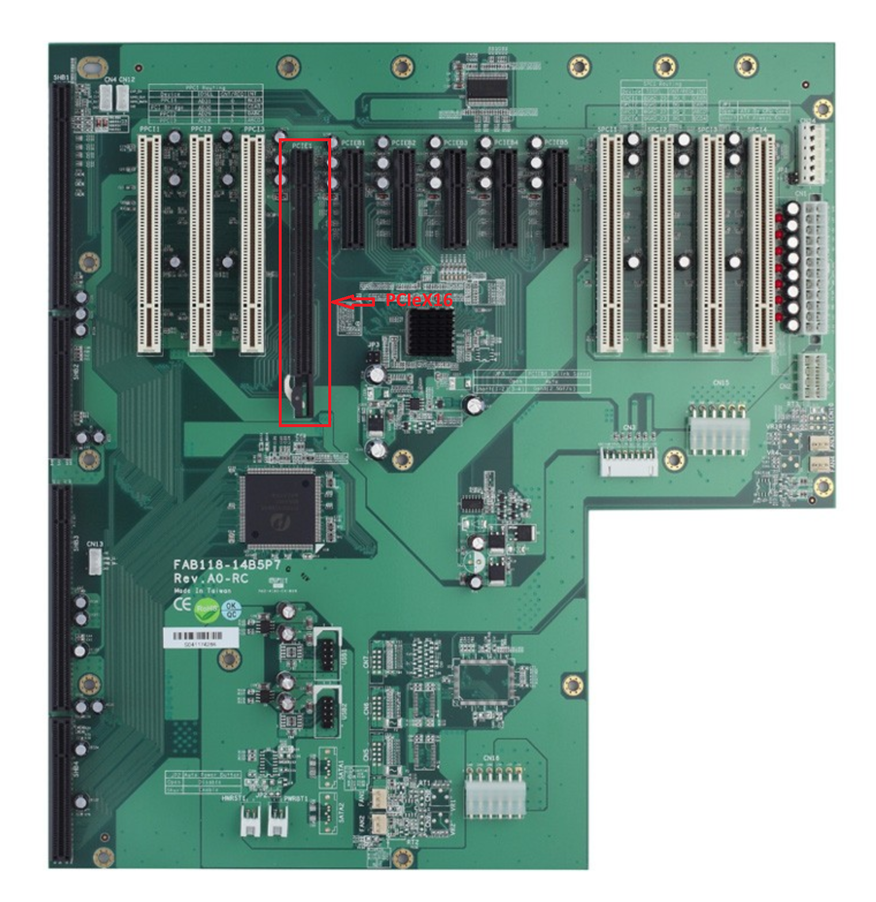


<div align="right">

[**Back to Top**](#test-guide)

</div>


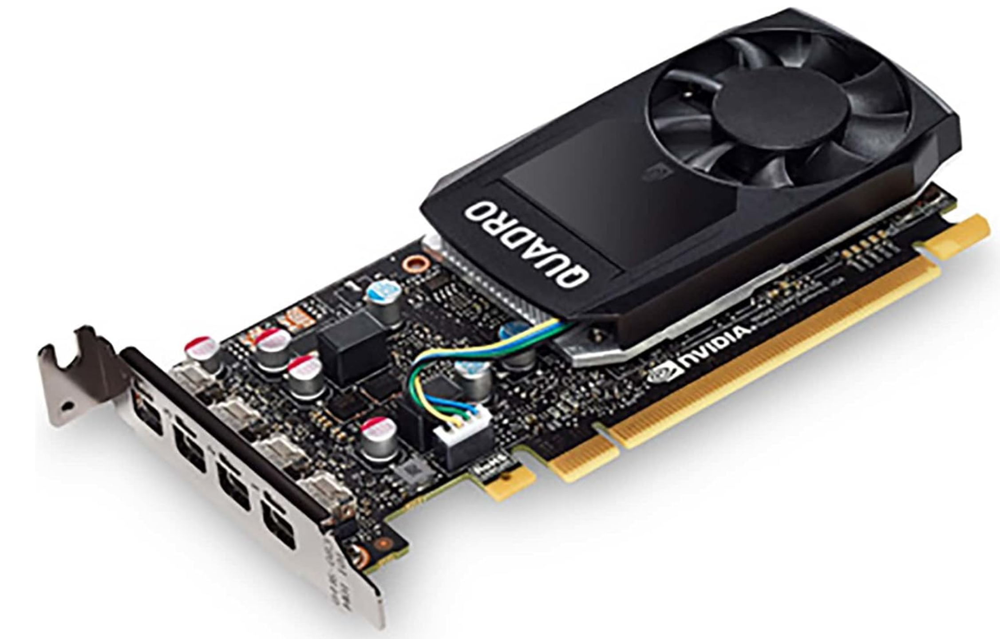


<div align="right">

[**Back to Top**](#test-guide)

</div>


Before inserting the test card:

```console
#
# pci-tool -v

Partition: pci

Managing Server ID: 1, pid: 20487, running
B000:D00:F00 @ idx 0
        vid/did: 8086/a705
                Intel Corporation, <device id - unknown>
        class/subclass/reg: 06/00/00
                Host-to-PCI Bridge Device

B000:D02:F00 @ idx 1
        vid/did: 8086/a782
                Intel Corporation, <device id - unknown>
        class/subclass/reg: 03/00/00
                PC Compatible VGA Display Controller
.
.
.
B000:D31:F05 @ idx 23
        vid/did: 8086/7aa4
                Intel Corporation, <device id - unknown>
        class/subclass/reg: 0c/80/00
                Other Serial Bus Controller

B001:D00:F00 @ idx 24
        vid/did: 15b7/5017
                Sandisk Corp., <device id - unknown>
        class/subclass/reg: 01/08/02
                Non-volatile Memory Subsystem (NVMe Interface IO Controller)
.
.
.

B011:D14:F00 @ idx 33 in slot 8 of chassis 0
        vid/did: 12d8/8152
                Pericom Semiconductor, PI7C8152 2-Port PCI-To-PCI Bridge
        class/subclass/reg: 06/04/00
                PCI-to-PCI Bridge Device

B013:D00:F00 @ idx 34 in slot 10 of chassis 0
        vid/did: 8086/125c
                Intel Corporation, <device id - unknown>
        class/subclass/reg: 02/00/00
                Ethernet Network Controller

B014:D00:F00 @ idx 35 in slot 12 of chassis 0
        vid/did: 8086/125b
                Intel Corporation, <device id - unknown>
        class/subclass/reg: 02/00/00
                Ethernet Network Controller
#
```

<div align="right">

[**Back to Top**](#test-guide)

</div>


After inserting the test card, use `pci-tool -v` to verify that the card is detected:

```console
#
# pci-tool -v

Partition: pci

Managing Server ID: 1, pid: 20487, running
B000:D00:F00 @ idx 0
        vid/did: 8086/a705
                Intel Corporation, <device id - unknown>
        class/subclass/reg: 06/00/00
                Host-to-PCI Bridge Device

B000:D02:F00 @ idx 1
        vid/did: 8086/a782
                Intel Corporation, <device id - unknown>
        class/subclass/reg: 03/00/00
                PC Compatible VGA Display Controller
.
.
.
B000:D31:F05 @ idx 23
        vid/did: 8086/7aa4
                Intel Corporation, <device id - unknown>
        class/subclass/reg: 0c/80/00
                Other Serial Bus Controller

B001:D00:F00 @ idx 24 in slot 1 of chassis 0
        vid/did: 10de/1cb6
                NVIDIA Corporation, <device id - unknown>
        class/subclass/reg: 03/00/00
                PC Compatible VGA Display Controller

B001:D00:F01 @ idx 25 in slot 1 of chassis 0
        vid/did: 10de/0fb9
                NVIDIA Corporation, <device id - unknown>
        class/subclass/reg: 04/03/00
                Mixed Mode Multi-media Device

B001:D00:F00 @ idx 24
        vid/did: 15b7/5017
                Sandisk Corp., <device id - unknown>
        class/subclass/reg: 01/08/02
                Non-volatile Memory Subsystem (NVMe Interface IO Controller)
.
.
.


B011:D14:F00 @ idx 33 in slot 8 of chassis 0
        vid/did: 12d8/8152
                Pericom Semiconductor, PI7C8152 2-Port PCI-To-PCI Bridge
        class/subclass/reg: 06/04/00
                PCI-to-PCI Bridge Device

B013:D00:F00 @ idx 34 in slot 10 of chassis 0
        vid/did: 8086/125c
                Intel Corporation, <device id - unknown>
        class/subclass/reg: 02/00/00
                Ethernet Network Controller

B014:D00:F00 @ idx 35 in slot 12 of chassis 0
        vid/did: 8086/125b
                Intel Corporation, <device id - unknown>
        class/subclass/reg: 02/00/00
                Ethernet Network Controller
#
```

<div align="right">

[**Back to Top**](#test-guide)

</div>


### PCI Slots (PPCI1, PPCI2, PPCI3, SPCI1, SPCI2, SPCI3, SPCI4)


<div align="right">

[**Back to Top**](#test-guide)

</div>


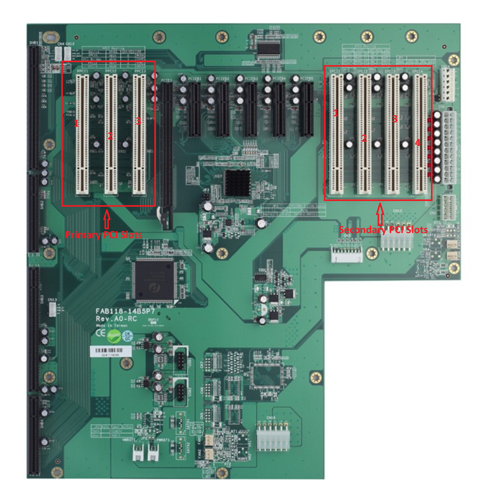


<div align="right">

[**Back to Top**](#test-guide)

</div>


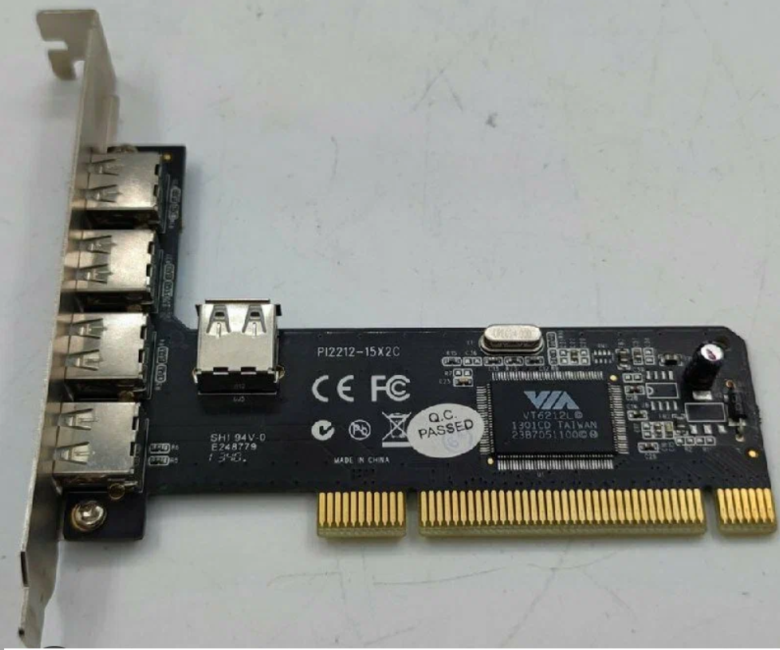


Before inserting the PCI test card:
```console
# pci-tool -v

Partition: pci

Managing Server ID: 1, pid: 20487, running
B000:D00:F00 @ idx 0
        vid/did: 8086/a705
                Intel Corporation, <device id - unknown>
        class/subclass/reg: 06/00/00
                Host-to-PCI Bridge Device

B000:D02:F00 @ idx 1
        vid/did: 8086/a782
                Intel Corporation, <device id - unknown>
        class/subclass/reg: 03/00/00
                PC Compatible VGA Display Controller
.
.
.

B010:D00:F00 @ idx 32 in slot 8 of chassis 0
        vid/did: 104c/8240
                Texas Instruments, <device id - unknown>
        class/subclass/reg: 06/04/00
                PCI-to-PCI Bridge Device

B011:D14:F00 @ idx 33 in slot 8 of chassis 0
        vid/did: 12d8/8152
                Pericom Semiconductor, PI7C8152 2-Port PCI-To-PCI Bridge
        class/subclass/reg: 06/04/00
                PCI-to-PCI Bridge Device

B013:D00:F00 @ idx 34 in slot 10 of chassis 0
        vid/did: 8086/125c
                Intel Corporation, <device id - unknown>
        class/subclass/reg: 02/00/00
                Ethernet Network Controller

B014:D00:F00 @ idx 35 in slot 12 of chassis 0
        vid/did: 8086/125b
                Intel Corporation, <device id - unknown>
        class/subclass/reg: 02/00/00
                Ethernet Network Controller
#
```


<div align="right">

[**Back to Top**](#test-guide)

</div>


After inserting the PCI test card, use `pci-tool -v` to verify that the card is detected:

```console
# pci-tool -v

Partition: pci

Managing Server ID: 1, pid: 20487, running
B000:D00:F00 @ idx 0
        vid/did: 8086/a705
                Intel Corporation, <device id - unknown>
        class/subclass/reg: 06/00/00
                Host-to-PCI Bridge Device

B000:D02:F00 @ idx 1
        vid/did: 8086/a782
                Intel Corporation, <device id - unknown>
        class/subclass/reg: 03/00/00
                PC Compatible VGA Display Controller
.
.
.

B010:D00:F00 @ idx 32 in slot 8 of chassis 0
        vid/did: 104c/8240
                Texas Instruments, <device id - unknown>
        class/subclass/reg: 06/04/00
                PCI-to-PCI Bridge Device

B011:D12:F00 @ idx 33 in slot 8 of chassis 0
        vid/did: 1106/3038
                VIA Technologies, Inc., VT6212L USB
        class/subclass/reg: 0c/03/00
                USB Serial Bus Controller (UHCI)

B011:D12:F01 @ idx 34 in slot 8 of chassis 0
        vid/did: 1106/3038
                VIA Technologies, Inc., VT6212L USB
        class/subclass/reg: 0c/03/00
                USB Serial Bus Controller (UHCI)

B011:D12:F02 @ idx 35 in slot 8 of chassis 0
        vid/did: 1106/3104
                VIA Technologies, Inc., VT6202 USB 2.0 Enhanced Host Controller
        class/subclass/reg: 0c/03/20
                USB Serial Bus Controller (EHCI)

B011:D14:F00 @ idx 36 in slot 8 of chassis 0
        vid/did: 12d8/8152
                Pericom Semiconductor, PI7C8152 2-Port PCI-To-PCI Bridge
        class/subclass/reg: 06/04/00
                PCI-to-PCI Bridge Device

B013:D00:F00 @ idx 37 in slot 10 of chassis 0
        vid/did: 8086/125c
                Intel Corporation, <device id - unknown>
        class/subclass/reg: 02/00/00
                Ethernet Network Controller

B014:D00:F00 @ idx 38 in slot 12 of chassis 0
        vid/did: 8086/125b
                Intel Corporation, <device id - unknown>
        class/subclass/reg: 02/00/00
                Ethernet Network Controller

#
```


<div align="right">

[**Back to Top**](#test-guide)

</div>


---

[**Back to SHB160 BSP**](../README.md)
